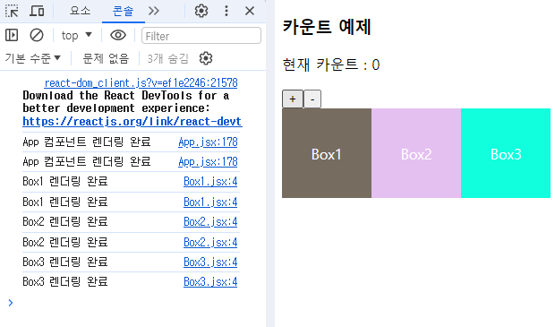
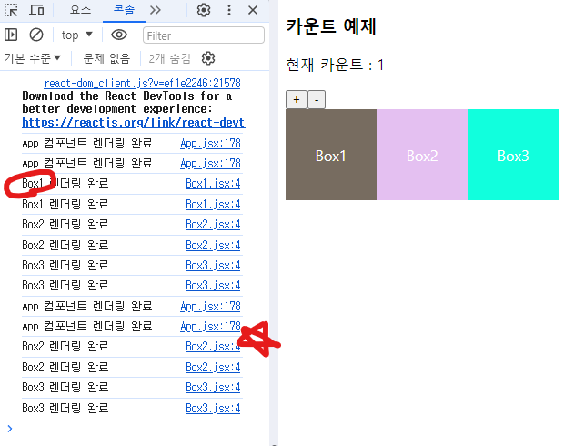
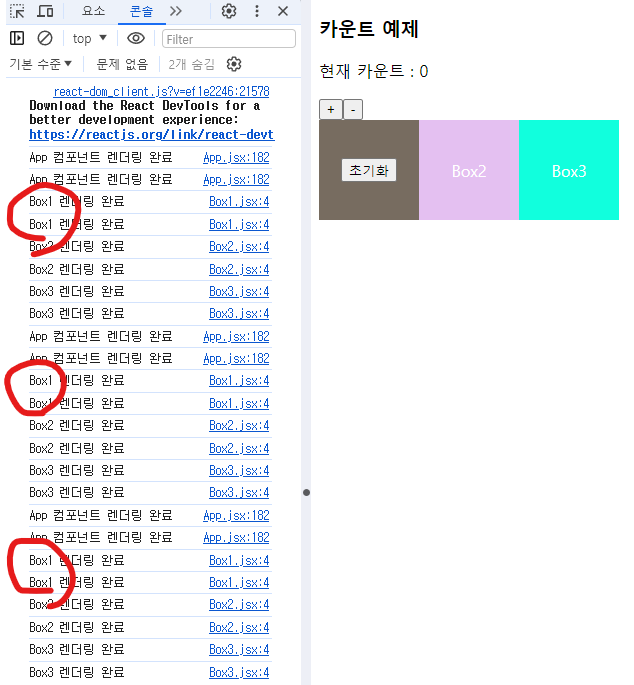
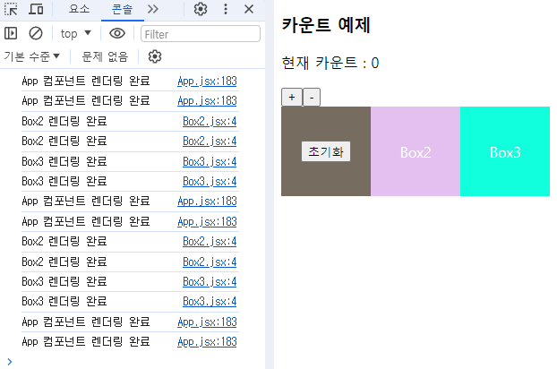
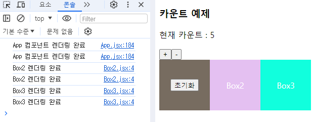
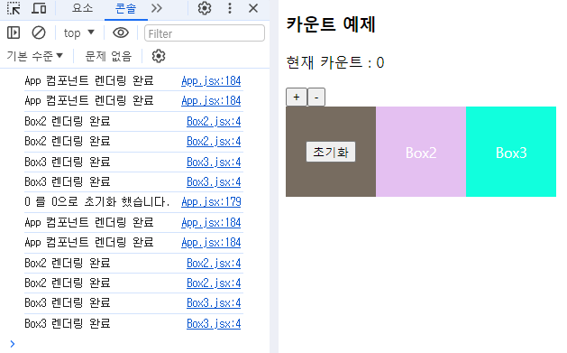

# 목적

리액트에 대해 여러 가지 hook(useState, useEffect, useRef, useContext)을 이용하면서,  
리액트는 State 의 변경에 따른 리렌더링이 핵심이라는 것을 알게되었다.

이 리렌더링이 너무 빈번하게 일어난다면, 사용자 측면에서 좋은 평가를 받지 못하게 된다.
웹 사이트에서 별 작업을 수행하지 않아도 메모리를 많이 잡아 먹는 등의 문제가 생길 수도 있다.

그래서, 이를 최적화하기 위한 방법인 Memoization 에 대해서 알아보자.

## Memoization 이란?

프로그래밍에서 사용하는 최적화 기술 중 하나로, 먼저 이전의 연산 결과를 저장해둔다.
그리고, 같은 입력이 들어온다면 이를 다시 계산하는게 아니라 저장해둔 값을 불러오는 방법이다.
이를 위해, 배열이나 해시 테이블을 사용핧 수 있다.

리액트에서도, 이 메모이제이션 기법을 사용할 수 있다!

### React.memo

`React.memo` 를 사용하면, 컴포넌트에 메모이제이션 기법을 적용할 수 있다!

다만, 이때는 아래 사실을 하나 알고 있어야한다.

    ✨ 부모 컴포넌트가 리렌더링되면, 그에 속한 자식 컴포넌트도 모두 리렌더링 된다.

부모의 내용이 바뀌긴 했지만, 자식 컴포넌트의 내용은 바뀌지 않아서 리렌더링 할 이유가 없다면 `React.memo` 가 도움이 된다.

```javascript
// App.jsx
const App = () => {
  const [cnt, setCnt] = useState(0);

  const onPlusBtnClick = () => {
    setCnt(cnt + 1);
  };

  const onMinusBtnClick = () => {
    setCnt(cnt - 1);
  };

  console.log("App 컴포넌트 렌더링 완료");
  return (
    <div>
      <h3>카운트 예제</h3>
      <p>현재 카운트 : {cnt}</p>
      <button onClick={onPlusBtnClick}>+</button>
      <button onClick={onMinusBtnClick}>-</button>
      {/* 버튼을 눌러, 부모에서 State 가 바뀌니 App 부터 Box3 까지 모두 리렌더링이 됨. */}
      <div
        style={{
          display: "flex"
        }}
      >
        <Box1 />
        <Box2 />
        <Box3 />
      </div>
    </div>
  );
};

export default App;
```

최상위 부모인 `App` 컴포넌트의 코드다.
자식 컴포넌트인 `Box1`,`Box2`, `Box3` 는 부모 컴포넌트의 상태가 바뀔 때 마다, 함께 리렌더링이 되고 있다.



자식 컴포넌트는 아래와 같이 작성했다.

```javascript
// Box1
import React from "react";

export default function Box1() {
  // export default React.memo(function Box1 () {

  console.log("Box1 렌더링 완료");
  return (
    <div
      style={{
        display: "flex",
        justifyContent: "center",
        alignItems: "center",
        width: "100px",
        height: "100px",
        backgroundColor: "#321a",
        color: "white"
      }}
    >
      Box1
    </div>
  );
}
// })
```

자식 컴포넌트에서의 불필요한 리렌더링을 막기위해서, 다음과 같이 바꿔보자.

위 예시 코드에서는 `export default function Box1()` 를 `export default React.memo(function Box1()` 로 바꿔주면 결과가 달라진다.

`export` 문을 외부에 따로 사용한 경우는 `export default React.memo(컴포넌트_이름)` 처럼 사용하면 된다.



### React.memo 의 문제점

그런데, Box1을 메모이제이션 했음에도 불구하고 부모 컴포넌트로 부터 props 를 받아오니 자식 컴포넌트가 변하지 않는데도 리렌더링 되기 시작했다.

```javascript
// App.jsx
const initCnt = () => {
  setCnt(0);
};
<Box1 initCnt={initCnt} />;
```

State 를 초기화하는 함수를 전달했다.

```javascript
import React from "react";

export default React.memo(function Box1({ initCnt }) {
  console.log("Box1 렌더링 완료");
  return (
    <div
      style={{
        display: "flex",
        justifyContent: "center",
        alignItems: "center",
        width: "100px",
        height: "100px",
        backgroundColor: "#321a",
        color: "white"
      }}
    >
      <button onClick={() => initCnt()}>초기화</button>
    </div>
  );
});
```



+, - 버튼을 누르거나, 초기화를 누르면 모두 리렌더링이 되는 문제가 있다.

이는, 함수형 컴포넌트를 사용했기 때문에 `React.memo()` 로는 한계가 있기 때문이다.
`Box1` 컴포넌트 뿐만 아니라 부모 `App`도 함수형 컴포넌트다.
이때, `App` 컴포넌트에 속한 상태가 바뀌어 리렌더링 되면 요소들이 변경된 값을 가지고 다시 생성이 되는 것이다.
그래서, 결국 자식 컴포넌트로 넘겨준 props(ex. `initCnt()`) 가 변경이 되었다고 보기 때문에 Memoization 이 적용되지 않고 리렌더링이 일어나는 것이다.

`useCallback` 을 사용하면 함수 자체를 메모이제이션할 수 있다는 답을 얻었다.

### useCallback

위에서 살펴본 것 처럼, 자식 컴포넌트는 변함이 없지만 props 로 전달된 함수가 재생성되는 현상 때문에 나타나는 리렌더링을 막고싶다면 이렇게 해보자.

```javascript
// App.jsx
const initCnt = useCallback(() => {
  setCnt(0);
}, []);
<Box1 initCnt={initCnt} />;
```



그런데, 사실 해결하지 못했다고 봐야한다.

아래를 보자.



현재 카운트는 5인 상태다.

여기서 `initCnt()` 함수에 초기화가 이루어질 때 `cnt` 의 상태를 출력하기 위해 코드를 변경했다.

```javascript
const initCnt = useCallback(() => {
  console.log(`${cnt} 를 0으로 초기화 했습니다.`);
  setCnt(0);
}, []);
```

이 코드는, 초기화가 이루어질 때 `cnt` 의 값을 출력해 줄 것이다.



그런데, 0을 0으로 초기화 했다고 나오는 것이다.

`useCallback()` 으로, 메모이제이션 한 상태는 처음 생성이 된 시점에서 멈춰있다.
의존성 배열을 빈 값으로 넘겨줬기 때문이다.

따라서, 값을 추적할 수 없기 때문이다.
그래서, `cnt` 를 추적하도록 만들어주면 가능해진다.

```javascript
const initCnt = useCallback(() => {
  console.log(`${cnt} 를 0으로 초기화 했습니다.`);
  setCnt(0);
}, [cnt]);
```

### useMemo

마지막 방법이라고 할 수 있겠다.

첫 번째로 사용했던 `React.memo` 는 컴포넌트를 캐싱하는 것이고, 두 번째 `useCallback()` 은 함수를 캐싱한 것이다.
마지막 `useMemo()` 는 값을 캐싱하는 것이라고 한다.

코드로 알아보자.

```javascript
import React, { useState } from "react";

function HeavyComponent() {
  const [value, setValue] = useState(0);

  const heavyWork = () => {
    for (let index = 0; index < 100000000000000; index++) {}
    return 100;
  };

  const sampleValue = heavyWork();

  return (
    <div>
      <p>
        Hi, I'm freakin Heavy but just {sampleValue}. {value}{" "}
      </p>
      <button onClick={() => setValue(value + 1)}>증가</button>
    </div>
  );
}

export default HeavyComponent;
```

이런 작업을 하는 컴포넌트가 있다고 가정해보자.
실제 코드를 사용하면 웹 브라우저가 멈추니 주의하자.

이때, heavyWork() 가 매번 실행이 된다면 아주 부담스러울 것이다.
따라서, useMemo() 로 값만 메모이제이션 해보자.

```javascript
import { useMemo } from "react";

const sampleValue = useMemo(() => heavyWork(), []); // 의존성 배열, 여기서는 딱 한 번만 진행하게 만들기 위해서 빈 배열 전달.
```

그렇다면, 이제는 컴포넌트에서 리렌더링이 일어나도 연산 때문에 지연되지 않고 바로 렌더링이 된다.
