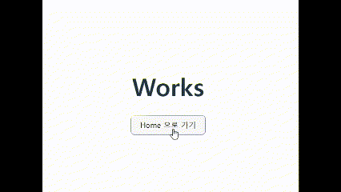
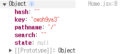
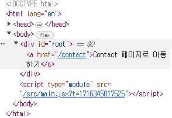

# 목적

> 이제 라우팅을 도입해 리액트로 간단한 프로젝트를 도전해보려고 한다. 그래서, 까먹으면 찾아오려고 작성해본다. 물론, 캠프 과제부터..!

## 설치 방법

```zsh
yarn add react-router-dom
```

이후, 프로젝트 내의 `package.json` 에 잘 추가 되었는지 확인해야한다.

## 사용법

아무런 hook 도 사용하지 않는 기본 사용 방법은 다음과 같다.

    my-app/

    ├── node_modules/
    ├── public/
    ├── src/
    │ ├── components/
    │ │ └── Router.jsx
    │ ├── pages/
    │ │ ├── Home.jsx
    │ │ ├── About.jsx
    │ │ ├── Contact.jsx
    │ │ └── Works.jsx
    │ └── App.jsx
    ├── package.json
    └── package-lock.json

이런 프로젝트 구조를 가졌다고 가정해보자.

먼저, `Router.jsx` 부터 구성해보자.

```jsx
// Router.jsx
import React from "react";
import { BrowserRouter, Route, Routes } from "react-router-dom";
import Home from "../pages/Home";
import About from "../pages/About";
import Contact from "../pages/Contact";
import Works from "../pages/Works";

function Router() {
  return (
    <BrowserRouter>
      <Routes>
        <Route path="/" element={<Home />} />
        <Route path="/about" element={<About />} />
        <Route path="/contact" element={<Contact />} />
        <Route path="/works" element={<Works />} />
      </Routes>
    </BrowserRouter>
  );
}

export default Router;
```

`App.jsx` 는 아래 처럼 구성이 가능하다.

```jsx
// App.jsx
import "./App.css";
import Router from "./shared/Router";

function App() {
  return <Router />;
}

export default App;
```

이후, 라우팅 대상인 `pages` 내의 컴포넌트들을 구성해주면 된다.

```jsx
//Home.jsx
import React from "react";

function Home() {
  return <div>Home</div>;
}

export default Home;
```

이제부터는 hook에 대해 간단히 알아보자.

## `useNavigate()`

`useNavigate()` 를 이용하면, 웹 페이지의 네비게이션 바 처럼 특정 링크로 보내주게 만들 수 있다.

방금 위에서 보았던 `Home.jsx` 에서 `Works.jsx` 로 이동시키고 싶을 때 이렇게 작성할 수 있다.

```jsx
import React from "react";
import { useNavigate } from "react-router-dom";

function Home() {
  const navigate = useNavigate();
  return (
    <div>
      <h1>Home</h1>
      <button onClick={() => navigate("/works")}>Works 로 이동</button>
    </div>
  );
}

export default Home;
```



## `useLocation()`

`useLocation()` hook 은 `location` 객체를 얻어올 수 있다.

```jsx
import React from "react";
import { useLocation, useNavigate } from "react-router-dom";

function Home() {
  const navigate = useNavigate();
  const location = useLocation();

  console.log(location);
  return (
    <div>
      <h1>Home</h1>
      <button onClick={() => navigate("/works")}>Works 로 이동</button>
    </div>
  );
}

export default Home;
```

이렇게, location 을 콘솔에서 확인해보면 현재 페이지 내의 정보를 얻을 수 있다.  
아직 이 정보가 어떤 것들인지는 잘 모르겠지만..! 추후 정리해보도록 하자.



`pathname` 은 현재 링크 location이 필요할 때 유용할 것 같다.

## `link`

`link` 는 hook 이 아니라 tag 다.  
역할은 `a` 태그를 완벽히 대체하는 것이다. 실제로 `link` 태그를 쓰면 브라우저 상에서 요소를 확인할 때 `a` 태그로 바뀌어 있다.

하지만 그렇다고, 명시적으로 HTML 의 `a` 태그를 작성하면 안된다.  
실제로 `a` 태그를 쓰면 지정한 링크로 이동할 때 브라우저에서 웹 페이지를 다시 로드하기 때문에 지금까지 저장되었던 State 가 모두 날아가는 문제가 생기기 때문이다.  
그럼, 리액트를 써서 SPA 를 구현할 이유가 없기 때문...!

```jsx
import React from "react";
import { Link, useLocation, useNavigate } from "react-router-dom";

function Home() {
  const navigate = useNavigate();
  const location = useLocation();

  console.log(location);
  return <Link to="/contact">Contact 페이지로 이동하기</Link>;
}

export default Home;
```



정말 `a` 태그로 바뀌어 있다!

## `children`

리액트의 props 에 대해 다룰 때, 살펴본 적 있었다.
컴포넌트에 자식 요소가 존재하긴 하지만, 동적으로 구성되는 상황에 사용할 수 있다.

예를 들면, 방금 예시로 다루었던 페이지의 구성을 보자.

```jsx
// Router.jsx
import React from "react";
import { BrowserRouter, Route, Routes } from "react-router-dom";
import Home from "../pages/Home";
import About from "../pages/About";
import Contact from "../pages/Contact";
import Works from "../pages/Works";

function Router() {
  return (
    <BrowserRouter>
      <Layout>
        <Routes>
          <Route path="/" element={<Home />} />
          <Route path="/about" element={<About />} />
          <Route path="/contact" element={<Contact />} />
          <Route path="/works" element={<Works />} />
        </Routes>
      </Layout>
    </BrowserRouter>
  );
}

export default Router;
```

여기서, 새로 추가된 것이 있다.
`Layout` 컴포넌트를 추가한 이유는,
`Routes` 는 path 에 따라 동적으로 변화하는 부분이다.

이때, 다양한 `Route` 중 어떤 것이 들어오더라도 웹 페이지가 동작하도록 만들기 위해서 `Layout` 컴포넌트에서 `children` 이라는 형태로 props 를 받아주도록 만들었다.

```jsx
// Layout.jsx
function Header() {
    return <header>헤더</header>
}

function Footer() {
    return <footer>푸터</footer>
}

function Layout({ children }) {
    return (
        <Header />
        <div><children /></div>
        <Footer />
    )
}
```

이렇게 구현해주면, path 에 따라 children 이 달라지더라도 문제없이 렌더링이 가능해진다!

이것들을 활용해보도록 하자.
