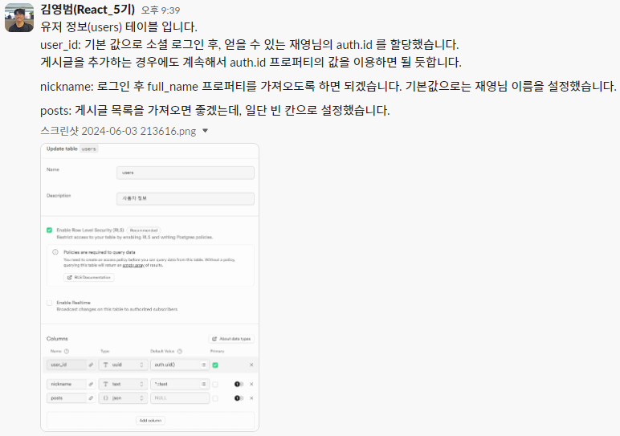
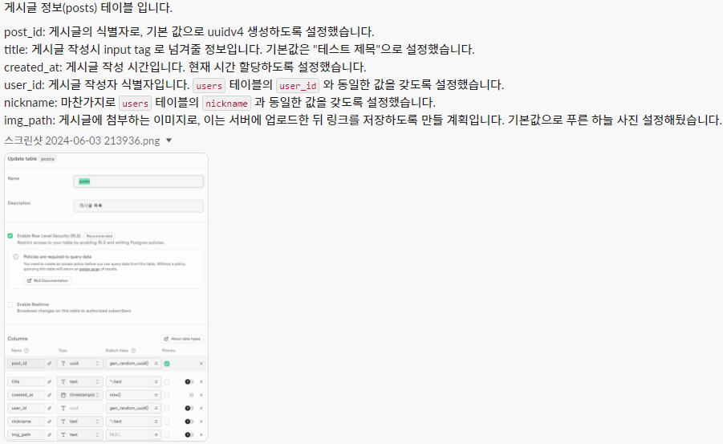
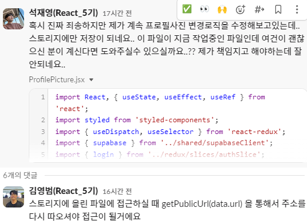

> 일주일 간 엄청 바빴다.
> 휴일 3일 포함해 열심히 만들었지만, 이번에도 아쉬움만 남았다

## 롤무위키

`슬기로운 게임생활을 위한 커뮤니티`

---

## 목차

1. 프로젝트 팀 구성 및 역할

2. 프로젝트 개요

3. 프로젝트 수행 절차 및 방법

4. 프로젝트 수행 경과

5. 자체 평가 의견

---

### 1. 프로젝트 팀 구성 및 역할

| 구분 | 역할                                                            |
| ---- | --------------------------------------------------------------- |
| 팀장 | 게시글 CRUD (글 작성, 수정, 삭제), 게시글 조회 모달 구현        |
| 팀원 | 소셜 로그인, 이메일 패스워드 기반 로그인&회원가입&패스워드 변경 |
| 팀원 | 마이페이지 구성 (내 게시물 보기 & 프로필 수정)                  |
| 팀원 | 페이지들의 전반적인 UI 구현                                     |

---

### 2. 프로젝트 개요 - (1)

- 주제 선정 배경

  - LoL, League of Lengends 는 오랜 시간동안 사랑받고 있는 게임임
  - 그만큼, 게임 시스템도 꾸준히 변화해오기에 지속적으로 새로운 전략이나 공략법을 공유할 커뮤니티 서비스가 필요

- 기획 의도

  - 게임을 즐기는 사용자들을 대상으로 자신의 노하우를 공유하고 서로 배우며 성장할 수 있는 환경을 조성하기 위함

- 구현 내용
  - 사용자 계정 관리: 회원가입, 로그인, 소셜 로그인 기능 및 사용자 프로필 조회
  - 게시글 작성 및 조회: 텍스트, 이미지를 활용한 게시글 작성 기능

---

### 프로젝트 개요 - (2)

- 배운 내용과의 연관성

  - 본 과정에서 학습한 웹 라이브러리인 리액트로 SPA(Single Page Application) 서비스를 구현함
  - 데이터베이스 기초 지식을 활용하여 본 서비스의 주요 기능들을 구현함
  - 회원가입이나 소셜 로그인 등 사용자 인증(Authentication) 시스템 도입
  - CRUD(Create, Read, Update, Delete) 기능을 통해 사용자 생성 콘텐츠를 효과적으로 관리할 수 있도록 함

---

### 프로젝트 개요 - (3)

- 활용 장비 및 재료
  - CSS Library: Styled Components
  - 프로그래밍 언어: Javascript
  - 웹 라이브러리: React
  - 데이터베이스: Supabase
  - 버전 관리: Git, Github

---

### 프로젝트 개요 - (4)

- 프로젝트 구조

  

---

### 프로젝트 개요 - (5)

- 활용 방안 및 기대 효과

  - 사용자 참여 유도: 사용자들이 직접 콘텐츠를 생성하고 공유하면서, 커뮤니티의 활성화가 기대됨

- 비즈니스 실무 활용성

  - 서비스 이용자들이 작성한 게시글, 공략법 등의 데이터를 분석해 현재 인기 있는 전략이나 게임 캐릭터를 파악해 제공할 수 있음

---

### 3. 프로젝트 수행 절차 및 방법

| 구분          | 일자            | 활동                                                                        | 비고               |
| ------------- | --------------- | --------------------------------------------------------------------------- | ------------------ |
| 기획          | 5/31(금)        | 프로젝트 기획 및 주제선정, 와이어프레임 작성, 컨벤션 설정,팀원 별 파트 선정 | 프로젝트 주제 선정 |
| DB 구축       | 6/1(토)~6/3(월) | Supabase 셋팅                                                               |                    |
| 프로젝트 구현 | 6/3(월)~6/6(목) | 프로젝트 파트별 구현                                                        | 팀원간 분담        |
| 사이트 배포   | 6/7(금)         | 파트 최종 취합 및 사이트 배포                                               |                    |

---

### 4. 프로젝트 수행 경과

#### (1) 기술적 의사결정

| 요구사항            | 활용한 기술      | 이유                                                                                                                                          |
| ------------------- | ---------------- | --------------------------------------------------------------------------------------------------------------------------------------------- |
| css styling library | style-components | CSS-in-JS 방식으로 간편한 컴포넌트 스타일링이 가능해 선택                                                                                     |
| Javascript Library  | React            | 간결한 구성의 서비스로 SPA 를 선택, 이용자가 작성한 게시물을 계속해서 렌더링 할 필요가 있음. 따라서 필요한 부분만 렌더링을 진행하기 위해 이용 |

---

#### (2) 기술적 의사결정

| 요구 사항      | 활용한 기술   | 이유                                                                                                                                        |
| -------------- | ------------- | ------------------------------------------------------------------------------------------------------------------------------------------- |
| 데이터베이스   | Supabase      | 본 서비스는 회원이나 게시글 관리를 위한 특성상 관계형 데이터 베이스가 필요하며 Supabase 가 별도의 백엔드 서버를 구축하는 부담을 덜어줘 선택 |
| 전역 상태 관리 | Redux Toolkit | 기존 Redux 에 비해 훨씬 간결한 상태 관리 방법을 제공하기에 선택                                                                             |
| 버전 관리      | Git           | 개발 과정에서 효율적인 분업, 파일 관리를 위해 선택                                                                                          |

---

#### (3) 프로젝트 주요 기능 소개

<!-- - [유튜브 공개 영상 링크](https://youtu.be/4OEYjQ-PPDY) -->

---

#### (4) 데이터 베이스 구조도

---

#### (5) 개발 진행 중 팀원 간 상호작용 - 1

- 관계형 데이터 베이스 구성
  

---

#### (5) 개발 진행 중 팀원 간 상호작용 - 2

- 관계형 데이터 베이스 구성
  

---

#### (5) 개발 진행 중 팀원 간 상호작용 - 3

- 기술 구현 중 팀원 간 코드 리뷰 및 피드백
  

---

### 5. 자체 평가 의견 - 1

- 프로젝트 결과물에 대한 완성도 평가 (10점 만점)

| 이름   | 점수 | 평가 점수 사유                                                  |
| ------ | ---- | --------------------------------------------------------------- |
| 김영범 | 8점  | 게시글에 이미지를 첨부하면 이미지 수정이 불가능해 아쉬움        |
| 강희진 | 8점  | 회원가입, 로그인 등의 기능을 구현, 하지만 예외 처리 등이 부족함 |
| 석재영 | 6점  | 프로필 사진 변경 시, 에러가 발생함. 이것을 고치지 못해 아쉬움   |
| 안시승 | 7점  | 필수 구현사항은 충족했으나, 충분한 사용자 경험을 제공하지 못함  |

---

### 5. 자체 평가 의견 - 2

- 공통적으로 언급한 잘한 부분과 아쉬운 점
  - 잘한 부분
    - 팀원 간 배려하며 협업을 진행
    - 부족한 부분은 서로 도와가면서 보완하려고 노력함
  - 아쉬운 점
    - 코드 컨벤션을 정할 때 prettier 설정만 정했음
    - 변수나 파일 이름 및 함수 작성 형태 등 전반적인 규칙이 필요하다 느낌
    - `Button`, `Btn` 같은 세세한 부분에서도 서로 표기하는 방법이 달랐음

---

### 5. 자체 평가 의견 - 3

- 느낀점 및 경험한 성과
  - Supabase와 같은 백엔드 서비스를 통해 데이터베이스 및 스토리지를 관리하고 이를 프론트엔드에서 활용하는 경험이 도움이 되었다.
  - 에러 처리와 Memoization 사용과 같이 성능 최적화 등의 부분에서 더 발전해 나가고 싶음.

---

### 5. 자체 평가 의견 - 4

- 추후 개선점이나 보완할 점
  - 이미지를 업로드하면, 수정이 불가능한 상태임. 개선이 필요함
  - 댓글이나 좋아요 기능을 위한 Table 도 구성을 했었으나 최종 결과물에는 추가하지 못했음.
  - 게시글의 카테고리를 설정해 보다 다양한 이야기를 나눌 수 있는 커뮤니티가 되면 좋을 것 같음

---

### 6. 출처

<!-- _class: tinytext -->

블로거 아이콘 제작자: Freepik - Flaticon (https://www.flaticon.com/kr/free-icons/)
참석하다 아이콘 제작자: Freepik - Flaticon (https://www.flaticon.com/kr/free-icons/)
데이터 베이스 아이콘 제작자: juicy_fish - Flaticon (https://www.flaticon.com/kr/free-icons/)
Html 아이콘 제작자: Freepik - Flaticon (https://www.flaticon.com/kr/free-icons/)
표 아이콘 제작자: Nikita Golubev - Flaticon (https://www.flaticon.com/kr/free-icons/)
아이콘 제작자: Freepik - Flaticon (https://www.flaticon.com/kr/free-icons/)
아이콘 제작자: Eklip Studio - Flaticon (https://www.flaticon.com/kr/free-icons/)
