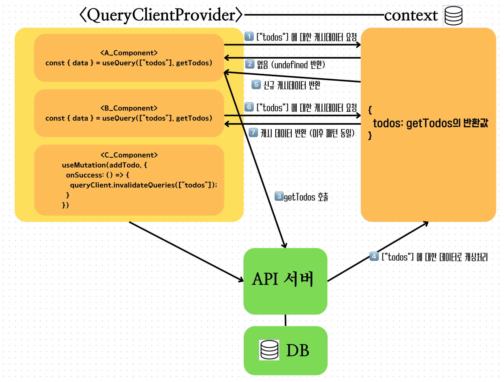

> 이전 포스팅에서 Tanstack Query 를 사용하는 간단한 예시를 살펴보았다.
> useQuery() 를 통해 Read, useMutation() 을 이용해 Create 동작을 구현해보았다.
> 이후, invalidateQueries() 로 캐시 데이터에 변화가 생기면 이를 반영하도록 만들었다.
> 이것이 어떤 원리로 동작하는 걸까?

## SWR 이란?

Stale-While-Revalidate(SWR)은 최신 데이터가 도착하기 전까지 `기존 캐시 데이터를 사용`하는 전략이다.

\*Stale: 오래된, 냄새가 나는

SWR은 stale time 이내의 짧은 시간에 동일한 요청이 반복될 시, 기존의 캐시 데이터를 사용한다.
그 보다 간격이 길다면 기존 캐시 데이터를 사용하다가 새로운 데이터가 도착하면 캐시 데이터에 새로 반영하는 방법이 되겠다.

## 캐시 데이터 저장소

그렇다면, 캐시 데이터를 전역적으로 사용하게 해주는 원리는 무엇일까?

Tanstack-Query 는 React Context API를 사용해 구현이 되어있다.
그래서, 전역적으로 캐시 데이터를 사용할 수 있는 것이다!



v4 버전 기준이지만, 좋은 자료인 것 같아 가져왔다.

## Stale Time 이란??

캐시 데이터가 최신 상태(fresh)인지, 이전 상태(stale)인지 구분하는 경과 시간이 되겠다.

만약, staleTime 이 0 초라면 데이터를 fetch 한 직후 stale 로 바뀔 것이다.

하지만 stale 이라고 해서 데이터를 지우지 않고 가지고 있는다.
이후 refetch 를 통해 업데이트하는 것이다.

이때, 현재 페이지에서 사용하지 않는 경우(컴포넌트 unmount 등)에는 inactive 상태로 존재한다.

계속해서 사용하지 않는 경우, 정해진 cacheTime(gcTime)까지 지난 경우 삭제하게 된다.

## Tanstack Query 의 생명주기

| 상태     | 설명                                                                             |
| -------- | -------------------------------------------------------------------------------- |
| fresh    | 데이터를 새로 패칭할 필요가 없는 상태. staleTime 이 지나지 않아 그대로 사용 가능 |
| stale    | staleTime 이 지나 새로운 데이터를 가져와야하는 상태                              |
| active   | 현재 컴포넌트에서 사용하고 있는 쿼리 상태                                        |
| inactive | 더 이상 사용하지 않는 쿼리 상태, 컴포넌트 unmount 시 해당                        |
| deleted  | 캐시에서 제거한 쿼리 상태, gcTime 이 지나면 이에 해당                            |
| fetching | 데이터를 서버에서 가져오고 있는 상태, isFetching === true 로 설정됨              |

## Tanstack Query 에서 기본 설정 값

| 기본 설정                   | 의미                                                                                                                 |
| --------------------------- | -------------------------------------------------------------------------------------------------------------------- |
| staleTime: 0                | useQuery 또는 useInfiniteQuery 에 등록한 queryFn 을 통해 fetch 한 데이터는 즉시 stale                                |
| refetchOnMount: true        | 컴포넌트 mount 시 stale data refetch                                                                                 |
| refetchOnWindowsFocus: true | 실행중인 브라우저 화면을 focus 할 때 마다 stale data refetch                                                         |
| refetchOnReconnect: true    | Network 가 끊겼다가 재연결되었을 때 stale data refetch                                                               |
| gcTime(cacheTime): 5min     | 컴포넌트 unmount 시 쿼리 상태가 있다면 inactive query가 됨. 이후 5min 이상 상태가 유지되면 가비지 컬렉터가 삭제 처리 |
| retry: 3                    | queryFn 이 데이터를 정상적으로 가져오지 못할 경우 최대 3번까지 시도                                                  |

## 옵션 설정 방법

만약, 공통적으로 모든 query 에 대해 설정을 적용하려면 new 연산자를 사용해 생성한 곳에서 이렇게 설정해주면 된다.

```jsx
const queryClient = new QueryClient({
  defaultOptions: {
    queries: {
      // staleTime 5초, 5000ms
      staleTime: 5000,
      // 컴포넌트 Mount 시 refetch
      refetchOnMount: true,
      // 네트워크 연결이 될 시 refetch
      refetchOnReconnect: true,
      // 탭이 비활성화되었다가 활성화 될 시 refetch
      refetchOnWindowFocus: true
      // API 호출 시도 횟수
      retry: 2
    }
  }
});
```

그렇지 않고, query 요청을 보내는 컴포넌트 마다 다르게 설정하고 싶다면 물론 가능하다.

```jsx
const {
  data: todos,
  isLoading,
  isError
} = useQuery({
  // queryKey 를 한 번 가져오고 난 뒤 변경이 생기기 전까지는 캐싱한다는 말??
  queryKey: ["todos"],
  // queryFn: () => {},
  queryFn: fetchTodos,
  // staleTime 5초, 5000ms
  staleTime: 5000,
  // 컴포넌트 Mount 시 refetch
  refetchOnMount: true,
  // 네트워크 연결이 될 시 refetch
  refetchOnReconnect: true,
  // 탭이 비활성화되었다가 활성화 될 시 refetch
  refetchOnWindowFocus: true
  // API 호출 시도 횟수
  retry: 2
});
```

`useQuery()` 에서 데이터를 가져올 때 설정해주면 된다.

## Tanstack Query Devtools

Tanstack Query 는 개발자도구를 지원한다!

```sh
yarn add @tanstack/react-query-devtools
```

이후, queryClinet 를 작성한 파일에서 아래와 같이 추가해주면 된다.

```jsx
import React from "react";
import ReactDOM from "react-dom/client";
import App from "./App.jsx";
import "./index.css";
import { QueryClient, QueryClientProvider } from "@tanstack/react-query";
// ✨ 추가한 부분
import { ReactQueryDevtools } from "@tanstack/react-query-devtools";

const queryClient = new QueryClient();

ReactDOM.createRoot(document.getElementById("root")).render(
  <React.StrictMode>
    <QueryClientProvider client={queryClient}>
      {/* ✨ 추가한 부분 */}
      <ReactQueryDevtools initialIsOpen={false} />
      <App />
    </QueryClientProvider>
  </React.StrictMode>
);
```
