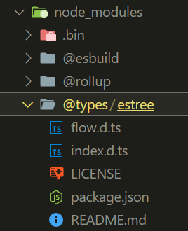

> 이제 TypeScript 를 마주했다!
> 간단한 설치법 부터, 기본 설정과 관련해서 내용을 정리해보았다.

## TypeScript 란?

다음과 같이 JavaScript 가 가진 약점들을 보완하기 위해 등장했다.

- 런타임 시에 결정되는 변수 타입
- 약한 타입 체크 등 느슨한 규칙

JS의 단점을 알 수 있는 아래 얘시를 보자.

```javascript
const obj = { latitude: 11.5, longitude: 47.1 };
const result = obj.latitude * obj.longitute; // 보통은 이런 실수는 컴파일러가 잡아줘야 되는데
console.log(result); // NaN이라는 엉뚱한 값 출현!
```

이렇게, 오타가 나서 존재하지 않는 값을 참조해도 오류를 일으키지 않는다.

그래서 때로는 디버깅이 어려워지는 문제도 있다.

또한 이런 상황도 있을 것이다.

```javascript
function add(a, b) {
  return a + b;
}

const result = add(1, "2");

console.log(result); // "12"
console.log("result type: ", typeof result); // "string"
```

`add` 함수의 동작은 숫자에 대한 덧셈 연산 결과를 제공하는 것이 목적인데,
인수로 숫자가 아닌 자료형이 들어오더라도 그대로 연산을 진행해버린다는 것이다.

코드의 흐름이 내가 원하지 않는 방향으로 흘러갈 수 있다는 문제점도 있다.

## TypeScript 개발환경 구축

1. NVM 설치 링크[1] 에 접속한다.
2. 스크롤을 내려 Assets 섹션에서 nvm-setup.exe 를 다운로드 받아 설치한다.
3. 설치 완료한 후, 터미널에 접속해 Node 18 이상의 버전을 설치해준다.
4. 나는 20 을 사용함 -> `nvm install 20`
5. 이후 `nvm use [버전]` 을 통해 설치한 버전을 사용해준다.
6. `npm install typescript -g` 을 입력해 Node 전역 환경에 TypeScript 설치를 한다.
7. `tsc` 를 입력한 뒤 명령어 실행이 된다면 끝!
8. `npm create vite` 를 진행하면 이후 설정은 똑같다.

## tsconfig.json

TypeScript 프로젝트 설정 파일이다.
주로 컴파일 옵션을 정의할 때 사용한다.

아래는 내가 작성한 옵션들이다!

```json
{
  "compilerOptions": {
    // target: 컴파일러가 TypeScript 프로젝트 내의 코드들을 어떤 JavaScript 버전으로 변환할지 설정
    "target": "ES2016",
    "useDefineForClassFields": true,
    // module: TypeScript 파일을 컴파일 후 생성하는 JavaScript 모듈의 형식, 어떤 것인지 정리하면 좋을 듯
    "module": "ESNext",
    "lib": ["ES2020", "DOM", "DOM.Iterable"],
    "skipLibCheck": true,
    // TypeScript 코드가 어떤 JavaScript 로 변환되었는지 확인할 수 있게 Map 을 생성하는 것!
    // 따라서 에러가 발생했을 때 TypeScript 코드 상 어떤 부분에서 오류가 났는지 확인 가능!
    // 하지만 개발환경에서만 사용하는 것을 추천.
    "sourceMap": true,
    // outDir: 컴파일 후 변환한 JavaScript 파일은 어디에 생성할지 경로 지정
    "outDir": "dist",

    /* Bundler mode */
    "moduleResolution": "bundler",
    "noEmit": true,
    "allowImportingTsExtensions": true,
    "resolveJsonModule": true,
    "isolatedModules": true,

    /* JavaScript Support */
    // TypeScript 프로젝트에 JavaScript 파일 허용 여부
    "allowJs": true,
    "checkJs": true,
    "jsx": "react-jsx",

    /* Linting */
    // strict: 엄격한 타입 검사 옵션 활성화, 아래 옵션들이 활성화됨.
    // strictNullChecks: 잠재적으로 null(undefined)이 될 수 있는 값들을 확인
    // strictFunctionTypes:
    // strictBindCallApply:
    // strcitPropertyInitialization:
    // noImplicitAny: type 을 명시하지 않은 경우, 컴파일러가 임의로 Any 를 부여하는 것을 막음.
    // noImplicitThis:
    // alwaysStrict:
    "strict": true,
    "noUnusedLocals": true,
    "noUnusedParameters": true,
    "noFallthroughCasesInSwitch": true
  },
  // 컴파일 시 포함할 경로
  "include": ["src/*"],
  // 컴파일 시 제외할 경로
  "exclude": ["node_modules", "dist"]
}
```

일단 기본 설정이다.

## .d.ts

> .d.ts 파일은 JavaScript 라이브러리도 TypeScript 코드에서 사용할 수 있게 해준다!



프로젝트를 생성하고 나니 `node_modules/@types` 내부에 이런 파일이 있었다.

`.d.ts` 파일은 **TypeScript 타입 정의 파일**이다.  
즉, JavaScript 라이브러리에 대한 타입 정보를 제공하며 이런 파일들은 아래와 같은 역할을 한다.

- `.d.ts` 파일로 TypeScript 컴파일러는 다음을 알 수 있다! [**💪💪💪**](https://emojipedia.org/flexed-biceps/)
  - 외부 라이브러리의 함수 타입 정보
  - 외부 라이브러리 클래스 타입 정보
  - 외부 라이브러리 객체 타입 정보
- 뿐만 아니라, `.d.ts` 파일로 외부 라이브러리의 **타입 추론**도 가능.
  - 타입 추론이란 **타입이 명시가 되지 않았을 때 컴파일러가 알아서 해당 타입에 대해 추론을 하는 것**.

[1]: https://github.com/coreybutler/nvm-windows/releases
