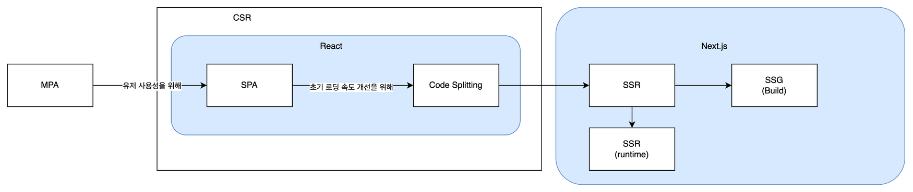
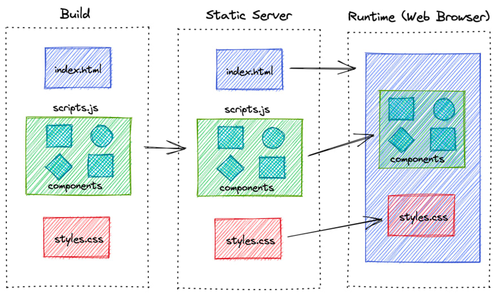
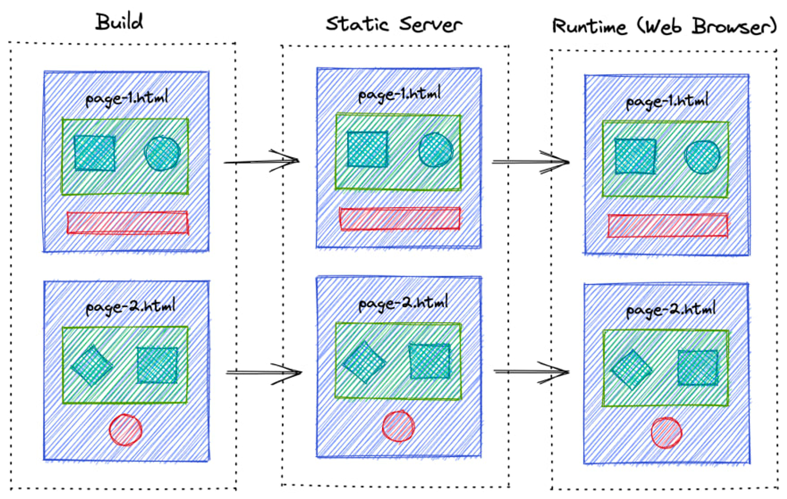
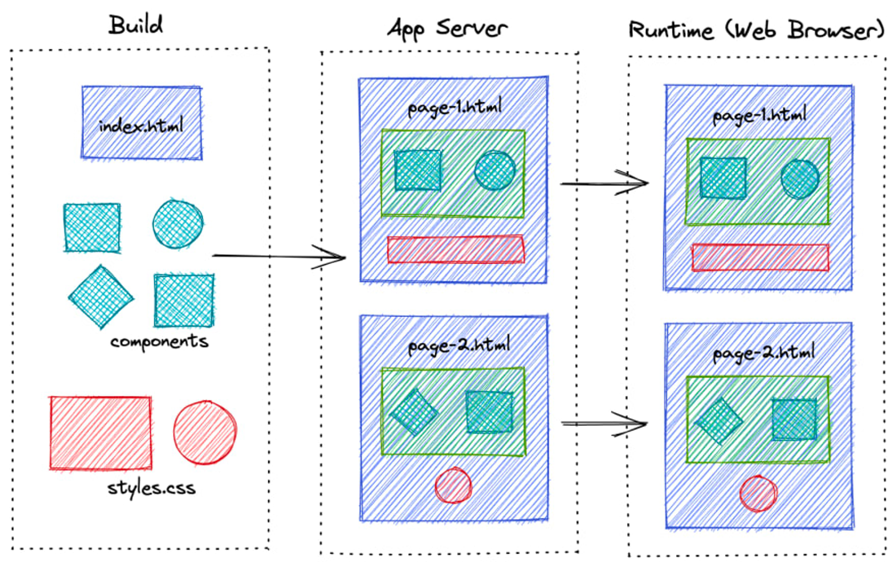

> Web FrameWork 인 Next js 에 대해서 다루어볼 차례가 됐다!

## Next.js 란?

리액트 기반 웹 프레임워크로서, React 를 확장해 다양한 기능을 제공한다.

## Next.js 에서 제공하는 대표적인 기능

1. 다양한 렌더링 기법: CSR, SSR, SSG, ISR
2. 라우팅: 파일(폴더) 기반 라우팅
3. Route Handler: 백엔드 구현 가능
4. 스타일링: CSS, Sass, CSS-in-JS
5. 최적화, 번들링
   - 코드 스플리팅, 이미지 최적화, 웹팩 설정 등

## 코드 스플리팅?

React 의 단점은, 페이지 초기 렌더링 시 로딩 시간이 다소 길다는 문제가 있었다. => Time To View(TTV) 가 길다.
이는 웹 사이트 전체 코드를 한 번에 다운로드 받아 처리하기 때문에 발생하는 현상이었다!

코드 스플리팅은 이를 극복하기 위한 방법으로, 방문하지 않는 페이지는 코드를 다운로드 받지 않도록 해 TTV 를 단축한다!
이를 위해 개발자가 별도로 설정할 필요 없이, 컴포넌트를 하나의 파일로 만들어서 분리를 해두면 Next js 에서 알아서 처리를 해준다.

## 페이지 라우터 vs 앱 라우터

여기에서 말하는 라우팅은 react-router-dom 을 통해 구현한 라우팅과 동일하다!

먼저, 페이지 라우팅은 page 폴더에 원하는 페이지의 파일을 배치해 라우팅이 이루어지는 방식이다.

```plaintext
├─ src
│  ├─ pages
│  │  ├─ about.js
│  │  ├─ index.js
│  │  └─ team.js
```

이렇게 구성하게 되면 페이지 라우팅 방식인 것이다.

이와 달리 앱 라우팅 방식은
app 폴더 하위에 구성한 폴더 명을 기반으로 자동 라우팅 처리가 된다.
그래서 앱 라우터 라고 부른댄다!

```plaintext
├─ src
│  ├─ app
|  |  ├─ main
│  │  |  └─ index.js
|  |  ├─ about
│  │  |  └─ about.js
│  │  └─ team.js
```

둘 중 어떤 방식이든 비슷하니 뭐가 더 좋은지는 일단 넘어가보자!

## 렌더링

초기에 사용했던 방식에서부터 React 를 거쳐 Next.js 까지 간단히 살펴보자!



## MPA, 원시적인 방법

```plaintext
/about -> about.html
/profile -> profile.html
```

위 경로로 이동할 시, 해당하는 html 파일이 존재하는 방식이다.
이동할 때 마다 html 파일을 불러와서 보여줘야하는데, 이 때 깜빡거리게 되는 현상이 있어 자연스럽지 못해 UX 가 저하된다.

따라서, 이를 해결하기 위해 등장했던 것이 React, Vuew, Angular 등의 SPA(Single Page Application)이 등장했다!

## SPA, 개선안

기존의 MPA 를 완전히 뒤집는 방식으로,
`index.html` 내에 root 라는 id 를 가진 div 단 하나만 다운로드하고 javascript 로 모든 UI 를 구성하는 방법이 등장했다!

이를 통해 페이지 전환 시 깜빡이는 문제가 해결되어 UX 가 크게 향상되었다.

다만, 초기 로딩이 오래걸려 다른 방면으로 UX 저하가 나타나게 되었다.
문제를 해결하기 위해서, 코드 스플리팅을 통해 해결하려고 했다.

React 에서 제공하는 `<Suspense></Suspense>` 가 대표적인데,
이 기능은 Suspense 내부에 있는 요소들이 로딩이 끝나기 전까지 대신 출력할 UI 를 설정할 수 있는 방식이다.

또는, 하나로 번들링 된 코드를 한 번에 불러오는 것이 아니라 필요하지 않다면 나중에 필요할 때 불러오게 만드는 방식도 있다!

## 주요 렌더링 기법

- CSR(Client Side Rendering)
  

  - 특징
    - 순수 리액트 사용했을 때 100%
    - 브라우저에서 JavaScript를 이용해 동적으로 페이지를 렌더링하는 방식
    - 렌더링의 주체 : 클라이언트
  - 장점
    - (최초 한번 로드가 끝나면) 사용자와의 상호작용이 빠르고 부드러움
    - 서버에게 추가적인 요청을 보낼 필요가 없기 때문에, 사용자 경험이 좋음!
    - 서버 부하가 적음
  - 단점
    - 첫 페이지 로딩 시간(Time To View)이 길 수 있다.
    - JavaScript가 로딩되고 실행될 때까지 페이지가 비어있어 검색 엔진 최적화(SEO)에 불리 => 검색 엔진이 파싱할 때, `<div id="root"></div>` 밖에 존재하지 않는 것으로 인식함.

- SSG(Static Site Generation)
  

  - 특징
    - 서버에서 페이지를 렌더링하여 클라이언트에게 HTML을 전달하는 방식
    - 따라서, **최초 빌드시에만 생성이 됨**
    - 사전에 미리 정적페이지를 여러개 만들어놓음 -> 클라이언트가 홈페이지 요청을 하면, 서버에서는 이미 만들어져있는 사이트를 바로 제공! -> 클라이언트는 이미 만들어진 문서를 브라우저 렌더링만 함
  - 장점
    - 첫 페이지 로딩 시간이 매우 짧아(TTV) 사용자가 빠르게 페이지를 볼 수 있다.
    - 또한, CSR에 비해 SEO에 유리. CSR 과 달리 검색 엔진이 완성된 페이지를 파싱하기 때문!
    - CDN(Content Delivery Network) 캐싱 가능
  - 단점
    - 정적인 데이터에만 사용할 수 있음
    - 사용자와의 상호작용이 서버와의 통신에 의존하므로, 클라이언트 사이드 렌더링보다 상호작용이 느릴 수 있다
    - 또한, 미리 페이지를 생성하기 때문에 서버 부하가 클 수 있음
    - 마이페이지 처럼 데이터에 의존하여 화면을 그려주는 경우 사용 불가

- ISR(Incremental Static Regeneration)
  

  - 특징
    - SSG처럼 정적 페이지를 제공
    - 설정한 주기만큼 페이지를 계속 생성해 줌
      - ex : 주기가 10분이라면? → 10분마다 데이터베이스 또는 외부 영향 때문에 변경된 사항을 반영하는 역할
    - 정적 페이지를 먼저 보여주고, 필요에 따라 서버에서 페이지를 재생성하는 방식
  - 장점
    - 정적 페이지를 먼저 제공하므로 사용자 경험이 좋으며, 콘텐츠가 변경되었을 때 서버에서 페이지를 재생성하므로 최신 상태를 (그나마) 유지할 수 있다.
    - CDN 캐싱 가능
  - 단점
    - 실시간 페이지 아니며 동적인 콘텐츠를 다루기에 한계가 있을 수 있음
    - 마이페이지 처럼 데이터에 의존하여 동적으로 화면을 그려주는 경우 사용 불가

- SSR(Server Side Rendering)
  

  - 특징
    - 빌드 시점에 모든 페이지를 미리 생성하여 서버 부하를 줄이는 방식
    - SSG, ISR처럼 렌더링 주체가 서버!
    - 클라이언트의 요청 시 렌더링
      - Clinet → Server : 이 페이지 줘!
      - Server → Client : (데이터베이스 읽고 등등 한 후) html 파일을 제공
  - 장점
    - 빠른 로딩 속도(TTV)와 높은 보안성을 제공
    - SEO 최적화 좋음
    - 실시간 데이터를 사용
    - 마이페이지 처럼 데이터에 의존한 페이지 구성 가능
    - CDN 캐싱 불가
  - 단점
    - 사이트의 콘텐츠가 변경되면 전체 사이트를 다시 빌드해야 하는데, 이 과정이 시간이 오래 걸릴 수 있다 → **_서버 과부하_**
    - 요청할 때 마다 페이지를 만들어야 함

|                              | CSR  | SSR  | SSG  | ISR          |
| ---------------------------- | ---- | ---- | ---- | ------------ |
| 빌드 시간                    | 짧음 | 짧음 | 긺   | 긺           |
| SEO                          | 나쁨 | 좋음 | 좋음 | 좋음         |
| 페이지 요청에 따른 응답 시간 | 보통 | 긺   | 짧음 | 짧음         |
| 최신 데이터 즉시 반영        | 가능 | 가능 | 불가 | 아닐 수 있음 |
