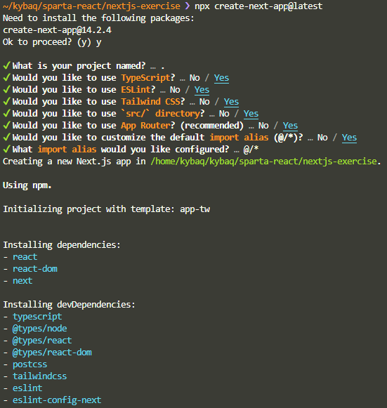
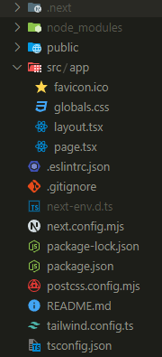
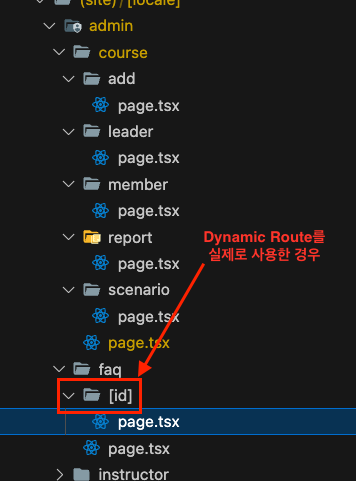
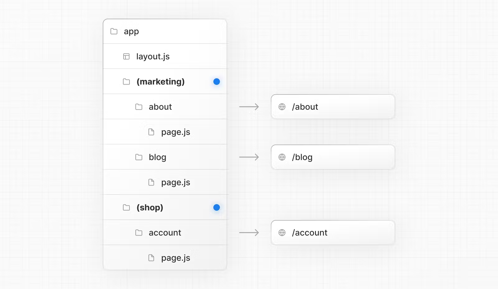

> 이제 Next.js 를 사용해보자!

## 설치

```sh
npx create-next-app@latest
```

create-next-app 을 통해 설치하기를 권장하고 있다.

이렇게 설치하고 나면 아래와 같은 터미널 프롬프트가 출력된다.



이후 프로젝트 파일 구조는 아래와 같이 생성된다.



## 라우팅 과정


- **Tree**
  - 계층 구조를 시각적으로 잘 보기 위한 규칙(위 → 아래). DOM tree와 비슷
- **Subtree**
  - tree의 한 부분
  - root부터 시작해서 leaf들에 이르기까지의 범위
- **Root**
  - Tree 또는 Subtree의 첫 번째 노드
- **Leaf**
  - children이 더이상 없는 node

위 예시에서는, 최상위 app 디렉토리 내부에 2개의 디렉토리가 존재하는 것이다.

1. /blog
2. /dashboard

만약 blog 디렉토리에 존재하는 `page.tsx` 의 내용을 보고싶다면 `www.sample-web.com/blog` 로 접근하면 된다!
dashboard 디렉토리의 내용을 보고싶은 경우, `www.sample-web.com/dashboard/analytics` or `www.sample-web.com/dashboard/settings` 로 접근하면 하위 디렉토리도 접근이 가능하다!


- **URL Segment**
  - 슬래시(/)로 분류된 URL path의 한 부분
- **URL Path**
  - 도메인(`www.sample-web.com`) 이후 따라오는 전체 URL 부분

❗참고해야할 것: 반드시 `page.tsx` 로 생성해야 next.js 에서 올바르게 인식한다!❗

### Static Routing

정적 라우팅의 경우, 이미 위 에서 /blog 와 /dashboard 경로를 통해 이루어진다는 것을 확인했다.

### Dynamic Routing

동적 라우팅의 경우, react-router-dom 을 이용할 때 아래처럼 구현 했었다!

```jsx
import React from "react";
import { BrowserRouter, Route, Routes } from "react-router-dom";
import Home from "../pages/Home";
import About from "../pages/About";
import Contact from "../pages/Contact";
import Works from "../pages/Works";
import Product from "../pages/Product";

const Router = () => {
  return (
    <BrowserRouter>
      <Routes>
        <Route path="/" element={<Home />} />
        <Route path="/about" element={<About />} />
        <Route path="/contact" element={<Contact />} />
        <Route path="/works" element={<Works />} />
        <Route path="/products/:id" element={<Product />} />
      </Routes>
    </BrowserRouter>
  );
};

export default Router;
```

"/products/:id" 같이 동적으로 id 값이 주어진다면, next.js 에서는 단순히 `[id]` 디렉토리를 내부에 하나 더 만들어 주면 된다!



물론, 추가로 처리할 것이 있다.
동적 라우팅이 필요한 페이지 컴포넌트에서 props 로 값을 받아주어야 한다.

```tsx
// app>test>[id]>page.tsx
import React from "react";

const TestDetailPage = ({
  // id 값을 props 로 전달 받도록 만들어 주어야 한다!
  params
}: {
  params: {
    id: string;
  };
}) => {
  return <div>Detail 페이지 : {params.id}</div>;
};

export default TestDetailPage;
```

디렉토리만 만들면 자동으로 라우팅이 일어나게 된다.

그런데, 우리가 프로젝트를 하면서 편의를 위해 라우팅에는 영향을 주지 않고 디렉토리를 만들고 싶을 때가 있을 것이다.

그럴 땐 이렇게 하면 된다!

### Route Groups

디렉토리 이름을 (), 소괄호로 감싸주면 라우팅에서 제외가 된다!



/about 디렉토리 상위에 (marketing) 디렉토리가 존재하지만, /about 이라는 경로로 접근하면 문제없이 /about/page.tsx 의 내용이 나타난다!

## layout

layout.tsx 파일은 해당 디렉토리 내의 모든 요소들에 공통적으로 적용할 UI 를 정의하는 파일이다.
따라서, props 에 children 이 존재해야한다!

특징은 동일한 layout 내의 다른 경로로 이동하더라도 re-rendering 이 일어나지 않는다는 것이다!
따라서, header 나 nav 같은 요소를 적용할 때 유용할 것이다!

## template

template.tsx 파일은 layout.tsx 와 비슷하지만 다른 경로로 이동하면 re-rendering 이 계속해서 일어나게 된다!
조금 더 정확히는, 경로를 이동할 때 마다 해당 template 이 다시 생성되는 것이다.

## not-found

Next.js 에서는 존재하지 않는 경로로 접근했을 때 표시해줄 404 페이지를 기본으로 제공하고 있다.
이때, not-found.tsx 파일을 프로젝트 최상위 경로(/app) 내에 생성해주면 404 not-found 페이지를 커스텀할 수 있다!

## metadata && SEO

검색 엔진 최적화를 위해, Next.js 에서는 page.tsx 별로 metadata 를 추가할 수 있다!
하지만, 이렇게 하게되면 해당 페이지에만 단독 적용이 된다.

만약 layout.tsx 에 metadata 를 추가한다면, 해당 layout 을 사용하는 모든 페이지는 이 metadata 를 갖게 되는 것이다!

## Link

Next.js 의 Link 는 **prefetching** 을 지원한다!
아주 중요한 개념인데, 뷰포트에 `<Link>` 컴포넌트가 나타난다면 미리 데이터를 로드해두어 사용자가 링크로 이동할 시 빠르게 페이지를 보여줄 수 있게 만든다!

두 번째로, **client-side navigation** 을 지원한다.
이는 HTML 을 서버에서 가져오는 것이 아니라, 클라이언트가 데이터만 받아온 뒤 렌더링까지 진행한다!

## Router(useRouter)

Next.js 에서 페이지 이동을 하게 만드는 방법 3가지 정도가 존재한다.

1. a태그 vs Link vs Router

   - a태그
     - 순수 HTML 요소
     - 완전한 새 페이지로 전환을 원할 때 : 페이지는 완전히 새로고침 됨
     - 빈 화면 보일 수 있음 ⇒ UX 좋지 않음
   - Link태그
     - 위 설명 참조
     - 결국 Link 태그는 a 태그를 만들어내기 때문에 SEO가 유리
     - 클릭 즉시 페이지 이동
   - Router(useRouter) => 리액트의 useNavigate 를 떠올리면 좋다
     `☝ useRouter를 사용할 때는 항상 코드 최상단에 “use client” 를 삽입해야한다.`
     - a 태그를 알아차릴 수 없기 때문에 크롤러 입장에서는 해당 요소가 ‘이동을 원한다’라는 것을 알 수 없음 ⇒ SEO 불리
     - 대부분 onClick 같은 이벤트 핸들러에서 사용
     - 클릭 후 로직의 순서에 따라 실행하므로, 즉시 이동이 아님

```jsx
"use client";

import { useRouter } from "next/navigation";

export default function Test () {
	const router = useRouter();

	const handleButtonClick = () => {
		로직1();
		로직2();

		...

		router.push("/new_location");
	}

	return <button onClick={handleButtonClick}>클릭!</button>
}
```

router 에서 사용할 수 있는 메서드들이 있다. 브라우저의 history stack 와 연관이 있다!

1. router.push
   - 새로운 URL을 히스토리 스택에 추가
   - 사용자가 router.push로 페이지를 이동하면, 이동한 페이지의 URL이 히스토리 스택의 맨 위에 쌓인다.
   - 이후 사용자가 브라우저의 '뒤로 가기' 버튼을 클릭하면, 스택에서 가장 최근에 추가된 URL로부터 이전 페이지(URL)로 돌아감
2. router.replace
   - 현재 URL을 히스토리 스택에서 새로운 URL로 대체
   - 현재 페이지의 URL이 새로운 URL로 교체되며, '뒤로 가기'를 클릭했을 때 이전 페이지로 이동하지만, 교체된 페이지로는 돌아갈 수 없다.
   - 현재 페이지를 히스토리에서 완전히 대체
3. router.back
   - 사용자를 히스토리 스택에서 한 단계 뒤로 이동
   - 마치 브라우저의 '뒤로 가기' 버튼을 클릭한 것과 같은 효과를 내며, 사용자를 이전에 방문했던 페이지로 돌아가게 함
4. router.reload
   - 현재 페이지를 새로고침
   - 히스토리 스택에 영향을 미치지 않으며, 페이지의 데이터를 최신 상태로 업데이트하고 싶을 때 사용할 수 있다.
