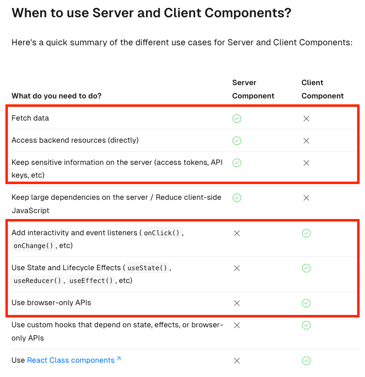

> Next.js 에서 컴포넌트 렌더링이 어떻게 이루어지는지 알아보자.

Next.js 13 버전 이후 부터는 리액트 처럼 컴포넌트 단위로 렌더링이 이루어지게 됐다.

그런데, 여기서 컴포넌트의 구분이 생겼는데

1. 서버 컴포넌트(Server Component)
2. 클라이언트 컴포넌트(Client Component)

이렇게 2개로 구분할 수 있다.

일단 기본적으로, Next.js 에서는 아무 설정을 하지 않는다면 app/ 디렉토리 하위의 모든 컴포넌트는 서버 컴포넌트로 설정된다!

## 서버 컴포넌트

```jsx
// src>app>page.tsx
export default function Home() {
  console.log("여기는 어디일까요?");

  return <div className="p-8">안녕하세요! 리액트.. 아니아니 넥스트입니다!</div>;
}
```

이런 코드가 있을 때, `console.log()` 가 어디에 출력되는지 확인해보자.

브라우저에서 출력이 될 것 같지만, 터미널에서 `console.log()` 가 실행이 될 것이다.

## 클라이언트 컴포넌트

그렇다면, 이를 원래 우리에게 익숙한 대로 브라우저에서 실행되도록 만드려면 무엇이 필요할까?

컴포넌트 코드 최상단에 `"use client"` 를 추가하는 것이다.

```jsx
"use client";

// src>app>page.tsx
export default function Home() {
  console.log("여기는 어디일까요?");

  return <div className="p-8">안녕하세요! 리액트.. 아니아니 넥스트입니다!</div>;
}
```

이렇게 추가해주면, 다시 브라우저 콘솔에서 출력이 되는 것이다.

서버 컴포넌트와 클라이언트 컴포넌트를 이렇게 이해해보았다.

그렇다면, 언제 서버 컴포넌트로 설정하고 언제 클라이언트 컴포넌트로 설정해야할까??

이는 공식문서를 참고해보자.



## 렌더링 방식 again

1. SSG(Static Site Generation) -> build time 에만 컴포넌트를 생성하고, 이후는 변하지 않는 페이지로 가정해 정적 컴포넌트를 제공, Next.js 에서의 기본값으로 사용
2. ISR(Incremental Site Regeneration) -> bulid time 에 컴포넌트를 초기 생성하고, 이후는 일정 주기마다 변화를 적용해 컴포넌트를 제공하는 방식
3. SSR(Server Side Rendering) -> bulid time 에 컴포넌트를 초기 생성하고, 컴포넌트 요청이 있을 때 마다 데이터를 갱신해서 가장 최신 데이터를 user 에게 제공
4. CSR(Client Side Rendering) -> build time 에 컴포넌트를 **생성하지 않는다**. jsx, tsx 파일을 다운로드 받은 뒤에야 화면이 그려진다. 일반적인 리액트 사용시에 흐름을 생각하면 됨

이 4가지를 구분하는 방법은, fetch 에 옵션에 따라 달라지게 되는 것이다!

- SSG 방식

```jsx
import { RandomUser } from "@/types";
import Image from "next/image";
import React from "react";

// SSG TEST : 아무것도 하지 않으면 SSG!
const SSG = async () => {
  // (1) 첫 번째 방법 : 아무 옵션도 부여 x
  // (2) 두 번째 방법 : cache: "force-cache" 옵션 사용
  const response = await fetch(`https://randomuser.me/api`, {
    cache: "force-cache"
  });
  const { results } = await response.json();
  const user: RandomUser = results[0];

  return <div></div>;
};

export default SSG;
```

fetch 에 옵션을 부여하지 않아도, 기본 값이 SSG 로 동작한다. 또는, force-cache 옵션을 부여해도 가능하다.

- ISR 방식

```jsx
import Image from "next/image";
import React from "react";

import type { RandomUser } from "@/types";

const ISR = async () => {
  // (1) 첫 번째 방법: fetch 에 revalidate 옵션 주기
  const response = await fetch(`https://randomuser.me/api`, {
    next: {
      revalidate: 5
    }
  });
  const { results } = await response.json();
  const user: RandomUser = results[0];

  return <div></div>;
};

export default ISR;
```

이외에도 페이지 단위로 revalidate 옵션을 부여하면 ISR 방식이 가능하다!

```jsx
// src>app>rendering.tsx
import ISR from "@/components/rendering/ISR";
import React from "react";

// 이렇게 revalidate 를 적용하는 방법은, page.tsx 에서만 적용이 됨.
// 페이지 전체를 10초마다 reavalidate 하는 것.
export const revalidate = 10;

const RenderingTestPage = () => {
  return (
    <div>
      <h1>4가지 렌더링 방식을 테스트합니다.</h1>
      <ISR />
    </div>
  );
};

export default RenderingTestPage;
```

- SSR 방식

```jsx
// src>components>rendering>SSR.tsx
import Image from "next/image";
import React from "react";

import type { RandomUser } from "@/types";

const SSR = async () => {
  // (1) 첫 번째 방법 : no-cache 옵션
  const response = await fetch(`https://randomuser.me/api`, {
    cache: "no-cache"
  });
  const { results } = await response.json();
  const user: RandomUser = results[0];

  return <div></div>;
};

export default SSR;
```

no-cache 옵션을 사용하면, 요청이 올 때 마다 새로운 데이터를 가져오게 되어 SSR 방식을 구현할 수 있다.

- CSR 방식

```jsx
"use client";

import Image from "next/image";
import React, { useEffect, useState } from "react";

import type { RandomUser } from "@/types";

const CSR = () => {
  const [user, setUser] = (useState < RandomUser) | (null > null);

  useEffect(() => {
    const fetchUser = async () => {
      const response = await fetch(`https://randomuser.me/api`);
      const { results } = await response.json();
      setUser(results[0]);
    };

    fetchUser();
  }, []);

  if (!user) {
    return <div>로딩중...</div>;
  }

  return <div></div>;
};

export default CSR;
```

"use client" 를 최상단에 표기하면, CSR 방식이 구현 가능하다.
리액트 컴포넌트 파일이 다운로드 되면 그때 렌더링이 된다. 사실 리액트만을 사용한다면 이런 방식으로 동작하니 익숙하다!
