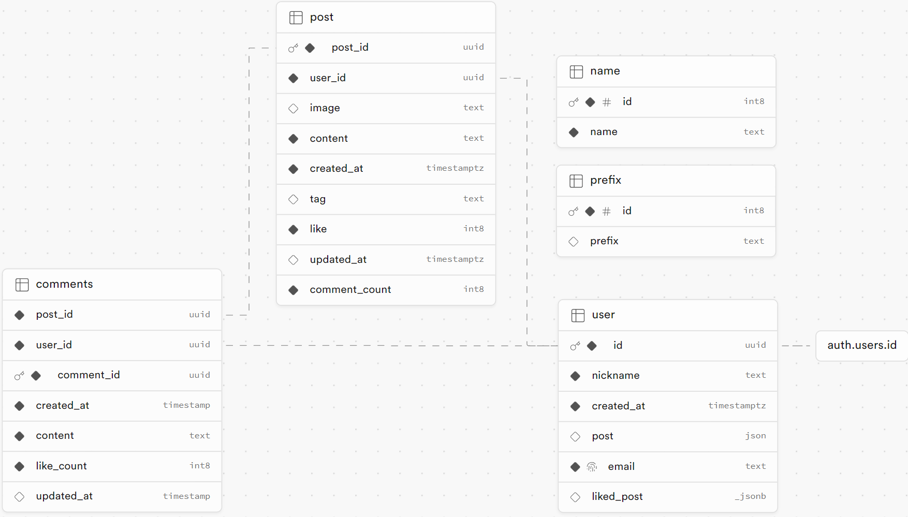

프로젝트를 진행하고, 정리하고 싶은 부분이 있어 간단히 정리해보기로 했다.

좋아요 기능을 구현하는 것에 애로사항이 있었다.

게시글 좋아요를 누르면, DB 에서 게시글에 대한 좋아요 수를 +1 만큼 늘려줘야하고 유저가 좋아요 누른 게시글 목록에 추가해줘야 했다.

Supabase 를 사용하고 있고, 별도의 SQL 문을 작성하기엔 지식이 부족했다.

궁여지책으로 세운 대책은 프론트엔드 단에서 API 요청 시 여러 개의 Table 에 접근해서 데이터 변경을 하는 것이었다.

DB 구성은 아래와 같았다.

