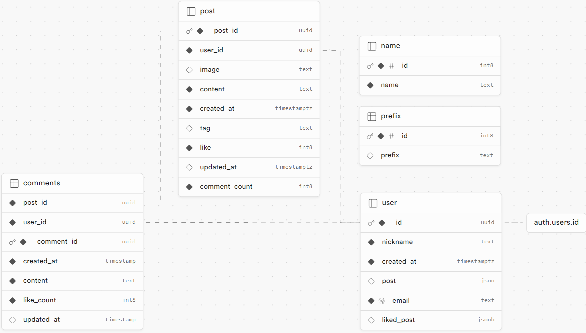

프로젝트를 진행하고, 정리하고 싶은 부분이 있어 간단히 정리해보기로 했다.

좋아요 기능을 구현하는 것에 애로사항이 있었다.

게시글 좋아요를 누르면, DB 에서 게시글에 대한 좋아요 수를 +1 만큼 늘려줘야하고 유저가 좋아요 누른 게시글 목록에 추가해줘야 했다.

Supabase 를 사용하고 있고, 별도의 SQL 문을 작성하기엔 지식이 부족했다.

궁여지책으로 세운 대책은 프론트엔드 단에서 API 요청 시 여러 개의 Table 에 접근해서 데이터 변경을 하는 것이었다.

DB 구성은 아래와 같았다.



좋아요 버튼을 누를 경우, 이 경우에서 처리하는 방식은 아래와 같았다.

1. 현재 로그인 한 유저의 `user_id` 와 좋아요를 누른 게시글의 `post_id` 를 저장한다.
2. `post` 테이블의 `post_id` 항목에서, 1번에서 저장한 `post_id` 와 일치하는 게시글을 찾는다.
3. 해당 게시글의 좋아요 수를 `+1` 만큼 늘린다.
4. 1번에서 저장한 `user_id` 를 이용해, `user` 테이블에서 해당 유저를 찾는다.
5. 4에서 발견한 유저의 정보에서 `liked_post` 항목에 현재 게시글의 `post_id` 를 추가한다.

다만 여기에서 문제가 있었다.

`user_id` 를 통해 여러 테이블에 접근했을 때, 어떤 오류도 발생하지 않고 정상적으로 요청이 보내지고 있음에도 테이블의 수정이 일어나지 않았다.

원인을 파악하지 못해, `user_id` 를 대신해 사용할 수 있는 `email` 항목을 사용해 접근하니 성공적으로 변경이 가능했다.

실제로 구현한 코드는 아래와 같았다.

```tsx
export async function POST(request: Request) {
  const supabase = createClient();
  // 현재 로그인 한 유저의 `user_id` 와 좋아요를 누른 게시글의 `post_id` 를 저장한다.
  const { email, post_id } = await request.json();
  // `post` 테이블의 `post_id` 항목에서, 1번에서 저장한 `post_id` 와 일치하는 게시글을 찾는다.
  const { data: post } = await supabase
    .from("post")
    .select("like")
    .eq("post_id", post_id)
    .single();
  // 해당 게시글의 좋아요 수를 `+1` 만큼 늘린다.
  const { data, error } = await supabase
    .from("post")
    .update({ like: (post?.like || 0) + 1 })
    .eq("post_id", post_id);

  if (error) console.error("error", error);
  // 1번에서 저장한 `user_id` 를 이용해, `user` 테이블에서 해당 유저를 찾는다.
  const { data: liked, error: userError } = await supabase
    .from("user")
    .select("liked_post")
    .eq("email", email)
    .single();

  const likedPosts = liked?.liked_post ? liked.liked_post : [];

  const {} = await supabase
    .from("user")
    .update({ liked_post: [...likedPosts!, post_id] })
    .eq("email", email);

  return NextResponse.json({ data });
}
```

하지만, 3번 항목과 5번 항목에서 한계가 존재했다.

좋아요 취소할 시, 현재 수에서 `-1` 만큼 연산을 해줘야하고 5번의 경우 좋아요를 위한 별도의 테이블이 없어 관심사 분리가 잘 되지 않았다.

여러모로 아쉬움이 많이 남는 프로젝트였다.

## 이외에도 해결하지 못한 문제

좋아요 수 실시간 반영

오류 : 좋아요 버튼을 누르더라도 실시간으로 반영이 되지 않는 문제

원인 : supabase 에서 `post` 테이블의 값이 변하는 상황을 감지하지 못해서 갱신이 안되는 현상으로 파악

좋아요 취소 기능

오류 : 이미 좋아요를 누른 상태여도 계속해서 중복 좋아요가 되는 문제

원인 : supabase 에서 `user` 테이블의 `liked_post` 항목에서 `post_id` 중복을 막는 기능이 필요한 것으로 파악

유저가 좋아요 누른 게시글의 버튼 UI 수정

오류 : 이미 좋아요를 누른 게시글이지만 새로 고침 시 좋아요를 누르지 않은 상태의 UI 가 나타남

원인 : 좋아요 누른 게시글의 목록을 가져오지 않고, 상태 관리를 통해 UI 조건부 렌더링을 적용해야할 것으로 파악
