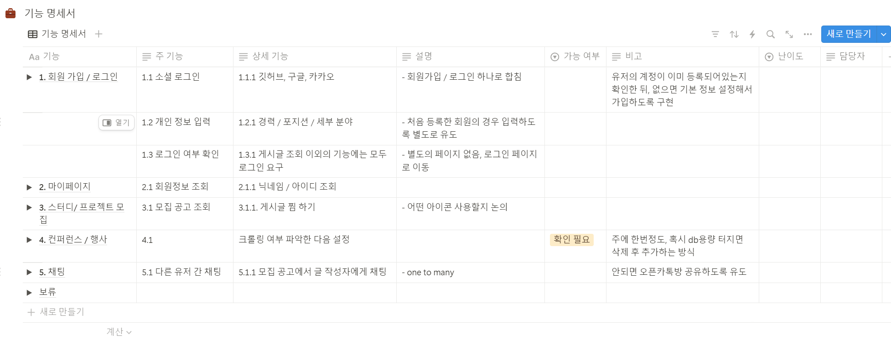

> 최종 프로젝트를 시작해서, 하루 동안 했던 일의 기록을 남기기 위해 별 게 없더라도 쥐어 짜내서 정리해보려고 한다!

어제 보다 조금 더 구체적인 내용이 되었다!

## 프로젝트 명(가칭)

프로젝트 방향성, 주제등이 빠르게 정해져 이름도 금방 정한 것 같다!

그렇게 설정한 이름은 바로, **@gather_here** 가 되시겠다.

서비스의 주요 기능이 뭔가 같이할 사람을 찾는 것이다 보니 ‘@’ 를 사용해 멘션하는 것을 차용했다!
또한 ‘gather_here’ 라는 명칭도 직역하면 ‘여기 모이자’ 라는 뜻이니 직관적인 이름이라고 생각이 들었다!

## 기술 명세서 초안 작성

다음으로는, 기술 명세서에 대해서 작성했다.
아래와 같은 목적 때문에 사용하기로 했다!

1. MVP 설정
2. 기능 별로 페이지 구분을 위해
3. 기능 별로 난이도 파악 후 전체 개발 일정을 파악하기 위해
4. 추후 테스트 시 누락된 기능이 있는지 파악하기 위해

## 기술 명세서 보완

기술 명세서 초안을 가지고, 팀원들과 보완을 하는 중이다.

현재 회원가입 / 로그인 부분에 대해서 보완을 완료했다.

우선, 서비스를 이용할 시 소셜 로그인으로만 회원가입 / 로그인이 가능하도록 정했다.

소셜 로그인을 사용하는 다른 사이트 들을 살펴보니, 회원가입이나 로그인 과정이 차이가 없었다.

회원 가입을 하지 않은 경우에 소셜 계정으로 로그인을 해도, 회원 가입 처리가 되고 회원가입을 해도 회원가입이 되었다.

우리도 이런 방식을 사용하면 좋을 것 같았다.

물론, 개인 정보 제공 동의 등 여러 약관을 처리할 때 문제가 없는지 추가 확인이 필요하나현재 단계에서는 회원가입 / 로그인을 하나의 버튼으로 처리하도록 설정했다.

내일은 마이 페이지부터 시작해 다른 페이지의 기능 명세서를 보충할 예정이다.
