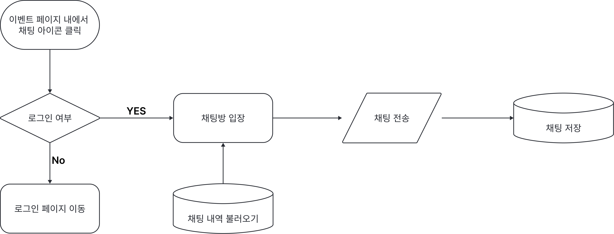

MVP 에 채팅 기능을 포함하도록 결정했다.

이에 따라, 채팅 기능을 어떤 방식으로 제공할 지 논의를 나누었다.
다양한 방법이 후보에 올랐다.

1. 첫 번째
   1. 스터디 / 프로젝트 공고의 경우, 글 게시자 다른 유저 간 1:1 채팅방 개설
   2. 컨퍼런스 / 행사의 경우 인원 제한을 건 오픈 채팅방 자유 개설
2. 두 번째
   1. 스터디 / 프로젝트 / 컨퍼런스 분류와 관계 없이, 게시글 당 한 개의 채팅방만 존재하도록 구현
3. 세 번째(현재 채택)
   1. 스터디 / 프로젝트 공고의 경우 개인 연락처(이메일 등)를 기재하도록 유도
   2. 컨퍼런스의 경우 페이지 내에서 존재하는 단 하나의 채팅방만 사용 ⇒ 모든 유저가 대화 가능
      네이버 스포츠 경기의 오픈 톡 처럼 참여하는 모든 사람이 자유롭게 대화할 수 있도록 구현

그 중 세 번째 방법으로 채택했다.

현재 MVP 에서는 모든 게시글 마다 개별적인 채팅 채널을 갖도록 만드는 것이 어렵다고 판단했다.
채팅 기능을 해본 팀원이 아무도 없었기에, 난이도에 대해 판단이 잘 서지 않았다.

개발 난이도 등을 고려해서 사용자 테스트 이후, 가능하다면 스터디 / 프로젝트에도 채팅을 사용할지 논의하기로 했다.

또한, 기능 명세서를 보완하면서, 추가적으로 플로우 차트를 작성했다.
디자이너 분과 개발진 모두 한 눈에 흐름을 파악할 요소가 있어야할 것 같다는 의견이 있었기 때문이다!

이후 내일은 기능 명세서를 모두 보완한 뒤, 데이터 베이스 구조를 생각해보려고 한다.
