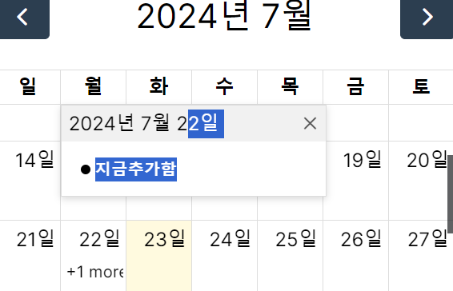
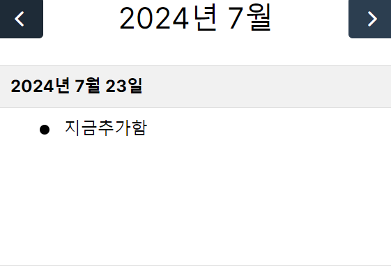

캘린더에서 일정을 표시하는 방법을 수정했다.

일정이 하나라도 존재하는 경우, 일단 더 보기형태로 만들었다.
하지만 더 보기가 있는 것 보다, 아예 일정에 색을 넣어서 표현하는 게 좋아보인다.

그 중간에, 와이어프레임의 break point 를 지정하고 메인 페이지의 전체 컨테이너 크기를 지정했다.

모바일 기기를 구분하는 지점으로는 max 768px, max 1068px 로 설정

이때 적용되는 컨테이너 크기는 다음과 같음.

화면 너비 < 768px 일 경우, 전체 컨테이너는 335px 로 설정.

768px ≤ 화면 너비 < 1068px 일 경우, 전체 컨테이너 크기는 744px 로 설정.

1068px ≤ 화면 너비 일 경우, 전체 컨테이너 크기는 1112xp 로 설정함.

캘린더나 채팅의 경우, 1068px 보다 너비가 작은 경우 모바일로 취급해 처리할 예정이다.

캘린더의 경우 일단 모바일에서는 리스트 형식이 되도록 만들었다.

물론 css 수정이 필요하다 ㅎㅎ;

