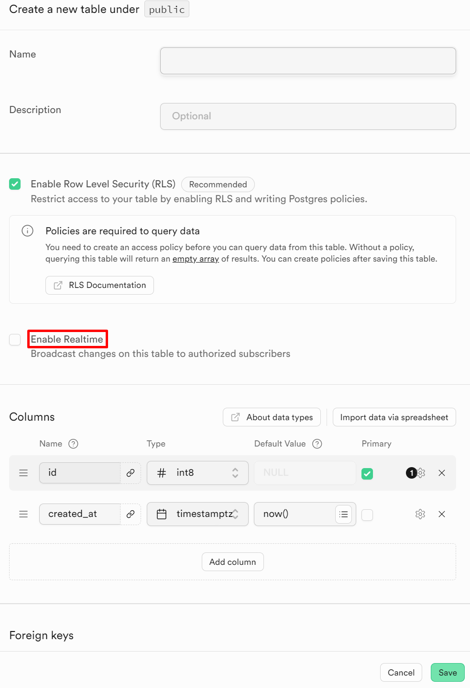

채팅기능 구현을 위해, Supabase 의 Realtime 을 사용하기로 했다.


일단 데이터 베이스 구조는 위와 같다.

하지만, 채팅방 인원 수를 별도로 테이블에서 관리하는 건 좋지 않은 생각 같다.

실시간으로 연결되어있는 유저의 수를 감지해서 계속 DB 에 값을 바꾼다?? 얼마나 비효율적인가!

이를 해결해보자.

## Realtime 의 특징

Supabase Realtime 의 3가지 큰 특징이 있다.

1. Broadcast: 즉각적인 메시지를 보낼 수 있다고 한다. 예를 들면, 이를 통해서 마우스 커서 추적이 가능하다.
2. Presence: 서비스에 연결한 상태인 유저의 상태를 알 수 있다. 쉽게 말해, 현재 온라인 상태인 것을 알려줄 수 있는 것이다.
3. Postgres Changes: 데이터베이스 변화를 감지할 수 있다.

링크[1]를 참고하면 supabase realtime 기능을 체험해볼 수 있다!

## Realtime 사용법

Realtime 이 필요한 테이블에서 활성화 시켜주면 된다.

두 가지 방법이 있는데, 하나는 테이블을 생성할 시에 활성화하는 방법이다.



다른 방법은, 이미 생성한 테이블에도 적용할 수 있는 방법이다.
좌측의 Database 메뉴에서 Publications 를 선택하면 아래와 같이 나타난다.


여기에서 Realtime 이 필요한 테이블을 선택하면 된다.


설정을 하고 난 뒤, 3가지 기능 중 어떤 것을 써야할까 고민했다.
그래서 Broadcast 먼저 사용해보았다.

```tsx
const supabase = createClient();

const handleSubmit = async (
  evt: FormEvent<HTMLFormElement>,
  text: string | undefined
) => {
  evt.preventDefault();
  openTalk.send({
    type: "broadcast",
    event: "test",
    payload: { message: text }
  });
};

function messageReceived(payload) {
  console.log(payload);
}

const openTalk = supabase.channel("openTalk", {
  config: {
    broadcast: { self: true } // 테스트를 위해, 스스로 발신 수신 가능하도록 설정
  }
});

openTalk
  .on("broadcast", { event: "test" }, (payload) => messageReceived(payload))
  .subscribe();

return (
  <div>
    Chat
    <form
      action=""
      onSubmit={(evt) => handleSubmit(evt, inputRef.current?.value)}
    >
      <input type="text" placeholder="메시지를 입력하세요" ref={inputRef} />
      <button>전송</button>
    </form>
  </div>
);
```

이런 코드를 통해서 Broadcast 기능을 이용해볼 수 있다.
전송 버튼을 클릭하면 submit 이벤트가 실행되며 `openTalk` 채널에 메시지를 발송하면서 수신이 가능하게 되어있다.


다른 기기에서 접속해도 가능한지 확인해보고 싶은데 나중에 모바일에서도 localhost 에 접속할 수 있게 설정해봐야겠다.

그런데, 실제 사용해보니 Broadcast 는 채팅에 필요하지는 않은 것 같았다.

`1. Broadcast: 즉각적인 메시지를 보낼 수 있다고 한다. 예를 들면, 이를 통해서 마우스 커서 추적이 가능하다.`
이 설명이 이제야 이해가 가기 시작했다.

Messages 테이블에서 변경이 있으면 실시간으로 반영하는 것은 아무래도 3번 Postgres Changes 의 역할 같다.

내일은 3번을 시도해보고, 2번도 시도해 본다음 참여인원 수를 파악하는데 사용할 수 있는지 알아봐야겠다.

[1]: https://multiplayer.dev/
