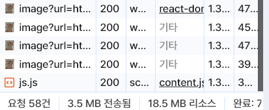

채팅 컴포넌트는 더 이상 손 대지 않아도 될 줄 알았다..
하지만, 비즈니스 로직에 크나큰 위험성이 있었다.

`useEffect()` 때문에 유료 결제까지 하게 되었으니 앞으로 정말 조심히 쓰자.

문제가 된 부분은 아래 부분이다. 정확히는 `useEffect()` 내부 동작이다.
채팅 기능의 핵심적인 부분인데, 테이블에 저장된 채팅 내역을 불러오는 역할을 한다.

```tsx
const getAllMessages = async () => {
  const { data, error } = await supabase
    .from("Messages")
    .select("*")
    .order("sent_at", { ascending: true });

  if (error) {
    console.error(error);
    return;
  }

  setMessages(data as MessageRow[]);
};

// customHook 으로 따로 빼서 코드 정리
useEffect(() => {
  // 채팅 내역 불러오기
  getAllMessages();
  // INSERT 이벤트 감지
  const openTalkSubscription = supabase
    .channel("openTalk") // realtime 이라는 명칭만 아니면 아무 문자열이나 가능함
    .on(
      "postgres_changes",
      {
        event: "INSERT",
        schema: "public",
        table: "Messages"
      },
      // (payload) => console.log(payload), // 여기 콜백에 setState 함수 사용
      () => {
        setMessages([...messages, newMessages]);
      }
    )
    .on(
      "postgres_changes",
      {
        event: "DELETE",
        schema: "public",
        table: "Messages"
      },
      () => {
        setMessages((prevMessages) => {
          return prevMessages.filter(
            (prevMessage) => prevMessage.message_id !== deletedMessageId
          );
        });
      }
    )
    .subscribe();
}, [supabase, message]);
```

여기에서 일단 중대한 문제가 있다.

`useEffect()` 는 message 를 불러오기 역할인데, 동시에 의존성 배열이 message 그 자체가 되는 것이다.

이렇게 동작하면, 컴포넌트가 처음에 마운트가 되며 `setMessage()` 동작이 이루어지면 `message` 에 변화가 생기고
이는 다시 `useEffect()` 의 동작을 야기한다.

이렇게 단순할 수도 있는 문제를 놓치고 있었다.

어쩐지 브라우저가 자주 뻗더라니,, 더욱 놀라운 건 개발자 도구의 네트워크 탭을 보고 나서알았다.


채팅 컴포넌트가 로드 되자마자 찍은 게 이정도다.

1분만 기다리면 요청이 천 여개는 우습게 넘고 있었다.

```tsx
useEffect(() => {
  // 채팅 내역 불러오기
  const getAllMessages = async () => {
    const { data, error } = await supabase
      .from("Messages")
      .select(`*, Users (nickname, profile_image_url)`) // user_id 를 통해 관계가 맺어져 있어서 참조가 가능한 듯?
      .order("sent_at", { ascending: true });

    if (error) {
      console.error(error);
      return;
    }

    setMessages(data as MessageRow[]);
  };

  getAllMessages();
}, []);

// INSERT 이벤트 감지
const openTalkSubscription = supabase
  .channel("openTalk") // realtime 이라는 명칭만 아니면 아무 문자열이나 가능함
  .on(
    "postgres_changes",
    {
      event: "INSERT",
      schema: "public",
      table: "Messages"
    },
    (payload) => {
      setMessages((prevMessages) => {
        return [...prevMessages, payload.new as MessageRow];
      });
      // setState 자체가 비동기적으로 동작해서 handleSubmit 함수 내부에서 동작하는 setNewMessages() 가 제대로 실행될 거라고 보장할 수 없다.
      // 따라서, 함수형으로 작성하고 데이터가 존재하는 것이 확실히 보장된 payload 객체를 이용하자!
    }
  )
  .on(
    "postgres_changes",
    {
      event: "DELETE",
      schema: "public",
      table: "Messages"
    },
    () => {
      setMessages((prevMessages) => {
        return prevMessages.filter(
          (prevMessage) => prevMessage.message_id !== deletedMessageId
        );
      });
    }
  )
  .subscribe();
```

`message` 를 새로 불러오는 역할은, `openTalkSubscription` 에서 담당하고 있으니 컴포넌트 마운트 시에 한 번만 로드하면 되는 문제였다!

이렇게 수정하고 나니 다행스럽게도 무한 호출은 해결되었다.. 아주 다행이었다.


