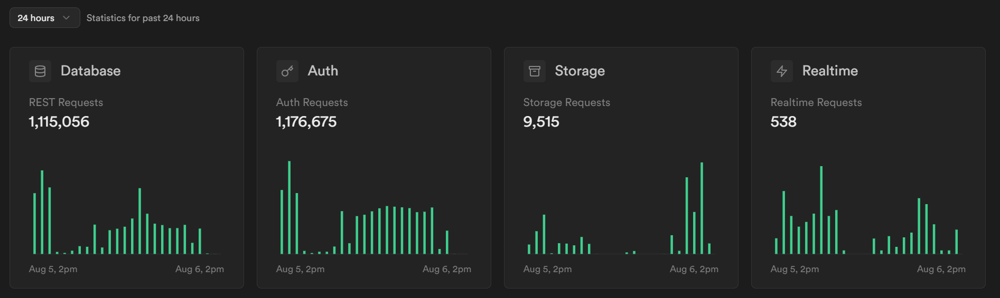
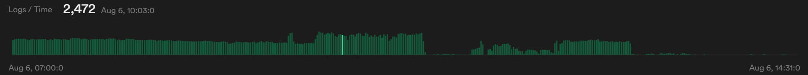
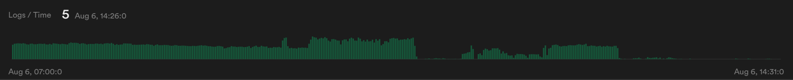

문제의 그 사진(?)

24 시간 만에 사용량이 폭발적이었다.

배포를 하긴 했지만, 실제 이용자는 아무도 없었다.

도대체 어느 바가지에서 이렇게 새는 걸까?

문제 자체는 vercel 을 통해 배포한 링크들이었다.

현재 팀 프로젝트 레포지토리를 제외하고, 무료 요금제를 사용할 때 배포 테스트를 하느라 개인 레포지토리로 fork 해서 만든 배포 링크가 하나 더 있었다.

이전 게시물에 있던 것 처럼 코드를 로컬해서 수정을해서 무한 fetch 를 해결했지만, 배포링크는 여전히 이전의 코드를 가지고 있던 것이다.

이게 원흉이었다. 최신 코드로 반영을 하지 않았더니 혼자서 계속 요청을 보내고 있던 것이다..

그래서 얼른 vercel 에 들어가 불필요한 배포 버전을 삭제했다.

현재는 팀 프로젝트 배포 링크만 남겼고, 이 역시 최신화 해주었다.

그렇게 하니 드디어 안정화 됐다...

useEffect... 참 무서운 녀석이라는 것을 깨달았다.
