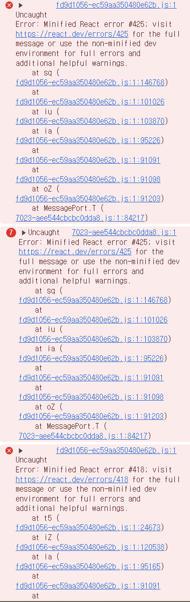
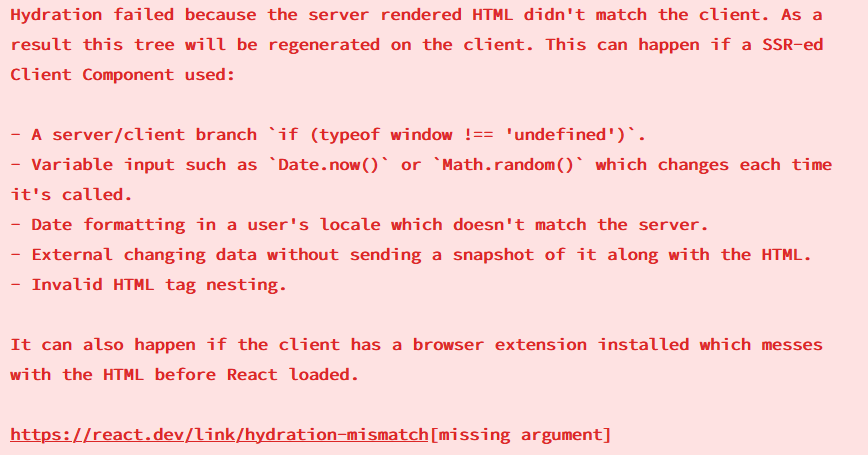
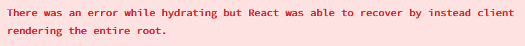
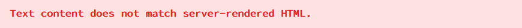

현재 진행하는 프로젝트를 일단 배포하고 난 뒤, 콘솔창에서 여러 가지 오류를 발견했다.



이 오류 코드를 검색하니, 한 번씩은 겪는 오류인 것 같아서 그나마 다행이었다.
그런데, 특이한 것은 동일한 레이아웃을 사용하면서 로직도 동일한 4개의 페이지 중 한 군데에서만 나타나는 것이다...

일단 서버 사이드 렌더링을 기본 설정으로 하는 Next.js 에서 클라이언트 사이드 렌더링인 React 를 사용하면서 겪는 문제인 것 같다.

## 분석

일단 각각 에러코드가 어떤 것을 의미하는지 간단히 알아보았다.



1. 서버요소 일 때와 클라이언트 요소일 때의 동작을 구분할 경우
2. `Date.now()`, `Math.random()` 과 같이 실행 마다 값이 계속 바뀌는 요소를 사용할 경우
3. 서버의 locale 과 유저의 locale 이 다른 경우
4. External changing data without sending a snapshot of it along with the HTML. => 어떤 오류인지 이해하지 못해 원문으로 두었다.
5. 유효하지 않은 HTML tag nesting. => `<div><p></p></div>` 처럼 `<div>` 내부에 `<p>` 요소가 있으면 안된다고 함



"Hydration 과정에서 오류가 발생해 root 부터 시작해 전부 리렌더링이 발생할 뻔 했지만 우리가 막아줬어 찡긋^^"



서버에서 렌더링 한 HTML 문서와 클라이언트에서 렌더링한 HTML 문서 간 텍스트 요소들이 다름

지금 상황에는 418의 2번, 425에 해당하는 오류로 판단했다.

## 원인

우리 경우에는 아래 코드가 문제였다.

```tsx
const ItEventCardLong: NextPage<EventsCardProps> = ({ post }) => {
  const deadlineDate = new Date(post.date_done);
  const daysLeft = Math.ceil(
    (deadlineDate.getTime() - Date.now()) / (1000 * 60 * 60 * 24)
  );
  const displayDaysLeft = daysLeft === 0 ? "D-day" : `D-${daysLeft}`;

  return (
    <ul className="flex items-center">
      <li>
        <span className="label-secondary rounded-full text-baseS  px-3 py-1.5 mr-1">
          {displayDaysLeft}
        </span>
      </li>
      <li className="text-baseS  text-labelNormal ml-2">
        <time dateTime="YYYY-MM-DD">
          {dayjs(post.date_start).format("YYYY-MM-DD")}
        </time>
      </li>
    </ul>
  );
};
```

이 코드가 문제되는 이유는 다음과 같다.

서버에서 이 부분을 렌더링 해서 보내줄 때의 `Date.now()` 와, 클라이언트에서 렌더링할 때 `Date.now()` 의 결과가 같지 않기 때문인 것이다.

그래서 마운트가 되었을 때 이를 감지하는 역할로 `isClient` 라는 상태를 추가했다. 이후 useEffect 를 통해, 컴포넌트가 확실히 렌더링 된 후에만 날짜 부분이 렌더링 되도록 설정하니 해결되었다.

```tsx
const ItEventCardShort: NextPage<EventsCardProps> = ({ post }) => {
  const { user: currentUser } = useUser();
  const [isClient, setIsClient] = useState<boolean>(false);
  const today = dayjs();
  const deadlineDate = dayjs(post.date_done);
  // const daysLeft = Math.ceil((deadlineDate.unix() - now.unix()) / (1000 * 60 * 60 * 24));
  const daysLeft = today.diff(deadlineDate, "d", true);
  const displayDaysLeft =
    daysLeft === 0 ? "D-day" : daysLeft < 0 ? `D${daysLeft.toFixed(0)}` : `D+${Math.ceil(daysLeft)}`;

  useEffect(() => {
    setIsClient(true);

    return () => {
      setIsClient(false);
    };
  }, []);

  return (
    {isClient ? (
        <ul className="flex justify-between items-center">
        <li>
            <span className="label-secondary rounded-full text-baseS px-3 py-1.5">{displayDaysLeft}</span>
        </li>
        <li>
            <time dateTime={post.date_done} className="text-baseS text-labelNormal">
            {dayjs(post.date_done).format("YYYY-MM-DD")}
            </time>
        </li>

        <LikeButton eventId={post.event_id} currentUser={currentUser} />
        </ul>
) : null})
}
```

## 참고 링크

[1](https://blog.hwahae.co.kr/all/tech/13604)
[2](https://velog.io/@hamjw0122/Next.js-Hydration)
[3](https://stackoverflow.com/questions/77437068/next-js-uncaught-error-minified-react-error-418-423?rq=2)
