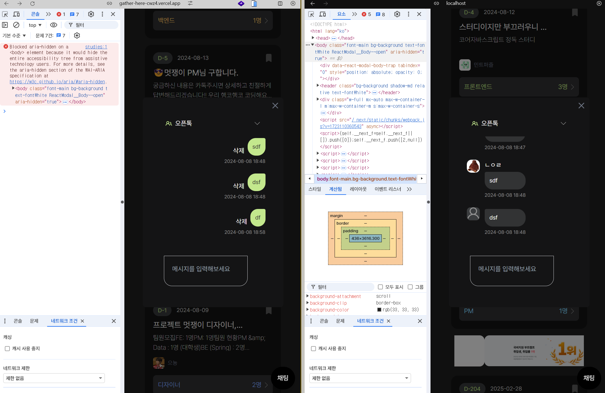

오늘은 간단하다.

오류를 고치느라 시간을 많이 썼는데, 그 중에서 좀 적을 만한 게 있었다.

```tsx
useEffect(() => {
  // 채팅 내역 불러오기
  const getAllMessages = async () => {
    const { data, error } = await supabase
      .from("Messages")
      .select(`*, Users (nickname, profile_image_url)`) // user_id 를 통해 관계가 맺어져 있어서 참조가 가능한 듯?
      .order("sent_at", { ascending: true });

    if (error) {
      console.error(error);
      return;
    }
    setMessages(data as MessageRow[]);
  };

  getAllMessages();

  // INSERT 이벤트 감지
  const openTalkSubscription = supabase
    .channel("openTalk") // realtime 이라는 명칭만 아니면 아무 문자열이나 가능함
    .on(
      "postgres_changes",
      {
        event: "INSERT",
        schema: "public",
        table: "Messages"
      },
      () => {
        getAllMessages();
      }
    )
    .on(
      "postgres_changes",
      {
        event: "DELETE",
        schema: "public",
        table: "Messages"
      },
      () => {
        getAllMessages();
      }
    )
    .subscribe();

  return () => {
    openTalkSubscription.unsubscribe();
  };
}, []);
```

여기에서, table 이벤트 핸들러의 동작을 변경했다.

그 이유는 아래 같은 이유 때문이었다.



새로 채팅을 보내는 경우 유저 데이터가 잘 불러와지지 않았다.

게다가 새로 고침 하지 않으면 삭제도 안 됐다.

useEffect hook 이 마운트 시에만 동작하게 만드는 것은 옳았는데, 이전처럼 `setMessages()` 만 사용하면 유저 정보를 가져올 수가 없는 것이다.

현재 상황에서 더 나은 방법을 찾지 못해서, 일단 해결 책으로 유저 정보를 가져오기 위해 `getAllMessages()` 를 호출하는 방식으로 변경했다.

서버에 요청을 덜 보내기 위해서 전부다 상태로 관리한다는 것은 아무래도 미친 짓 같아서 말이다..

현재로서는 더 나은 방법이 없는 것 같다.

이제 테스트를 받으면서 정말 본격적인 리팩토링에 들어가려고 하는데, 그때 방법을 조금 더 모색해 봐야겠다.
