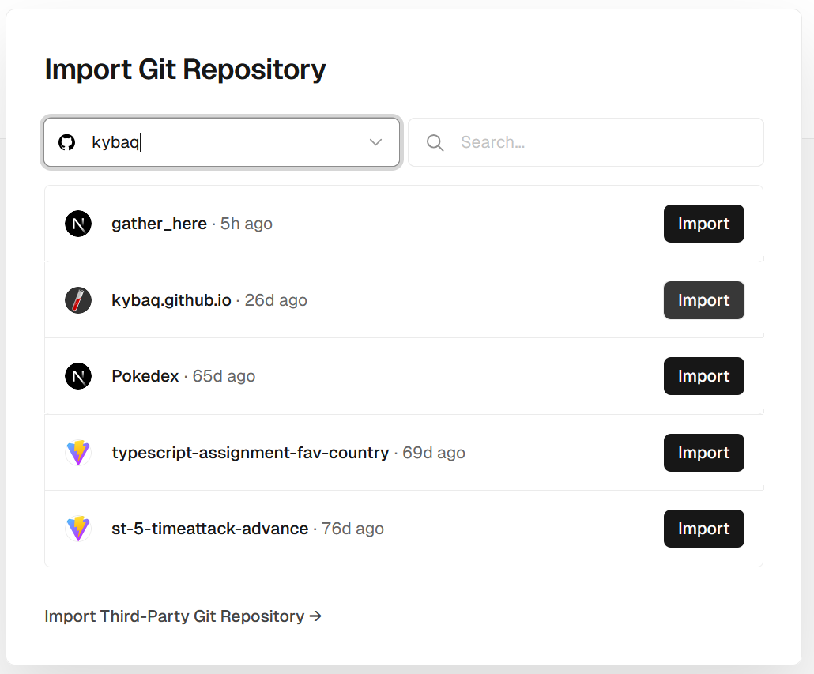
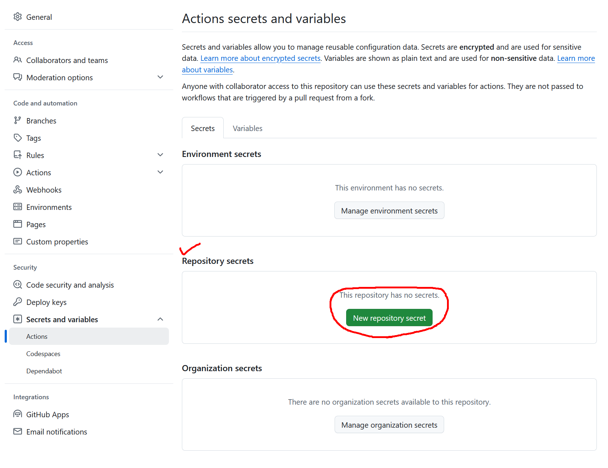
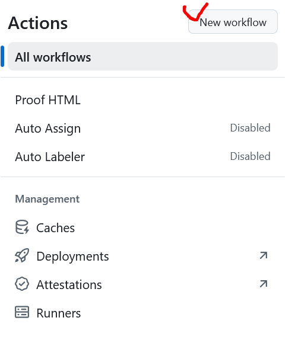
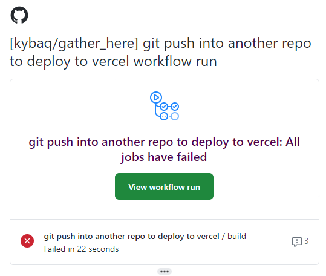

## 목적

이전에 @gather_here 프로젝트를 진행할 때, Github Oraganization 을 통해 협업을 진행했다.
하지만, 이 팀 프로젝트를 Vercel 로 배포하려고 하니 Pro 요금제를 사용해야만 가능하다는 것이었다.

개인 repo 로 fork 한 뒤 sync 를 맞추는게 귀찮기도 했고, 여러 명이 같이 작업하니 그냥 Pro 요금제를 결제해서 사용하고 있었다.
하지만, 이제는 돈이 아깝기도하고 무료 요금제로도 팀 repo 와 fork 한 개인 repo 의 동기화를 자동처리할 수 있는 방법을 알았다!

빨리 적용해보자.

## 과정

1. Github Token 을 발급받는다.
이 Token 은 한 번 발급하면 다시 조회할 수가 없으니, 잘 적어둬야한다.


2. 팀 프로젝트 repository 로 이동해 fork 를 진행한다.


3. 2번에서 fork 한 repository 를 vercel 에서 import 한다.



잊지말고 환경 변수(Environmental Variables) 설정 해주기!

4. 팀 프로젝트 repository 로 이동해 최상위 경로에 `build.sh` 스크립트 파일을 하나 추가해준다.

```sh
#!/bin/sh
cd ../
mkdir output
cp -R ./팀에서 사용하는 레포지토리 이름/* ./output
cp -R ./output ./팀에서 사용하는 레포지토리 이름/
```

위 처럼 파일을 하나 작성해준다.

이후 Actions 를 위해 추가할 `.yaml` 파일에서 `build.sh` 를 사용하게 될 것이다.

5. Actions 추가에 앞서 1에서 발급받은 토큰과 개인 repository 소유자의 이메일을 팀 프로젝트 repository 에 등록해주자.

- 프로젝트 repository -> Settings -> 좌측 메뉴의 Secrets and variables -> Actions 클릭



이 부분에서 **Repository secrets** 항목의 새 값을 추가해주자.

fork 한 repository 소유자의 이메일, Github Token 을 추가해주면 된다.

지금 나의 경우, gather here 프로젝트를 관리하는 계정의 정보를 기입했다.


6. 새 Github Actions 를 생성한다.




- 팀 프로젝트 repository 에서 Actions 탭 선택 -> new workflow -> set up a workflow yourself 선택!

아래 yaml 을 복사해 사용한다.

`.github/workflows/deployment.yml` 로 만들었다.

```yaml
name: git push into another repo to deploy to vercel

on:
  push:
    branches: [main]

jobs:
  build:
    runs-on: ubuntu-latest
    container: pandoc/latex
    steps:
      - uses: actions/checkout@v2
      - name: Install mustache (to update the date)
        run: apk add ruby && gem install mustache
      - name: creates output
        run: sh ./build.sh
      - name: Pushes to another repository
        id: push_directory
        uses: cpina/github-action-push-to-another-repository@main
        env:
          API_TOKEN_GITHUB: ${{ secrets.OFFICIAL_ACCOUNT_TOKEN }} // 변경
        with:
          source-directory: 'output'
          destination-github-username: 개인 깃헙 아이디 // 변경
          destination-repository-name: fork 해 온 개인 레포 이름 // 변경
          user-email: ${{ secrets.OFFICIAL_ACCOUNT_EMAIL }} // 변경
          commit-message: ${{ github.event.commits[0].message }}
          target-branch: main
      - name: Test get variable exported by push-to-another-repository
        run: echo $DESTINATION_CLONED_DIRECTORY
```

`API_TOKEN_GITHUB` : 시크릿 변수에 등록한 토큰 변수명
`destination-github-username` : 개인 깃헙 username (프로필에서 굵고 진한 이름말고 바로 아래 있는거!)
`destination-repository-name` : fork 해 온 개인 레포 이름
`user-email` : 시크릿 변수에 등록한 개인 이메일 변수명

이 4가지를 변경해줘야 한다.

그리고 해봤는데..??



고쳐야할 부분이 많은 것 같다..