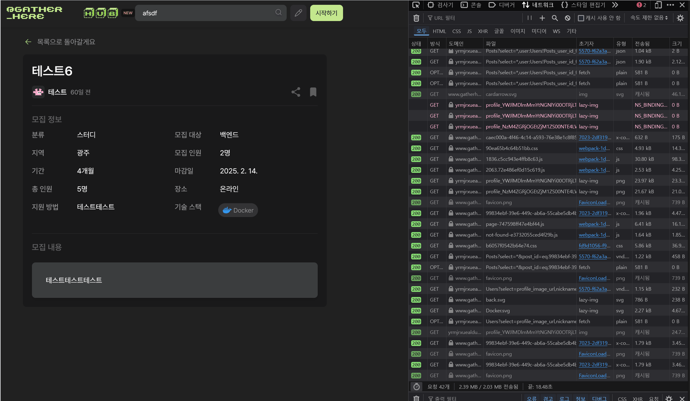

## 문제 상황

[오류 현상을 정리한 JIRA 이슈](https://gatherhere.atlassian.net/jira/software/projects/GH/boards/1/backlog?assignee=712020%3Af9657b51-c3a8-4ded-9e62-8fee85fc620b&selectedIssue=GH-4)

지금 현재 구현되어있는 검색 기능은 직관적이지 않다.
헤더에 존재해서 어디에든 검색이 가능하지만, 정작 메인페이지를 제외하고는 검색 기능이 동작하지 않는 것이다.

## 현재 상황

실제 검색 창에서 검색을 해보자.


검색어가 없을 때는 url 에 변화가 없다.


검색어가 있는 경우에는 url 에 `query string` 이 생긴다.

## 원인

```ts

import { useSearchParams, useRouter } from "next/navigation";
import { FormEvent, useState, useEffect, useCallback } from "react";

const useSearch = () => {
  const searchParams = useSearchParams();
  const router = useRouter();
  const [searchWord, setSearchWord] = useState("");

  useEffect(() => {
    const searchParam = searchParams.get("search") || "";
    setSearchWord(searchParam);
  }, [searchParams]);

  const handleSearch = useCallback(
    (evt: FormEvent<HTMLFormElement>) => {
      evt.preventDefault();
      router.push(`?search=${encodeURIComponent(searchWord)}`);
    },
    [searchWord, router],
  );

  return { searchWord, setSearchWord, handleSearch };
};

export default useSearch;

```

현재 코드를 보면, 검색을 실시할 때 마다 라우팅을 시킨 다음 query string 으로 부터 추출해오는 것이다.

검색 기능을 사용할 때 마다, `searchParam` 을 가지고 게시글을 필터링해서 가져오지만, 지금의 코드에서는 메인 페이지의 게시글 목록을 바꿔치기 할 뿐이다.
**그러니, 사용자가 메인페이지에 있지 않으면 아무런 동작을 하지 않는 것 처럼 보이는 것이다.**


실제로 다른 페이지에서 검색을 수행하면 url 이 변하고, GET 요청이 한 번 보내지고 있었다.



그래서 별도의 검색 페이지를 만들고, 검색어에 따라 결과를 제공해주는 페이지를 만들기로 했다.

## 참고한 사이트

우리는 `서핏` 이라는 서비스의 검색 페이지를 참고했다.

기존에는 게시글에 대해서만 검색을 제공하면 되었는데, 이제는 유저들이 자신의 정보를 올리는 "게더허브" 기능이 있기 때문이다.


사진을 보면 서핏은 게시글과 유저들의 프로필을 함께 띄워주고 있는데, 이는 우리에게 딱 적절해보였다!

## 마무리

이제 어떻게 구현할 지는 결정했으니, 기술적인 이야기를 해야겠다.

기존에 만들었던 페이지는 대부분 CSR 기반으로, SSR 을 적용하면 좋을지 CSR 을 적용하면 좋을지 깊게 고민하고 결정한 사안이 아니다.
우리가 React 기반으로 페이지를 만드는 데 익숙하다보니, 각자 React 에서 하던 방식이 안 통하면 `"use client"` 를 사용하고 진행한 것이다.

이번에 내가 검색 페이지를 새로 만들면서, SSR 을 적용하기 위해 Next.js 에서 어떤 요소를 알아야하는지 자세히 살펴보도록 할 것이다.
