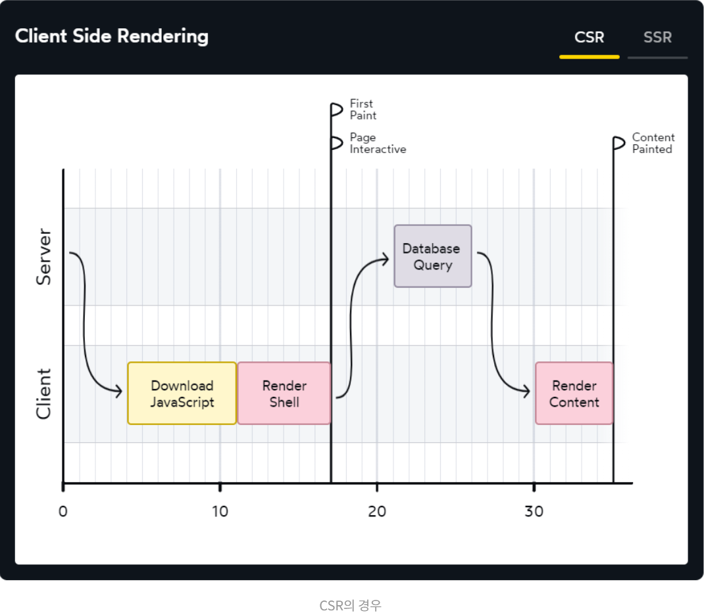
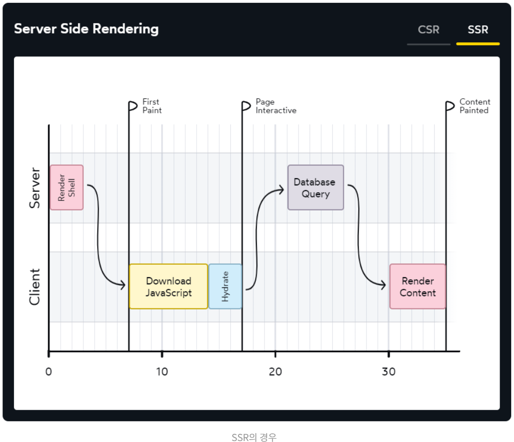
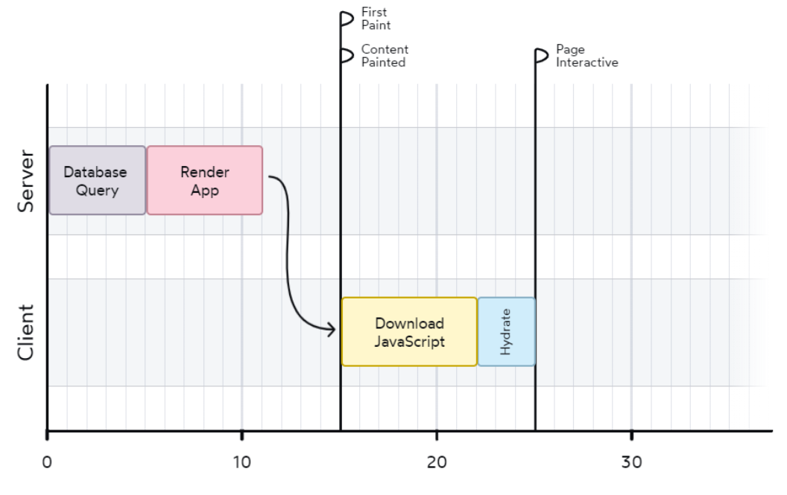
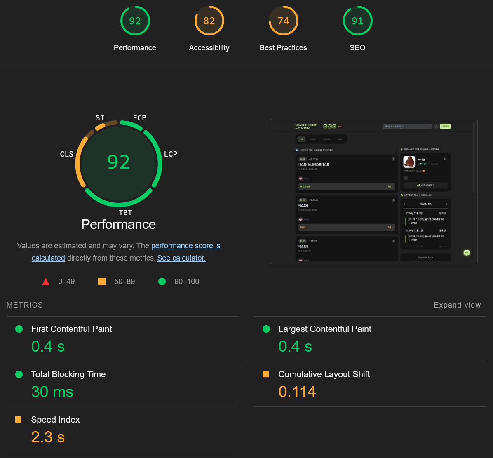
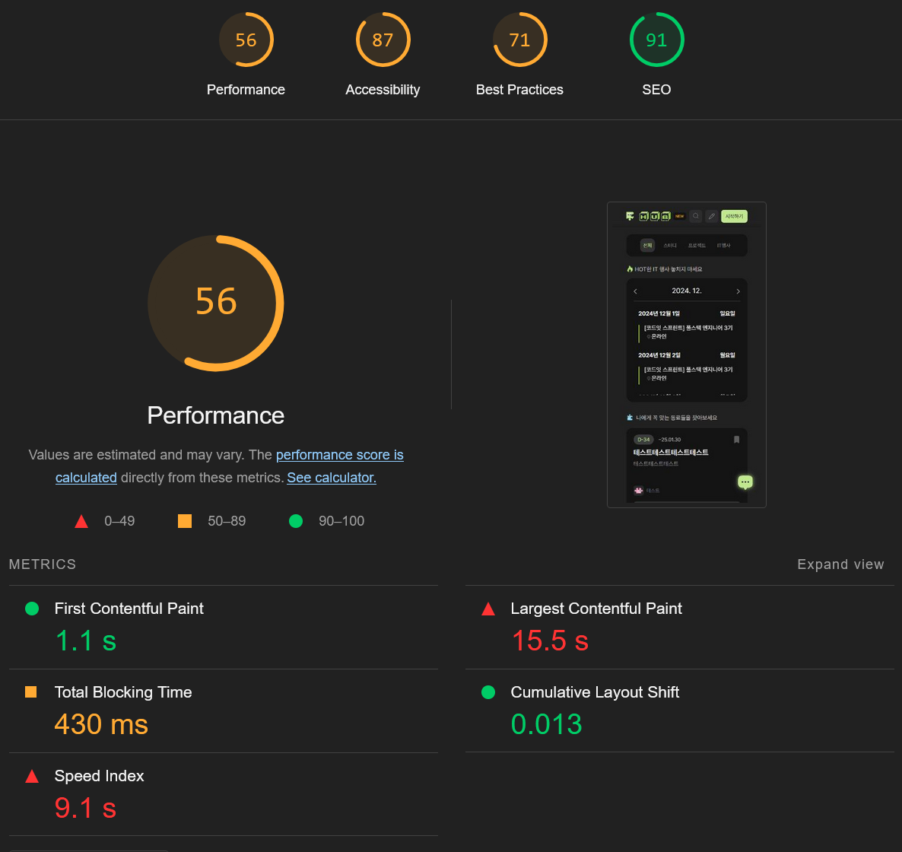

## 목적

저번 포스팅에서, RSC 를 다루기 이전 CSR -> SSR 을 혼합하게되는 배경을 간단히 다루어보았다.
이 내용을 이해해야, 왜 RSC 가 등장했는지 이해할 수 있을 것 같았다.

이번 포스트에서는 RSC 를 통해 CSR + SSR 을 결합하면서 얻는 장점을 살펴보자.

## FCP, TTI, LCP

RSC 를 이용하면서 얻을 수 있는 장점을 설명하기 위해, 먼저 웹 페이지의 성능을 측정하는 지표를 이해하고 넘어가보자.

1. FCP(First Contentful Paint): 사용자가 UI 를 볼 수 있는 단계, CSR 에서는 이 부분이 길어지게 되면 사용자가 흰 화면을 오랫동안 봐야한다. 쉽게 말하자면, 화면에 뭐라도 나타나는 시간으로 이해하면 된다.
2. TTI(Time To Interactive): FCP 이후, 리액트가 로드 되면서 유저와 상호작용이 가능해지는 단계.
3. LCP(Largest Contentful Paint): DB 에서 데이터를 가져와 유저가 요청한 정보를 UI 에 렌더링한 단계. 실제 의미있는 데이터가 웹에 불러와진 상황이다.

SSR, CSR 방식에 따라 이 지표 값이 달라질 수 있다. 아래 그래프를 보자.

## 렌더링 방식에 따른 웹 성능

CSR 방식에서는, 클라이언트가 JS 파일을 먼저 로드한 뒤 화면을 그려낸다. 화면이 그려진 이후, 필요한 데이터들을 요청하고 화면에 표시한다.
그래프 상에서 First Paint 가 FCP 에 해당하고, Page Interactive 가 TTI 에 해당한다.

CSR 에서는 FCP와 TTI 가 같은 시점에 이루어진다.
아무래도, 클라이언트 측에서 JS 파일을 로드한 뒤 화면을 그려내기 때문일 것이다.

JS 파일이 크지 않은 경우에는, FCP 가 짧을 것이기 때문에 CSR 을 적용하더라도 큰 문제가 안 될 것으로 보인다.

SSR 방식의 경우, 먼저 html 문서가 생성이 되고 클라이언트에게 전달하기 때문에 CSR 에 비해 FCP 에 도달하는 시간이 상대적으로 짧다.

FCP 이후, hydration 과정을 거쳐 유저가 클릭 같은 상호 작용을 할 수 있는 TTI 에 도달한다.

하지만, 조금 이상한 부분이 있다.
서버에서 html 문서를 생성해서 보내준 다음, 클라이언트 측에서 hydration 을 진행한 이후 **다시** 서버에서 데이터를 요청해서 클라이언트에서 이를 렌더링 한다.

그렇기 때문에 LCP 에 도달하는 시간 또한 여전히 개선하지 못한 상황이다.

이를 개선하기 위해서 도입한 것이 바로 RSC 이다.

RSC 를 통해 웹 앱을 구축한다면, LCP 를 개선할 수 있는 것이다!
Next.js 의 App Router 를 사용한다면, 이 RSC 를 기반으로 구현이 되어 있기 때문에 LCP 를 개선할 수 있게 된다.

RSC 에서는 그래프에서 보이는 것 처럼, DB 에 Query 를 html 문서 생성 이전에 실시한다.
그래서, 데이터를 채운 html 문서를 유저에게 전달해줄 수 있는 것이다.

그 다음 hydration 을 통해 유저가 웹 사이트를 이용할 수 있게 된다.

이제서야 RSC 에 대해서 이야기 할 수 있겠다.

## RSC 에 대해 알아보게 된 이유

`@gather_here` 의 성능 측정 결과는 지금 어떨까? 한 번 살펴보자.

데스크탑 환경과 모바일 2개의 환경에서 진행해보았다.

- 데스크탑 환경

데스크탑에서는 성능 수치가 좋다!!  
어떤 요소 덕분에 결과가 좋은 건지 다음에 추가로 찾아보도록 하자.

- 모바일 환경

반면, 모바일 환경에서는 LCP 에서 성능 수치가 정말 안 좋다.
체감 상으로도 모바일로 접속할 경우, 생각보다 오래걸리는 느낌이다.

Lighthouse 에서 짚어준 문제로는, 페이지 로딩 애니메이션 때문이라고 한다.
현재 `.gif` 파일을 사용 중인데, 이를 `.webm` 으로 변환하면 조금이라도 덜 수 있는지 확인해볼 필요가 있어보인다.

여러 이미지 최적화를 함께 적용하고, 기존의 클라이언트 컴포넌트들을 최대한 줄이고, 서버에서도 미리 컴포넌트를 만들도록 구현한다면 성능적으로 좋은 페이지를 만들 수 있을 것 같다.

앞서 RSC 를 통해 개선할 수 있는 점들을 살펴보았을 때, LCP / TTI 를 개선할 수 있을 것이다.
RSC 를 이용하면, LCP의 경우 클라이언트에서 렌더링해야하는 번들 크기를 줄일 수 있기 때문에 TTI 를 조금 더 줄일 수 있을 것이다.

## 마무리

앞으로 할 일은 RSC 를 적극적으로 이용해, 현재의 코딩 패턴을 바꿀 필요가 있어보인다.
서버 / 클라이언트 컴포넌트를 적절히 구분해 변경해나가도록 하자.
