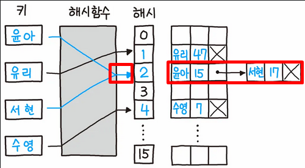
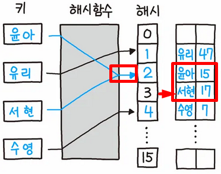

## 해시 테이블이란?

- **배열의 색인(index)를 지정할 때 해시 값을 사용**해 데이터를 저장하는 자료 구조.
- 해시 함수를 사용해, 값에 대한 고유 색인을 생성함.  
이후 값을 저장하는 공간인 버킷에서 색인에 대응하는 위치에 데이터를 저장함.
- 해시 충돌이 발생하지 않을 경우 시간 복잡도는 O(1) 이며, 충돌이 발생하면 최대 O(N).

## 동작 원리

1. 해시 함수
    - 입력값(키)을 고정된 크기의 고유 숫자로 변환하는 함수.
    - 입력값이 아무리 크더라도, 정해진 크기의 숫자가 나오게 됨.
    - 예시로, 어떤 숫자를 10으로 나누는 함수가 있다면 이 함수는 해시 함수다.  
    모든 결과가 0 - 9 사이의 범위에 있기 때문이다.
2. 버킷
    - 특정 값에 대해 해시 함수를 적용한 결과를 색인으로 이용해 데이터를 저장할 공간.

## 해시 충돌이란?

해시 함수를 만들 때, 다른 값임에도 불구하고 연산 결과가 같은 경우가 발생할 수 있다.

이때, 그대로 버킷에 저장한다면 기존에 있던 값이 없어지기 때문에 문제가 되는 것이다.

충돌이 발생하지 않도록 해시 함수를 고도화 하면 해결이 될까 싶지만, 결국 정렬보다 연산이 복잡해지는 문제가 발생하기도 한다.

가장 많이 사용하는 방식은 2가지는 바로 `1. 개별 체이닝(Seperate Chaining)` 방식과 `2. 오픈 어드레싱(Open Addressing)` 이 2가지를 사용한다.

## 개별 체이닝

간단히 말하자면, 충돌이 발생한 경우 연결 리스트(Linked List)를 통해 중복을 해결한다.  좋은 예시가 있어 나무위키를 참고[1]했다. 원 출처는 <파이썬 알고리즘 인터뷰>



예시를 보면, 두 가지 키 값인 `윤아` 와 `서현` 의 해시 값이 `2`로 동일하다.

이때 이미 존재하는 `윤아`의 값을 덮어쓰지 않기 위해 `윤아`의 값에 연결 리스트를 생성한 뒤 `서현`의 값을 저장한다.

충돌을 간단하게 해결이 가능하고, 메모리 공간이 충분하다면 연결 리스트 방식으로 무한히 저장이 가능한 것이다.

## 오픈 어드레싱



이전과 동일한 예시로, 이번엔 연결 리스트를 사용하지 않고 충돌이 발생한 위치에서 가까운 빈 공간에 저장한 상황이다.

이렇게 빈 공간을 찾는 방식은 탐사(Probing)이라고 부르며, 탐사 방식에 따라 개별 체이닝 보다 좋은 효율을 보일 수 있다고 한다.

## 해시 테이블을 사용한 예시

1. Python 의 Dictionary
2. JavaScript 의 Object

처음 해시 테이블의 정의를 보고, 이 두 가지를 바로 떠올렸다.  

지금 주로 사용하는 JS 를 기준으로 보자.

```js
const myObject = { apple: 3, banana: 5 };
```

이런 객체의 경우, `apple` 과 `banana` 는 키가 되며 `3` 과 `5`는 값이다.

이때, `apple` 에 접근하게 되면 값 `3`을 얻을 수 있는데, `apple` 을 키로 하는 값 `3`을 버킷에 저장할 때 해시 함수를 활용하는 것이다.

## JavaScript 의 Object & Map 에 대해

방금은 Object 에 대해서만 이야기 했지만, 사실 JS 에는 Map 이라는 것이 존재한다.

JS 를 처음에 배울 때, 이 두가지는 비슷하면서도 쓰임이 다르다고 이해했다.  

mdn 문서를 참고해보니, 성능 면에 있어서는 Map 이 더 유리하게 구현되어있다고 하니 앞으로 Map 도 적극적으로 활용해보도록 하자.

다음 게시글로는 정말 간단한 예시를 풀어보고, 조금 더 수준 높은 문제를 풀어서 오도록 하자.

[1]: https://namu.wiki/w/%ED%95%B4%EC%8B%9C
