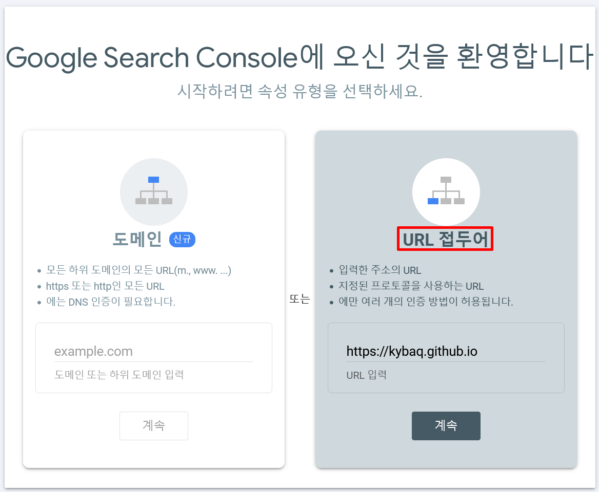
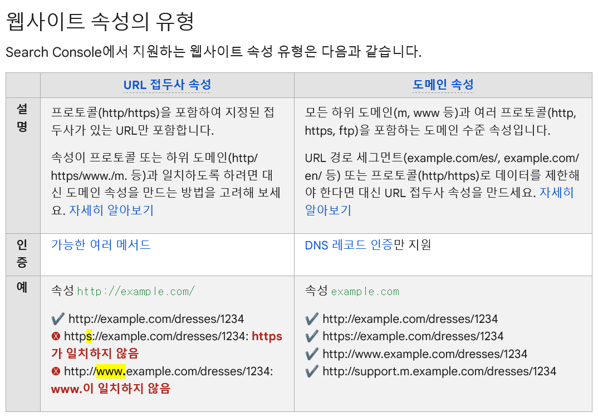
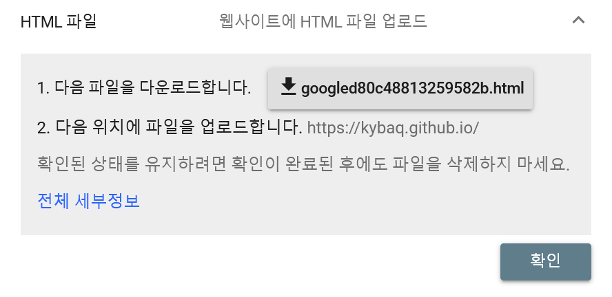
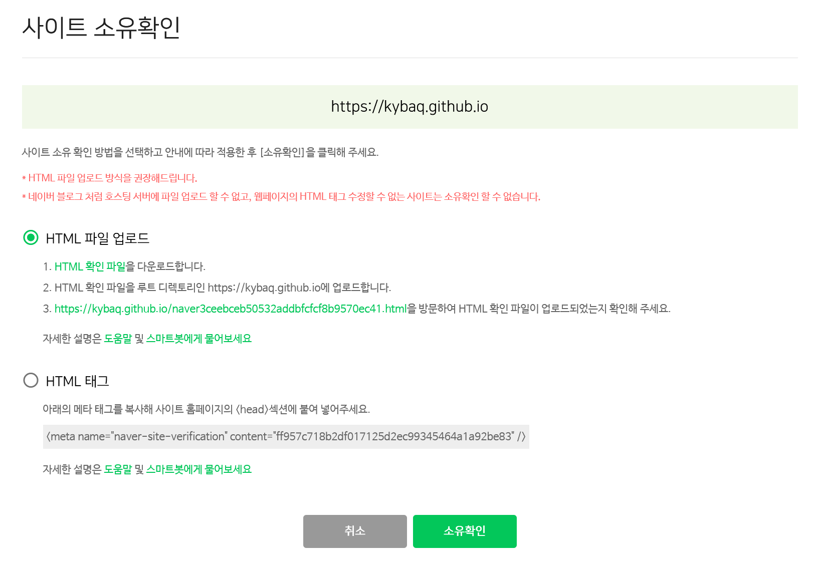
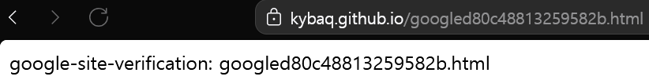
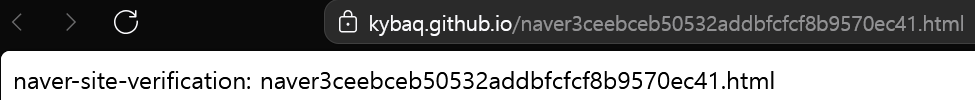
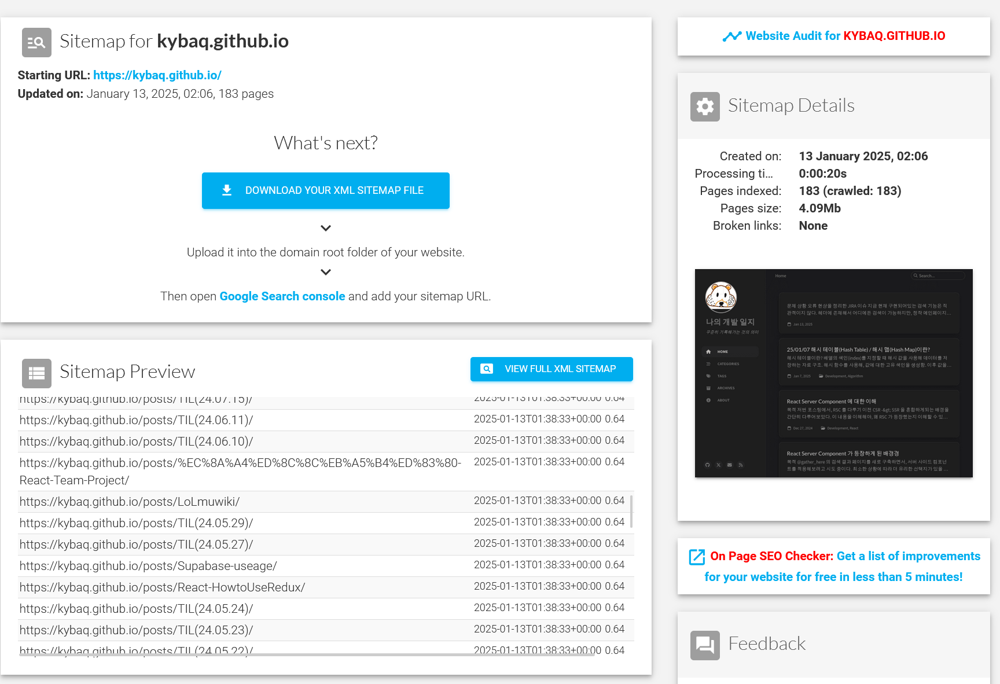
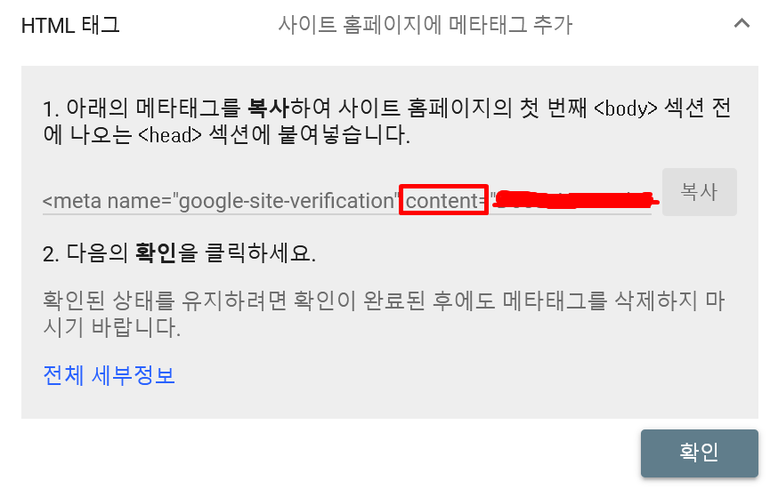

## 목적

지금까지 운영하고 있던 블로그는 사실 아무도 볼 수 없다고 봐야한다.  
Github 에 들어가서 찾아보거나, 내가 주소를 전달해주지 않으면 검색을 해도 나타나지 않기 때문이다.

진작에 했다면 좋았겠지만, 그 때는 막연하게 어렵다고만 생각을 하고 있었다.
사실 귀찮음이 아닐까..

아무튼! 페이지를 직접 검색 엔진에 등록하기 위해 준비하는 이 과정을 정리해두면 정말 좋은 것 같았다.

시작해보자!

## Google Search Console

우선적으로 구글부터 진행해보자.

요새는 말도 많고 탈도 많은 느낌이지만.. 구글의 점유율은 무시할 수가 없는 법!

등록하기 위해 콘솔에 진입하게 되면, 아래와 같이 선택지가 존재한다.  

### 등록하는 법법



도메인의 경우 DNS 인증을 한다고 하니, 소유자 인증을 하는게 아닐까..!  
최상위 경로의 도메인을 등록하면 하위 도메인까지 적용이 가능한 것 같다.

하지만 내 블로그는 github 를 통해 정적 사이트를 호스팅 하고 있는 것이다 보니, URL 접두어를 통해 등록을 해주어야하는 것으로 이해 했다.



Google Search Console 의 도움말 항목에서 해당 부분을 확인해보았다.

아무래도 제대로 이해한 것 같았다.  
다음에는 `@gather_here` 페이지를 등록할 예정인데, 그때는 도메인 방식을 사용하면 될 것 같다.

### 사이트 소유권 확인

도메인 인증을 하고 나면, 내가 소유하고 있는게 맞는지 확인하기 위한 절차가 필요하다.  
추천하는 방식을 보니, `.html` 파일을 루트 경로에 업로드하라는 것인데 네이버 블로그 같은 게 아니니까 권장 방식으로 해보자!





현재 블로그 프로젝트의 루트 경로에 두 파일을 업로드한 뒤, 한 번 확인해보았다.





두 가지 모두 제대로 등록이 이루어졌다!!

### Sitemap 등록록

GPT 와의 대화, 검색 등을 통해 다음으로 할 것을 찾아보니, 크롤러에게 정보를 제공해주는 사이트맵과 크롤링 허용 여부 robot.txt 도 만들어 추가해야한다고 했다.

아래 페이지에 따라 달라지기 때문에, 자동으로 만들어주는 사이트[1]를 이용해보았다.



근데, 페이지가 추가 되면 계속해서 업데이트 해줘야할 것 같다.
자동화 할 수 있는 방법이 없을지 고민해보자.

### robots.txt 등록

다음은 `robots.txt` 차례다. 이미 만들어져있던 파일을 활용했다.

어떤 환경에서 접근 하든 상관이 없고, 나중에 크롤링을 막고 싶을 경우엔 `/norobots` 경로에 내가 파일을 넣어두면 되니 그대로 이용하기로 했다.

```plain
---
permalink: /robots.txt
# The robots rules
---

User-agent: *

Disallow: /norobots/

Sitemap: {{ '/sitemap.xml' | absolute_url }}
```

### 마무리

이제 최대 1주일 이상 기다리고, 결과를 확인해보면 될 것이다.
두구두구...

#### 번외

지금 내 블로그는 `jekyll` 테마를 쓰고 있는데, `_config.yml` 파일에 이런 부분이 있다.

```yml
# Site Verification Settings
webmaster_verifications:
  google: # fill in your Google verification code
  bing: # fill in your Bing verification code
  alexa: # fill in your Alexa verification code
  yandex: # fill in your Yandex verification code
  baidu: # fill in your Baidu verification code
  facebook: # fill in your Facebook verification code
```

여기에 코드를 추가해줘도 되는데, 그 방식도 간단히 다루고 가자.



이 방식에서는 `<meta>` 태그를 직접 넣는 방법인데, 나는 `_config.yml` 에 `content` 부분만 복사해서 넣어주면 알아서 생성이 된다고 한다.

하지만 이 방법을 사용하지는 않았다.

[1]: https://www.xml-sitemaps.com/
