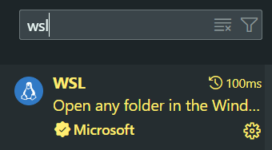
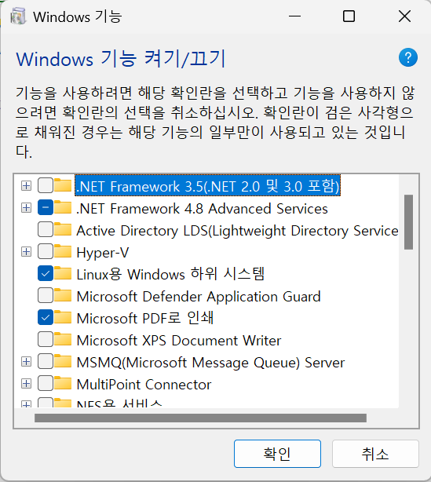
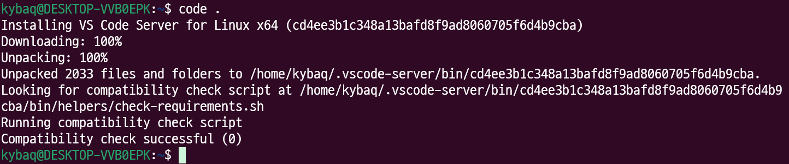
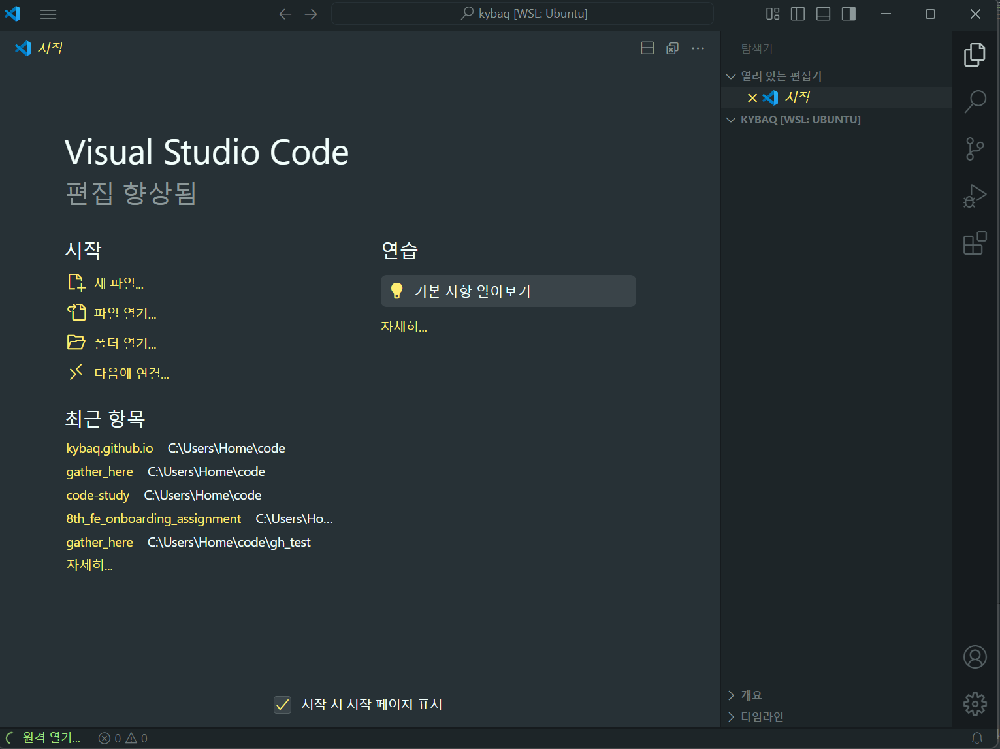

## WSL 을 사용하려는 이유

개발을 처음 접하게 됐을 때 사용했던 기기가 mac 이었다.
개인용 맥북도 있었고, 윈도우 데스크탑도 가지고 있었기에 문제가 없었다.

다만 지금은 윈도우 데스크탑이 없기 때문에 윈도우 노트북을 소지하고 있는데, git bash 를 이용하고 있는 실정이다.
사실 이전에 WSL 을 썼다가, git bash 로 이전하고 결국엔 다시 WSL 로 가고 싶었다.

사실 mac/linux 계열의 명령어를 사용할 수 있어서 큰 불편함이 없었지만, 결국엔 윈도우 기반이 아닌가..!
사용 불가능한 명령어가 종종 있어 불편했다. 그리고 무엇보다 git bash 는 너무 느리다...

WSL 을 셋업할 때 마다, 게시글을 보고 따라하고 있어서 내가 정리해보기로 했다.

## WSL 설치하는 방법

### WSL 설치

`Windows PowerShell` 또는 `명령 프롬프트` 를 **관리자 권한**으로 실행한다.

```cmd
wsl --install
```

이렇게 입력하면, 기본적으로 Ubuntu 를 설치해주는데 버전이 명시되어있지는 않았다.
찾아보니, latest LTS 를 설치해준다고 하니 특정 버전이 필요한 경우라면 버전을 명시해서 설치하도록 하자.

나는 사실 큰 필요가 없어서 최신 버전으로 설치했다.

### Linux 유저 설정 및 배포 업데이트

설치하고 나면, 자동으로 Ubuntu 환경이 연결되고 유저이름과 비밀번호를 설정하라는 메시지가 나타날 것이다.
root 계정이 될테니 이름과 암호를 잘 기억해두자.

이후, `sudo apt-get update` 명령을 통해 패키지 관리자 부터 업데이트를 해주도록 하자.

### VScode 확장 프로그램 설치



이 확장을 설치해주도록 하자. 그래야 wsl 터미널을 vscode 에서 사용할 수 있고, `code .` 명령도 사용이 가능하다!

### 제어판 설정 확인



아마 기본적으로 설치하면 이 부분이 활성화 되지 않을 수 있다.

"제어판" -> "프로그램" -> "프로그램 및 기능" -> "Windows 기능 켜기/끄기" 로 들어가 두 가지를 체크하도록 하자.

- Linux 용 Windows 하위 시스템
- 가상 머신 플랫폼

이렇게 체크 해주면 재부팅이 필요할 것이다.
재부팅을 하고 오도록 하자.

### WSL 환경에서 VScode 연동

이렇게 설정을 해주고 나면, 이제 Ubuntu 환경에서 VScode 가 잘 동작하는지 살펴보도록 하자.

Ubuntu 터미널을 열어주고, `code .` 명령어를 입력하면 아래 사진 처럼 진행될 것이다.



원격 환경이기 때문에, VScode server 가 설치되는 것 같다.

### 이후



VScode 가 잘 열렸다!

이제 할 것은, Python 이나 여러 Linting 확장 프로그램들을 WSL 에서도 사용할 수 있게 확인해주어야 한다.
간단히 해당 확장 프로그램을 켜보면, `WSL에 설치` 라는 버튼이 활성화 되었을 경우에만 설치해주면 되니 편리했다.

`Ubuntu 가 설치된 경로와, Windows 가 설치된 경로에서 열리는 VScode 는 다른 환경이니 유의하도록 하자!!`
