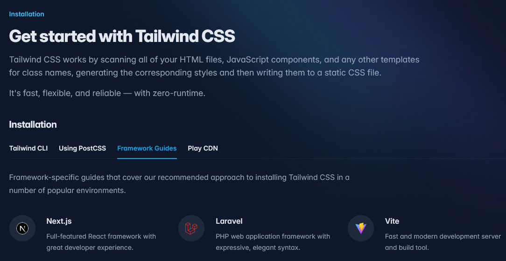

인턴 과제를 위해 Vite 로 프로젝트 셋업이 필요한 상황이다.
Vite 로는 몇 번 해본 적이 없어, 간단히 정리해보도록 하자.

## Vite 로 프로젝트 생성하기

아래는 JavaScript 기반 React 프로젝트 셋업 방법이다.

```zsh
$ npm create vite@latest my-vue-app -- --template react
```

이외에도 다른 프레임워크를 지원한다. --template 의 인수는 아래와 같다.

`vanilla`, `vanilla-ts`, `vue`, `vue-ts`, react, `react-ts`, `react-swc`, `react-swc-ts`, `preact`, `preact-ts`, `lit`, `lit-ts`, `svelte`, `svelte-ts`, `solid`, `solid-ts`, `qwik`, `qwik-ts`

정말 많다..

나는 react + typscript 기반 프로젝트를 셋업해야해서 `react-ts` 로 생성했다.

## ESLint + Typescript 설정 + Prettier

나는 권장 설정을 사용하고 있다.

물론 권장 설정에 포함된 내용들엔 일부 과거의 문법이나 내가 필요하지 않은 부분들이라 있어도 그만, 없어도 그만 이런 느낌이지만 다른 부분은 내가 사용하면서 놓치기 쉬운 것이라 생각했다.

또한, 이제 막 ESLint 를 사용해보고 있는 와중이라 권장 설정을 먼저 사용해보고 있기 때문이다.

나중에 불편함이 생긴다면 규칙을 수정해보도록 하자.

Prettier 는 아래처럼 간단히 사용하고 있다.

```plain
{
  "printWidth": 120,
  "tabWidth": 2,
  "useTabs": false,
  "semi": true,
  "singleQuote": true,
  "bracketSpacing": true,
  "trailingComma": "all"
}
```

## react-router-dom 추가

react-router-dom 을 셋업할 때, FrameWork 로 쓸 지 Library 로 쓸 지에 따라 달라지는데 나는 이미 Vite 로 셋업을 해둔 상태이니까 Library 로 추가만 해주자.

```zsh
npm i react-router
```

이후, `main.tsx` 같은 최상위 파일에 `<BrowserRouter>` 를 추가해주자.

```tsx
import { StrictMode } from 'react';
import { createRoot } from 'react-dom/client';
import './index.css';
import App from './App.tsx';
import { BrowserRouter, Route, Routes } from 'react-router';

createRoot(document.getElementById('root')!).render(
  <StrictMode>
    <BrowserRouter>
      <Routes>
        <Route path="/" element={<App />}></Route>
      </Routes>
    </BrowserRouter>
  </StrictMode>,
);
```

## tailwind css 추가

이미 프로젝트를 Vite 로 셋업 했으니, 이 항목에서 Vite 를 선택해주면 된다.



```zsh
npm install -D tailwindcss postcss autoprefixer
npx tailwindcss init -p
```

명령어 동작이 끝나면, `tailwindcss.config.js` 파일을 설정해준다.

```json
/** @type {import('tailwindcss').Config} */
export default {
  content: [
    "./index.html",
    "./src/**/*.{js,ts,jsx,tsx}",
  ],
  theme: {
    extend: {},
  },
  plugins: [],
}
```

이후, `index.css` 파일 같은 최상위 스타일 문서에 아래 내용을 추가해주면 된다.

```css
@tailwind base;
@tailwind components;
@tailwind utilities;
```

## zustand 추가

```zsh
npm install zustand
```

이후, 테스트를 위한 Store 를 하나 만들어보자.

```tsx
// useStore.ts

import { create } from 'zustand';

interface Store {
  count: number;
  inc: () => void;
}

const useStore = create<Store>((set) => ({
  count: 1,
  inc: () => set((state) => ({ count: state.count + 1 })),
}));

export default useStore;
```

여기에서도 타입을 사용해주도록 하자.

## Tanstack Query

이제 마지막이다.

```zsh
npm i -D @tanstack/eslint-plugin-query
```

Tanstack 에서 eslint plugin 이 있다고해 일단 추가해보았다.

```js
    extends: [
      js.configs.recommended,
      ...tseslint.configs.recommended,
      tseslint.configs.recommendedTypeChecked,
      ...pluginQuery.configs['flat/recommended'], // Here!
    ],
```

여기에 추가해줬다.

초기 설정 끝! 이제 개발 진행해보자..
