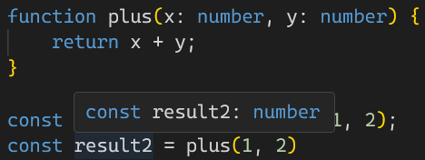
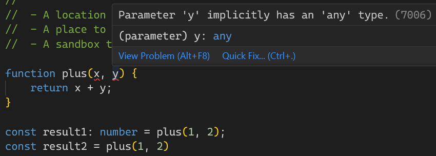

TypeScript 를 짤막하게 배웠지만, 제대로 써먹지는 못하고 있다.
그래서 사실 타입 지정을 거의 하지 않고 JS 를 쓰는 것 같은 기분이랄까..!

이전에 타입이 필요한 이유에 대해서는 [여기](https://kybaq.github.io/posts/Why-JS-needs-types/)에 작성을 한 적이 있다.

천천히 복습해보자.
본 글의 내용은 `타입스크립트 교과서`의 내용을 보고 작성했다.

### 타입은 어떤 값에 지정할까?

기본적으로는, **`변수`**, **`함수`**와 `함수`의 **`매개변수`** 그리고 그 **`반환값`**에 부여한다고 이해하면 쉽다.

TypeScript 의 타입은 JavaScript 의 자료형인 string(문자열), number(숫자), boolean(참 / 거짓), null, undefined, symbol(심볼), bigint, object 이 모두 존재한다.
함수와 배열도 내부적으로 객체로 구현되어있기에 `object` 형이다.

### 타입은 어떻게 부여할까?

그렇다면, 어떻게 사용하는지 바로 직접 살펴보도록 하자.

```ts
const str: string = "hello";
const num: number = "123";
const bool: boolean = false;
const n: null = null;
const u: undefined = undefined;
const sym: symbol = Symbol("sym");
const big: bigint = 1000000000n;
const obj: object = { hello: "world"};

function plus(x: number, y: number): number {
    return x + y;
}

const minus = () => {return ;}

const minus = (x: number, y: number): number => x - y;
```

이렇게 식별자 옆에 `: 자료형` 처럼 작성해주면 된다.

화살표 함수는 조금 헷갈릴 수도 있지만 `=>` 이전, 또는 매개변수를 표기하는 괄호 다음 반환값의 타입을 지정해주면 된다.

### 타입 추론

앞서, TypeScript 에 존재하는 타입을 살펴보았고 어떻게 지정해야하는지도 알아보았다.
그런데 문득 이런 생각이 들 수도 있다.

'매번 이렇게 타입을 명시해줘야하는 걸까?'
'조금은 알아서 추론해주면 좋지 않을까?'

그에 대한 대답은, **가능하다** 라고 할 수 있다!

코드를 통해 살펴보자.

```ts
function plus(x: number, y: number): number {
    return x + y;
}

const result1: number = plus(1, 2);
const result2 = plus(1, 2)
```

현재 `result1` 변수와 `result2` 변수엔 `plus()` 함수의 반환값을 할당했다.
차이가 있다면, `result1` 에서는 타입을 명시해주었고, `result2` 는 그렇지 않았다.

그럼에도, 이 코드를 [플레이그라운드](https://www.typescriptlang.org/ko/play/) 또는 vscode 에 작성한 뒤 `result2` 변수 위에 마우스를 올려보면 number 로 타입이 명시되어있는 것을 알 수 있을 것이다.


그 이유는 `plus()` 의 반환값을 명시해준 덕분이다. 그런데, 사실 `plus()` 함수의 경우에는 반환값도 명시하지 않아도 된다.

```ts
function plus(x: number, y: number){
    return x + y;
}

const result1: number = plus(1, 2);
const result2 = plus(1, 2)
```



숫자와 숫자를 더하면, 숫자가 나오는 것은 당연해보인다.

하지만, 매개변수의 타입을 빼면 설정에 따라 `implicitAny` 오류가 발생할 수도 있다.



현재 함수에 어떤 타입의 값이 들어올지 모르니, 당연히 추론해낼 수가 없게 되는 것이다.
그래서 타입스크립트는 `any` 타입으로 추론을 하게 되는데, 이는 어떤 자료형이든 들어올 수 있다는 것이다.

다만, 이렇게 사용한다면 그냥 자바스크립트를 쓰는 것과 다름이 없어지니 권장하지 않는 방식이라 기본으로 오류를 내는 쪽으로 되어있다.

여기까지 살펴보니, 최대한 타입 추론을 이용하는 방향을 선택하는게 좋아보인다.
타입스크립트를 쓰면서도, 어느정도의 자유도와 생산성을 확보할 필요가 있기 때문이다.

마지막으로 타입 추론 예시를 한 가지 정도만 더 살펴보고 마무리해보자.

#### const, let 으로 변수를 선언할 때

타입 추론을 적극적으로 사용할 수 있는 상황이 바로 '변수를 선언할 때'다.
일단 const 를 통해 선언한 변수를 살펴보자.

```ts
const str = 'hello'; // string ?
const num = 123; // number ?
const bool = true; // boolean ?
const n = null;
const u = undefined;
const obj = { hello: 'world'}; // object ?
```

이 변수들의 타입을 직접 살펴보기 전에, 각각 어떤 타입일지 생각해보자.
아마 주석에 적어둔 내용 처럼 생각했을 텐데 직접 살펴보도록 하자.

`str` 은 타입이 'hello' 라고 명시되어 있고, `num` 또한 number 가 아니라 123 으로 명시되어 있다.
`obj` 은 { hello: 'world' } 로 명시되어 있다. 객체의 경우, 이런 식으로 타입을 표기하니 참고하도록 하자.

뭔가 이상함이 느껴지는데, 그렇다면 let 으로 선언한 변수는 어떨까?

```ts
let str = 'hello'; // string
let num = 123; // number
let bool = true; // boolean
let n = null;
let u = undefined;
let obj = { hello: 'world' }; // { hello: 'world' }
```

let 으로 선언한 변수들은, 처음에 우리가 생각한 대로 추론을 했다.

잘 생각해보면, const 는 초기화 후 재할당이 불가능하고, let 은 어떤 값이든 재할당이 가능하다.
그래서 const 는 할당한 값을 그대로 타입으로 사용하고, let 으로 선언한 변수라고 하더라도 다른 자료형을 대입하는 경우가 많지 않으니, 초기에 할당한 값의 타입으로 추론하는 것이다.

const 로 선언한 변수들의 타입은 리터럴 타입이라고 부르면 된다.

타입스크립트의 타입 추론에 대해서 알아보았으니, 앞으로는 타입 추론을 적극적으로 활용하도록 하자.
다만, 부적절한 값으로 추론할 수 있으니 반드시 확인을 할 필요가 있다.