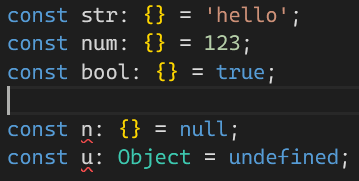

자바스크립트와 달리, 타입스크립트에서만 존재하는 타입과 연산자가 있다.
바로 Union Type 을 지정할 때 사용하는 연산자인 |(파이프 연산자)인데, 이번엔 이들에 대해 알아보자.

## Union Type(유니온 타입) 이란?

유니온 타입은 하나의 변수가 여러 타입을 가질 수 있는 가능성을 표시한다.
말 보다는 코드로 보도록 하자.

```ts
let strOrNum: string | number = 'hello';
strOrNum = 123;
```

이렇게, 한 변수가 2가지 이상의 타입을 가지게 될 때 사용할 수 있다.

## any

any 의 경우, 앞으로 타입스크립트를 적극적으로 사용할 생각이라면 지양해야한다고 했었다.
간단한 예시를 통해 위험성을 알아보자.

```ts
let str: any = 'hello';
const result = str.toFixed();
```

코드를 이런 식으로 작성했다면, 차라리 타입스크립트를 쓰지 않는게 나을 수 있다...
현재 str 엔 문자열을 할당했고, 문자열에는 `toFixed()` 메서드가 존재하지 않음에도 불구하고 아무런 오류가 발생하지 않는 것을 볼 수 있다.


차라리, any 로 지정을 하지 않고 타입 추론을 적극적으로 이용하도록 하자.


타입 추론을 이용했더니, string 타입에는 해당 메서드가 존재하지 않으니 오류를 일으키는 것을 볼 수 있다!
하지만, 빈 배열을 선언하는 경우나 `JSON.parse()` 의 반환값, 비동기 요청의 반환값엔 타입 추론 시 any 로 추론을 하게 되니 명시하도록 하자.


## unknown

unknown 은 any 와 유사한 점이 있는데, 모든 자료형을 대입할 수 있지만 해당 변수에 대해 어떤 작업도 실행할 수 없게 만든다.
그래서 any 를 대체하는 역할로 활용할 수 있는데, 예시를 보자.

```ts
const a: unknown = 'hello';
const b: unknown = 'hello';

a + b;
a.length;
```


변수 a, b 에 대해 어떤 동작도 수행할 수 없다.
값을 할당하기는 해서 그런지, `console.log()` 는 동작을 한다.


## void

void 의 경우, 함수의 반환값을 무시하도록 하는 타입이다.
어떻게 동작하는지 코드를 통해 살펴보자.

```ts
const func: () => void = () => 3;
const value = func();

const func2 = (): void => 3;
const func3: () => void | undefined = () => 3;
```


그런데 조금 특이한 점이 있다.
함수 `func` 의 경우, 그 반환값을 저장한 변수 `value` 에는 void 가 할당되어 있고 오류가 발생하지 않는다.

하지만, `func2` 와 `func3` 의 경우엔 3 을 반환하는 함수 동작에 오류를 일으킨다.
반환하지 못하게 만들고 있는 것이다.

이를 어떻게 활용할 수 있는지는 아래 코드를 보면 이해가 될 것이다.

```ts
[1, 2, 3].forEach((v) => v);

[1, 2, 3].forEach((v) => console.log(v));

[1, 2, 3].forEach((v) => v.toString());
```

첫 번째 `forEach` 는 그냥 배열의 원소를 반환한다.
두 번째는 console.log() 를 실행하고, 반환 값은 `undefined` 가 된다.
세 번째는 원소를 문자열로 변경해 실행한다.

지금 보면, 한 배열에 3가지 다른 반환값이 존재한다. 이때, 유저의 동작을 모두 예상해서 Union Type 으로 타이핑으로 해야만 하는걸까?

이때, void 를 사용하게 되는 것이다.

해당 함수에 타이핑을 할 때, `(v: number) => void` 로 타이핑을 해준다면 오류를 발생시키지 않고 사용자가 반환값을 알아서 처리하도록 만들 수도 있다.
만일, 반환값을 못 쓰게 만들고 싶다면 `(): void` 처럼 함수의 반환값만 void 로 설정하면 오류를 일으켜 사용을 막을 수도 있는 것이다.

## {}, Object, object

타입스크립트에서 `{}` 는, 객체 타입이 아니고 null 과 undefined 를 제외한 모든 타입을 지정할 때 사용 가능하다.

Object 도 동일한데, non-nullish-value 를 저장할 때 사용할 수 있는 타입이다.

```ts
const str: {} = 'hello';
const num: {} = 123;
const bool: {} = true;

const n: {} = null;
const u: {} = undefined;
```



null 과 undefined 를 대입하면, 오류를 일으킨다.


추가로, {} 나 Object 타입을 가진 변수를 실제로 사용하려고 하면 오류를 일으키거나 동작을 예상하기 힘들어진다.


실제로, Object 타입에는 해당 속성이 없으니 오류가 발생한다.
하지만 자바스크립트 내장 객체에 존재하는 메서드들은 사용이 가능하긴 하다.


다만, 이렇게 하면 타입을 지정하는 이점을 얻기가 힘들기에 사용할 이유가 없다.

마지막으로 object 는 이전 두 가지와 달리 원시값을 제외한 순수 객체를 의미한다.
하지만, 이 역시 사실 장점은 없으므로 사용할 이유는 없다.

## never

마지막으로, never 타입은 어떤 값도 대입이 불가능한 타입이다.
어쩌다가 한 번씩 마주칠 수 있으니, 알아만 두자.

에러를 일으키는 코드를 작성했다고 해보자.

```ts
function nerverFunc1() {
    throw new Error('에러');
}

const result1: never = neverFunc1();

const nerverFunc2 = () => {
    throw new Error('에러');
}

const result2 = neverFunc2();

const infinte = () => {
    while (true) {
        console.log('무한 반복입니다.');
    }
}
```

조금 특이한데, 함수 선언문과 함수 표현식에서 서로 다르게 처리한다.
선언문의 경우, throw 의 반환값은 void 로 처리하지만 표현식의 경우 never 로 처리하게 된다.

그래서 never 로 타이핑한 `result1` 에는 대입이 불가하고, `result2` 나 `infinite` 함수는 반환값이 never 가 된다.
