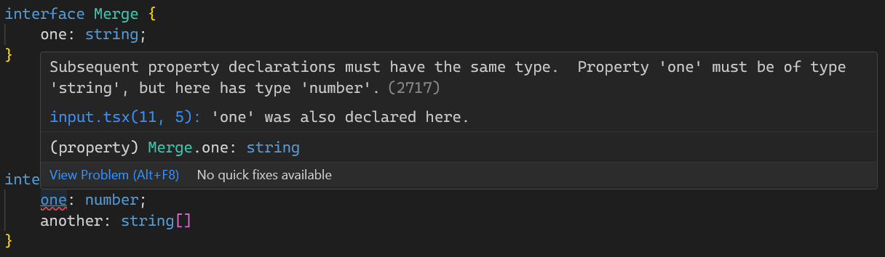

이번에 다루어볼 내용은, 타입 별칭(Type alias)라는 것이다.
타입 별칭을 이용하면, 마치 변수를 통해 값을 저장하는 것 처럼 특정 타입을 저장하고 하용할 수 있다.

## 타입 별칭(type alias)

```ts
type A = string;
const str: A = 'hello';
```

지금은 간단한 에시로, A라는 새 타입을 정하고 string 타입으로 지정한 에시다.
이제부터, string 을 지정할 땐 string 대신 A 라고 타이핑해줘도 무방하다.

이렇게 타입 별칭을 설정할 때는 첫 글자를 대문자로 지정하는게 컨벤션이라고 한다.
사실, 타입 추론을 이용하면 되는 상황이라 좋은 예시는 아니다.

조금 더 좋은 예시를 보자.

```ts
const func1: (value: number, unit: string) => string = (value, unit) => value + unit;

const ValueWithUnit = (value: number, unit: string) => string;
const func2: ValueWithUnit = (value, unit) => value + unit;
```

함수의 타입을 지정할 때, `func1` 처럼 하게 되면 가독성이 좋지 않다.
그래서 `ValueWithUnit` 타입을 지정해, 함수의 타입을 미리 정하고 이를 `func2` 함수에 타이핑해준 것이다.

물론, 객체나 배열을 타이핑할 때도 이용할 수 있는데 이때는 `interface` 라는 것을 자주 사용한다.

## 인터페이스(interface)

```ts
interface Person {
    name: string,
    age: number,
    married: boolean
}

const person2: Person = {
    name: 'k',
    age: 1000,
    married: true
}

const person3: Person = {
    name: 'o',
    age: 1,
    married: false
}
```

이런 식으로 활용이 가능하다.
타입 별칭과 유사하게 첫 글자를 대문자로 설정하는 것이 컨벤션이다.

이렇게만 보면, 타입 별칭과 다를 것이 없어보이는데 사실 몇 가지 기능이 더 있으니 살펴보도록 하자.

```ts
interface Func {
    (x: number, y: number): number,
}

const add : Func = (x, y) => x + y;

interface Arr {
    length: number,
    [key: number]: string,
}
```

인터페이스로 함수와 배열을 타이핑해준 예시다.
함수의 경우는 특별할 것은 없지만, 배열을 보면 조금 독특한 표기가 있다.

`[key: number]` 라는 표기가 있는데, 이를 **인덱스 시그니처** 라고 한다.
이 표기가 의미하는 것은 다음과 같다.

Arr 인터페이스를 가질 경우, length 를 제외한 다른 모든 키는 number 타입이고 그 짝(할당한 데이터)은 string 타입 이라는 것이다.

### 인터페이스 선언은 합칠 수 있다

인터페이스의 다른 특징은 서로 합칠 수 있다는 것이다.

```ts
interface Merge {
    one: string
}

interface Merge {
    two: number,
}

const example: Merge = {
    one:'1',
    two: 2,
}
```

이렇게 선언이 가능하다.
같은 이름으로 여러 번 선언할 수 있고, 이 인터페이스들은 자동으로 합쳐진다.

이런 동작을 `선언 병합(delclaration merging)` 이라고 부른다.
이 선언 병합은 확장하기 편하지만, 언제나 이럴 땐 의도하지 않은 결과가 생기기 마련이다.

서로 병합이 되어도 괜찮다면 모르겠지만, 서로 다른 타입을 지정하는 인터페이스가 같은 이름을 가지는 경우는 문제가 될 수 있다.

```ts
interface Merge {
    one: string;
}

interface Merge {
    one: number;
    another: string;
}
```



물론, 같은 속성 키에 대해 다른 타입이 지정되어있다면 오류가 발생하긴 하지만 첫 번째 Merge 인터페이스를 사용하는 것은 another 라는 키가 없을 텐데, 병합 때문에 혼란이 생길 수 있다.
그래서 네임스페이스(namespace) 가 존재한다.

## 네임스페이스(namespace)

```ts
namespace Example {
    export interface Inner {
        test: string;
    }
    export type test2: number;
}

const ex1: Example.Inner = {
    test: 'hello',
}

const ex2: Example.test2 = 1;
```

이렇게 네임스페이스를 선언하고 나면, 내부에서 사용할 타입 / 인터페이스를 반드시 `export` 해야한다.

그리고, 네임스페이스도 중첩이 가능하며 이름이 같은 네임스페이스의 경우에도 병합이 된다.

```ts
namespace Example {
    export interface Inner {
        test: string;
    }
    export type test2: number;
}

namespace Example {
    export type test3: string;
}

namespace Outer {
    export namespace Innter {
        export interface Inner {
            test: string;
        }
    export type test2: number;
    }
}
```

네임스페이스를 중첩할 경우, 내부 네임스페이스는 반드시 export 를 해야 접근이 가능해지니 잊지 말자.
