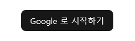
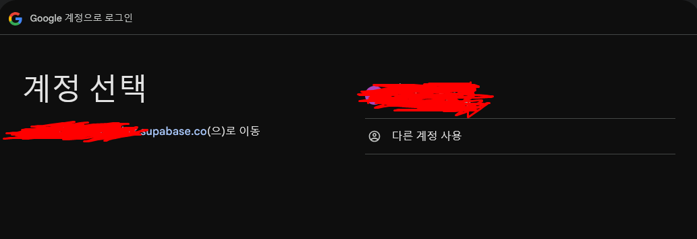
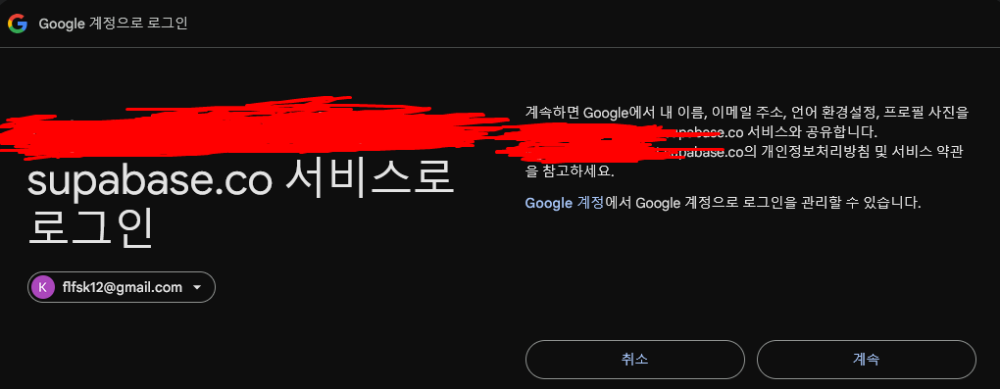
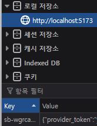
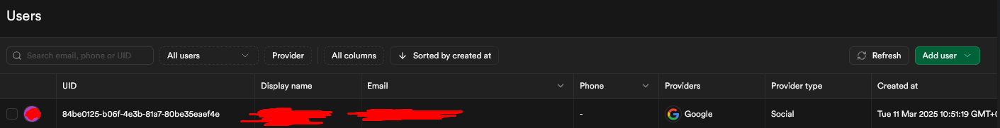
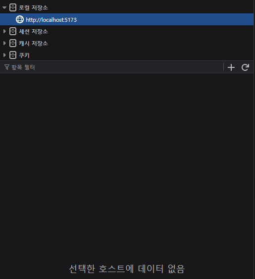

이번에는 직접 Sign-in 기능을 구현해보도록 하자.
그에 앞서, Supabase 에서 OAuth 를 구현할 때는 2가지 방법이 있다.

1. Application code configuration
2. Google pre-built configuration

1번의 경우, 로그인 버튼을 내가 직접 만드는 것이다.
2번의 경우, 미리 만들어진 로그인 버튼이 있어서 이를 이용하는 방식이다.

1번으로 선택을 했다.
오히려 이미 만들어진 것을 사용하려고 하니 귀찮은 점이 많았다. 물론, 이전에 로그인 한 세션이 있다면 아래 처럼 아이디를 보여줄 수 있다.

이 부분은 매력적인 것 같은데, 사실`<script></script>` 태그를 통해 import 를 진행해야하며 특정 컴포넌트나 페이지에서만 불러오도록 만들기엔 react 프로젝트이기 때문에 번거로울 것 같았다.
이 방법 밖에 없다면 모르겠으나, 지금은 로그인 기능을 구현해보는게 중요한 부분이라 1번 방식으로 진행하도록 하자.

## Application code

1. 본 링크로 [접속](https://console.cloud.google.com/apis/credentials/consent) 한다.
2. Google 인증 플랫폼 이라는 메뉴에 접속하게 되는데, 본인의 프로젝트를 생성해주자.
3. 생성하는 과정에서, '승인된 도메인' 섹션에서 supabase 프로젝트의 도메인을 입력해야한다. `<PROJECT_ID>.supabase.co` 형식의 주소를 기입하면 된다.
4. 생성이 되면, 데이터 액세스 항목으로 이동해 '범위 추가 또는 삭제' 버튼을 누른다.
5. `.../auth/userinfo.email`, `.../auth/userinfo.profile`, `openid` 라는 범위를 선택해준다.
6. 이후 API 및 서비스 제품으로 이동해 '사용자 인증 정보' 항목으로 이동한다.
7. '사용자 인증 정보 만들기' 버튼을 클릭하고 'OAuth 클라이언트 ID' 를 누르고, '어플리케이션 유형'을 웹 애플리케이션으로 선택해준다.
8. '승인된 JavaScript 원본' 섹션에서는, 실제 서비스의 도메인을 작성해주면 되는데 개발 과정에서는 localhost:<포트번호> 형태로 추가해주면 된다.
9. '승인된 리디렉션 URI' 섹션에서는, Supabase 에서 제공하는 callback URL 를 기입하면 된다.
10. 이를 확인하기 위해서는 Supabase 프로젝트에서 Google OAuth 를 활성화 해주면 된다. Client Ids / Client Secret 등의 항목은 OAuth 클라이언트를 생성하고 나면 기입이 가능하니 닫지 말고 둔다.
11. Google OAuth 페이지로 넘어와 '만들기' 버튼을 눌러 생성을 끝내면, OAuth 클라이언트의 ID 와 비밀번호를 확인할 수 있는데, 10번의 Supabase Google OAuth 활성화 창에 기입해준다.
12. 이제 코드를 작성할 시간이다. 로그인을 담당할 요소를 만들어주고, 아래 코드를 추가해주자.

```js
// implicit flow
supabase.auth.signInWithOAuth({
  provider: 'google',
})

// PKCE flow, For Server Side Auth
await supabase.auth.signInWithOAuth({
  provider,
  options: {
    redirectTo: `http://example.com/auth/callback`,
  },
})
```

13. 이후, Refresh Token 을 위해 `option` 속성에 아래 항목을 추가해주면 된다.

```js
const { data, error } = await supabase.auth.signInWithOAuth({
  provider: 'google',
  options: {
    queryParams: {
      access_type: 'offline',
      prompt: 'consent',
    },
  },
})
```

`acess_type` 이 토큰과 관련한 항목이고, `prompt` 는 유저에게 확인을 받는 프롬프트를 말한다.

14. 테스트



15. 로그인...





16. 완료!





17. 로그아웃까지!




기능 자체는 구현이 끝났다.

이제 다음으로는 trigger 와 function 차례다.

## trigger 와 function

trigger 와 function 이 필요한 이유는, private 영역에 있어 접근이 어려운 유저 정보를 public 영역에서 관리하기 위해서였다.
trigger 를 등록해 OAuth 를 통한 로그인이 이루어져 데이터가 기록이 되면, function 이 동작해 이를 public 영역으로 복사해주는 기능을 작성했다.

supabase AI 의 도움으로 쉽게 해결할 수 있을까 싶었는데, 자꾸 데이터가 옮겨지지 않아서 검색을 통해 다른 게시글을 참고[1]했다.

마침내 데이터가 제대로 이전이 되는 것을 확인했다!! 끝!
다음엔 OAuth 2.0 의 동작 방식에 대해 조금 다루어보도록 하자.

[1]: https://whereannalee.tistory.com/202