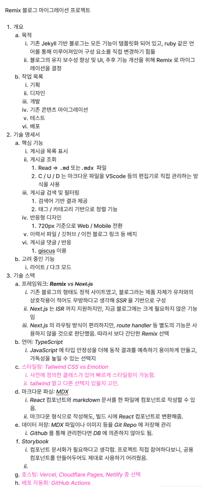
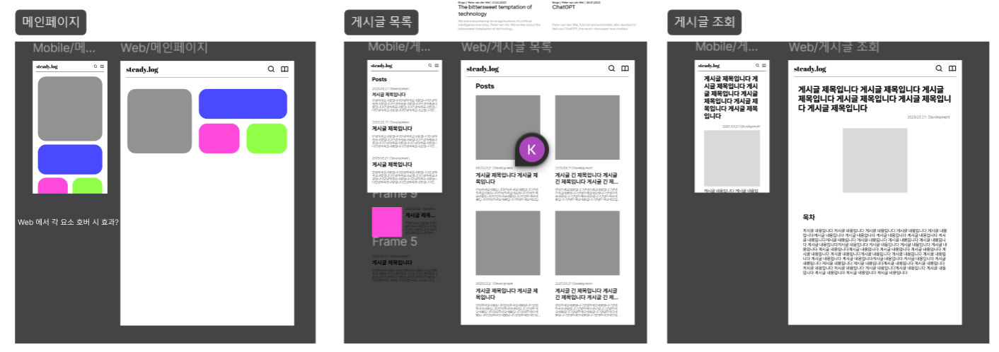

## 블로그

개발자의 길을 걷기로 결정하면서, 블로그를 통해 일지를 남기는 것을 가장 중요하게 생각했다.
그래서, 어떤 플랫폼에서 블로그를 운영할지 많이 고민했었다.

티스토리, 벨로그, 미디움 등 여러 플랫폼에 가입도 해보고 글도 작성해보았었다.
처음에 선택했던 것은 미디움이었는데, 영어권 개발자들이 많이 이용을 하고 있어서 교류할 수도 있다는게 장점 같았다.

하지만 얼마 못가 철수하게 되었다.
10개 정도 게시글을 작성했는데, 게시글을 작성할 때가 너무 불편했고 UI 에 정감이 안 갔다.

방황은 길지 않았고, 다음으로 선택한 플랫폼이 현재 사용하는 중인 jekyll 기반 페이지다.
물론 템플릿을 사용하긴 했지만, github 로 배포까지 하고나니 정말 나만의 페이지가 만들어진 것 같아 애정이 생겼다.

물론 보는 사람 하나 없지만, 그 뒤로 게시글은 작성했다.
어떤 날엔 영양가 하나 없는 게시글이었지만... 그래도 일기라고 생각하고 꾸준히 습관을 들였다.
그렇게 1년 정도 지났다.

## 블로그를 옮기자

사실 템플릿을 사용한 뒤, 블로그의 기능이나 디자인을 직접 수정해본 적은 한 번도 없었다.
크게 신경을 쓰고 있지 않다가, 얼마 전 부터 조금 더 깔끔한 디자인으로 변경하고 싶어졌다.

템플릿을 직접 수정하려고 하니, 이미 틀이 다 짜여져있는 것을 건드려니 별로 내키지가 않아서 어떻게 할지 생각만 하고 있었다.
그러다 문득, '이제 내가 직접 만들 수 있는 정도 아닌가?' 하는 생각이 들어서 바로 실행에 옮기기로 했다.

완벽하지는 않겠지만, 처음부터 끝까지 모든 과정을 직접 해볼 수 있겠다는 생각이 들어 재밌을 것 같았다.

## 기획서를 간단히 써보자

혼자서라도 프로젝트를 시작하는 것이니, GPT 에게 부탁해 기획서 형식을 작성해달라고 부탁했다.
그 형식을 통해 초안을 작성했었다.

세세한 사항은 아직 결정이 되지 않았지만, 기능 구현을 위한 와이어 프레임을 만들어가고 있다.

아직 개발은 시작하지 못했지만, 곧 시작할 수 있을 것이다.

그리고 간단히 디자인 시스템을 만들었는데, 이 내용은 다른 포스트에 정리해볼 생각이다.
도움 받은 출처들이 꽤나 많아서, 다음에도 이용하기 위해 아무래도 기록이 필요할 것 같아서 말이다.
