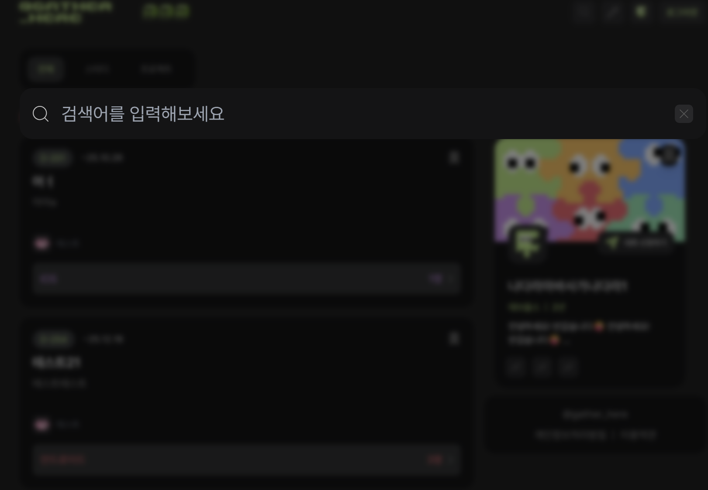
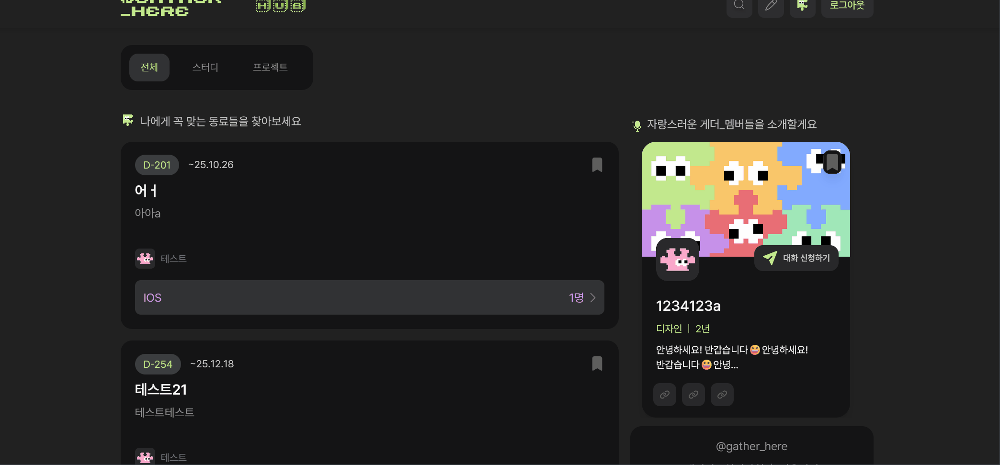

## 문제 상황

- 검색 기능을 개선하는 과정에서, 검색창을 모달로 구현하기로 결정함.
- 모달이 나타나면, backdrop 을 만들어 배경을 흐리게 만들고 싶었음.



이렇게!

- 이 과정에서 ***모달 내의 `input` 이 아닌 모달의 외부 영역(backdrop)을 클릭한 경우, 모달이 닫히는 기능을 구현***하고자 함.
- 이를 위해서는 `useRef` 를 사용해 DOM 요소에 직접 접근, 현재 클릭한 DOM 요소가 모달 내부인지 아닌지 파악한 뒤, state 를 변경
- 하지만 문제 발생, 모달을 열고 닫는데 필요한 state 가 2개가 필요.
  - 부모 컴포넌트에서 prop 으로 전달받아 모달을 열고 닫을 때 사용하는 stata 1개
  - 모달 내부에서 클릭 이벤트가 발생한 노드를 파악할 때 사용하는 state 1개
- 모달의 backdrop 요소와 input 요소 2가지 모두에 이벤트 핸들러를 추가해 해결하려했지만, 부모에게 전달받은 prop 을 자식에서 변경할 수는 없기에 해결 불가.

정리해보자면, 부모로 부터 받은 prop 과 내부에서 사용하는 state 가 모두 false 일 때만 모달이 닫혀야 하는데, backdrop 을 만들어 버리면 부모에서 state 를 변경할 수 없어져 새로고침이 아니라면 모달을 닫을 수 없게 돼버렸다.

prop 으로 하나 더 전달하지 않고, 모달 내부에서만 state 를 갖도록 통합할 필요가 있었다.

## `useImperativeHandle()` 이란?

> 공식문서에서 모달이나 토글 메뉴를 열고 닫는 에시를 보여주긴 하지만, props 를 전달해서 해결이 가능한 경우엔 ref 를 쓰지 말라고 당부하니 참고하자.  
> 나의 경우엔, backdrop 이 있어 props 로 전달 받은 state 를 바꿀 수 없었기에 이용한 것이다.

```js
useImperativeHandle(ref, createHandle, dependencies?)
```

첫 번째 인자로 원하는 ref 를 넘기고, 두 번째 인자에 ref 를 조작할 Handle 을 넘겨주면 된다.

세 번째 인자는 `useEffect()` 의 의존성 배열과 같은 역할이라고 생각하면 된다.
인자로 넘겨준 의존성 배열의 요소들이 변할 경우 두 번째 인자를 전달 받은 createHandle 함수가 재실행 되며, ref에 다시 handle 이 할당된다.

간단히 정리해 지금 이 hook 을 이용하면, state 를 조작하는 함수를 부모 컴포넌트의 ref 에 전달할 수 있었다.

하나의 state 로 통합이 가능해지는 것이다!

게다가 `useImperativeHandle()` 을 통해 전달한 것이 아니라면, 어떤 것도 접근이 불가능하게 만들 수 있었다. (사실 지금 필요한 것은 아니었다)

다시 말해, 원래는 ref 로 전달을 하게되면 `current` 속성에 DOM 요소 자체가 할당되는 방식이라 해당 DOM 요소의 속성에 마음대로 접근이 가능했다.

하지만, useImperatvieHandle() 을 이용하면 이 hook 에서 반환해주는 것에만 접근이 가능하도록 막아줄 수 있게 된다.

## 해결 과정

```tsx
const Modal = ({ isSearchOpen }) => {
    const [isOpen, setIsOpen] = useState(false);
{(isSearchOpen || isOpen) && (
    <form
    className="absolute top-0 left-0 w-full bg-background z-50 p-2 flex items-center s:block"
    onSubmit={handleSearch}
>
    <label htmlFor="search" className="sr-only">
    검색창
    </label>
    <input
    type="text"
    id="search"
    name="search"
    placeholder="검색어를 입력해보세요"
    className="shared-input-thin-gray w-full"
    value={searchWord}
    onChange={(evt) => setSearchWord(evt.target.value)}
    />
    <button type="button" onClick={toggleSearch} className="absolute right-4 top-1/2 transform -translate-y-1/2">
    <Image src="/assets/header/close.svg" alt="닫기 버튼" width={16} height={16} />
    </button>
</form>
)}
}
```

처음엔 이런 식으로 조건부 렌더링을 걸어두었다.

그런데, backdrop 이 있으니 부모의 prop 을 더 이상 변경할 수가 없어 모달을 한 번 열고나면 `isSearchOpen` 이 항상 `true` 인 상태였다.

이를 해결하기 위해, useImperativeHandle 을 사용해 변경해주었다.

## 최종

```tsx
'use client';

import React, { useRef, useEffect, forwardRef, useImperativeHandle, useState, FormEvent } from 'react';
import { createPortal } from 'react-dom';
import useSearch from '@/hooks/useSearch';
import { SearchModalRef } from '@/types/refs/SearchModal';

const SearchModal = forwardRef<SearchModalRef>((props, ref) => {
  const { searchWord, setSearchWord, handleSearch } = useSearch();
  const modalRef = useRef<HTMLDivElement>(null);
  const [isOpen, setIsOpen] = useState<boolean>(false);

  // 외부에서 접근 가능한 메서드 노출
  useImperativeHandle(ref, () => ({
    open: () => setIsOpen(true),
    close: () => setIsOpen(false),
  }));

  // 외부 클릭 감지 효과
  useEffect(() => {
    const handleOutsideClick = (event: MouseEvent) => {
      if (modalRef.current && !modalRef.current.contains(event.target as Node)) {
        setIsOpen(false);
      }
    };

    if (isOpen) {
      document.addEventListener('mousedown', handleOutsideClick);
    }

    return () => {
      document.removeEventListener('mousedown', handleOutsideClick);
    };
  }, [isOpen]);

  // 검색 폼 제출 핸들러
  const onSubmit = (e: FormEvent<HTMLFormElement>) => {
    handleSearch(e);
  };

  if (!isOpen) return null;

  return createPortal(
    <div className="fixed inset-0 bg-black bg-opacity-50 ease-in-out backdrop-blur-sm z-10">
      <div
        ref={modalRef}
        className="mx-auto max-w-container-l m:max-w-container-m s:max-w-container-s w-full h-[78px] p-5 bg-fillStrong rounded-[20px] flex-col justify-start items-start inline-flex mt-[20px] absolute inset-x-0 inset-y-32 z-50"
      >
        <div className="self-stretch justify-start items-center gap-5 inline-flex">
          <div className="grow shrink basis-0 h-[38px] justify-between items-center flex">
            <div className="justify-start items-center flex">
              <form className="relative items-center s:w-full" onSubmit={onSubmit}>
                <label htmlFor="input" className="sr-only">
                  검색창
                </label>
                <input
                  type="text"
                  id="input"
                  name="search"
                  placeholder="검색어를 입력해보세요"
                  className="w-full h-[60px] bg-fillStrong text-fontWhite text-[28px] font-normal font-['Pretendard'] leading-[37.80px] focus:outline-none"
                  value={searchWord}
                  onChange={(evt: React.ChangeEvent<HTMLInputElement>) => setSearchWord(evt.target.value)}
                />
              </form>
            </div>
            <button onClick={() => setSearchWord('')} type="button" aria-label="검색어 지우기">
            </button>
          </div>
        </div>
      </div>
    </div>,
    document.body,
  );
});

SearchModal.displayName = 'SearchModal';

export default SearchModal;
```

모달 내부 / 외부 영역의 클릭을 감지하는 `handleOutsideClick()` 이벤트 핸들러가, 모달이 열릴 때만 등록이 되어야하기 때문에 `useEffect()` 를 사용했다.

이렇게 하고 나니 마침내 해결이 되었다!

## 실제 동작


