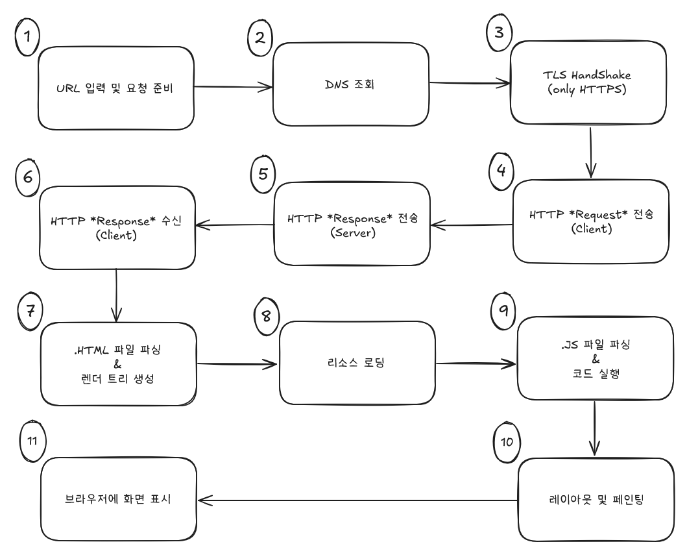

## 목적

> 우리가 웹 사이트를 접속하기 위해서 사용하는 대표적인 프로그램을 꼽아보라면 `웹 브라우저`인 'Google Chrome', 'Safari' 등이 있다.  
> 웹 브라우저 덕에 자주 이용하는 사이트에 접속해서 하고 싶은 일(ex. 유튜브 시청, 이메일 기능)을 하곤 한다.  
> 개발자가 아니었다면, 원리를 파고들지 않아도 괜찮지만 나는 '웹 개발'을 하기로 마음을 먹었으니 이 단계를 차근차근 정복해보려고 한다.

## 웹 사이트를 접속할 때

먼저 이 과정을 요약해둔 사진을 보도록 하자.

일단 각 과정에서 어떤 일이 벌어지는지 간단히 살펴보자.

### 각 과정 별 내용

#### 1. URL 입력 및 요청 준비

웹 브라우저 사용자가 주소 창에 URL 을 입력하는 경우, 다른 사이트로 연결하는 링크를 클릭하는 경우에 이 과정이 진행된다.

이때 URL 을 파싱하면서 해당 사이트가 이용하는 프로토콜(HTTP / HTTPS), 도메인, 경로를 파악한다.

[URL 구조 이해하기](posts/2025-08-04-URL-Structure.md)

#### 2. DNS 조회

사용자가 입력한 URL 에서 파악한 도메인 정보를 IP 로 변환하는 과정이다.  
이를 위해, 도메인-IP 쌍의 목록을 저장하고 있는 DNS(Domain Name System)를 조회한다.

[DNS 조회 과정 살펴보기](posts/2025-08-05-DNS-Query.md)

#### 3. TCP Handshake / TLS Handshake(HTTPS only)

원하는 사이트의 서버 IP 주소를 알아 냈으니, 이번엔 네트워크 연결 과정이다.  
HTTP는 TCP/IP 기반의 통신으로, TCP Handshake 과정이 필요하다.

[HTTP 통신 이해하기](posts/2025-08-06-What-is-HTTP.md)

[TCP Handshake 이해하기](posts/2025-08-06-What-is-TCP.md)

[TLS 암호화란?](posts/2025-08-06-What-is-TLS.md)

#### 4. 클라이언트 측 HTTP 요청(request) 전송

HTTP 연결이 가능하다는 것을 확인했다면, 클라이언트 측에서 필요한 자원을 요청하는 과정이다.

#### 5. 서버 측 HTTP 응답(response) 전송

클라이언트 측에서 보내온 정상적인 요청(request)에 따라, 서버에서 적절한 응답을 반환해준다.

#### 6. 클라이언트 측에서 HTTP 응답 수신

4번에서 보냈던 요청에 대한 응답을 '클라이언트'가 수신하고, HTTP 통신을 마친다.

#### 7. `.HTML` 파일 파싱 & 렌더 트리 생성

클라이언트(브라우저)가 수신한 `.HTML` 형식의 파일을 읽어내고, 화면에 그려내기 위한 준비를 한다.

[브라우저 렌더링 과정 이해하기](posts/2025-08-07-How-browsers-render.md)

#### 8. 리소스 로딩

계속해서, 브라우저가 화면을 그려내기 위해 HTML 파일에서 필요한 리소스(`.js`, 이미지 파일 등)을 불러온다.

#### 9. `.JS` 파일 파싱 & 코드 실행

자바스크립트 파일을 읽어들인 다음, 코드를 실행한다.

#### 10. 레이아웃 및 페인팅

7번, 8번, 9번 과정을 통해 화면에 그려내야할 요소들의 위치 / 순서를 결정했다면, 화면에 실제로 그려내는 과정이다.

#### 11. 브라우저에서 화면 표시

우리가 마침내 사이트의 UI 를 마주하게 되는 단계다.

### 마무리

지금까지, 우리가 사이트를 이동할 때 어떤 일이 벌어지는지 간단히 요약해보았다.

브라우저 주소창에서 `naver.com` 를 입력하거나, 사이트 내의 어떤 링크에 접속할 때마다 이 과정들이 계속 반복되고 있는 것이다.

다만 다양한 프레임워크가 등장하게 되면서 이 내용이 100% 부합하지 않을 수도 있다.  
본 내용은 참고 정도로 살펴보고 프레임워크를 이용하는 개발자가 잘 이해하고 하니, 공식문서 등을 잘 숙지할 필요가 있다.
