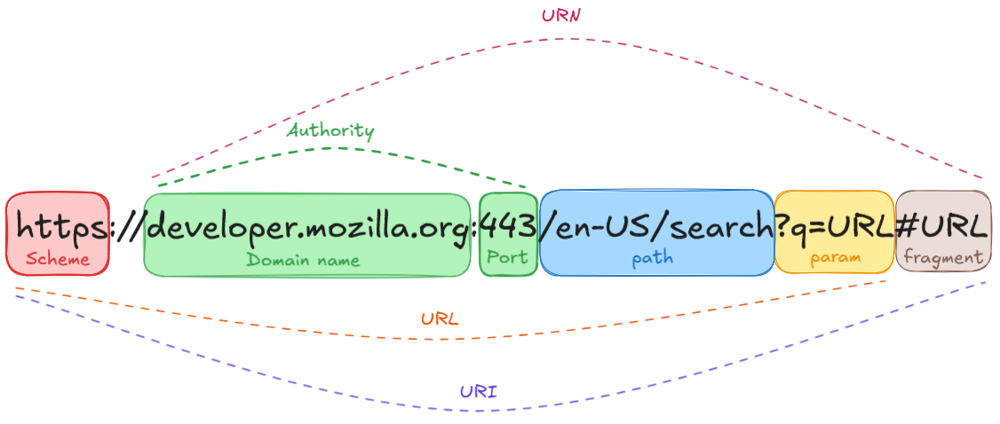

## 목적

> 이번엔 URL 구조에 대해 이해하는 시간이다!  
> 한 번 알아보도록 하자.

## URL 이란?

Uniform Resource Locator 의 약자로, 리소스(자원)의 위치를 알려주는 일종의 '우편번호'로 이해하면 되겠다.

'리소스'는 해당 페이지를 위한 HTML 파일이 될 수도 있고, 다운로드할 수 있는 다양한 파일이 될 수도 있다. 아무튼, 어떤 파일이 어디에 있는지 알려주는 수단이라는 것!

### URL 의 구조

위 사진을 보면, URI 와 URN 이라는 생소한 어휘도 존재한다.  
사실은 URI 가 최상위 개념이 되는 것이고, 그 하위 개념으로 URL / URN 이 존재한다.

단지 웹 사이트 자원의 위치를 어디까지 표기하는지에 따라 URI 인지, URL 인지 달라진다.  
그러니 복잡하게 파고들기 보단, 각 요소가 무엇을 의미하는 것인지 파악해보도록 하자.

#### Scheme

`Scheme` 은 해당 자원을 요청할 때 사용할 프로토콜을 작성한다.
웹의 경우엔 HTTP / HTTPS 를 사용하기에, 이렇게 작성해주는 것 뿐이다.

웹 주소를 입력할 때만 사용하지 않고, 메일을 보내고 싶다면 아래와 같이 표현할 수도 있다.

`mailto:flfsk12@gmail.com` (실제로 가능함)

#### Authority

`Authority` 는 2가지 정보를 함께 가지고 있다.

##### Domain name

첫 번째로는, 도메인 이름이다.

도메인 이름의 경우, DNS 서버를 통해 IP 주소로 변환하는 과정을 거친다.

##### Port

두 번재로는 포트 번호다. 해당 도메인 네임에서 사용하는 별도의 포트가 없다면, 비워두면 프로토콜 별 기본 값을 알아서 적용해준다.

HTTP 는 80 번, HTTPS 는 443 번 포트를 각각 사용한다.

#### Path

`Path` 는 리소스의 상세 경로다.

예를 들어, 위 예시에서는 `/en-us/search` 까지가 Path 인 것이다.  
`developer.mozila.org` 경로에서 '/en-us', '/search' 까지 총 2 단계로 이루어져있다.

#### Param

`Param` 의 경우, 서버에 요청을 보낼 때 함께 전송하는 데이터다.  

위 예시를 보면 `?q=URL` 에 해당하며, '&' 를 이용해 여러 개의 데이터를 전송할 수 있다.

예를 들면 이런 식이다. `?q=URL&sort=asc&page=1`

#### Fragment

사실, `Fragment` 는 URL 에 포함하지 않는다.  
URN 이나 URI 에 포함되는 속성인데, 일종의 '책갈피' 를 생각하면 이해하기 좋다.

HTML 문서의 heading 요소들이 이에 해당한다. (h1 - h6)

## 마무리

이렇게 URI, URL, URN 에 대해 간단히 알아보았다. 복잡한 내용은 없으니 간단히 마무리하도록 하자.
