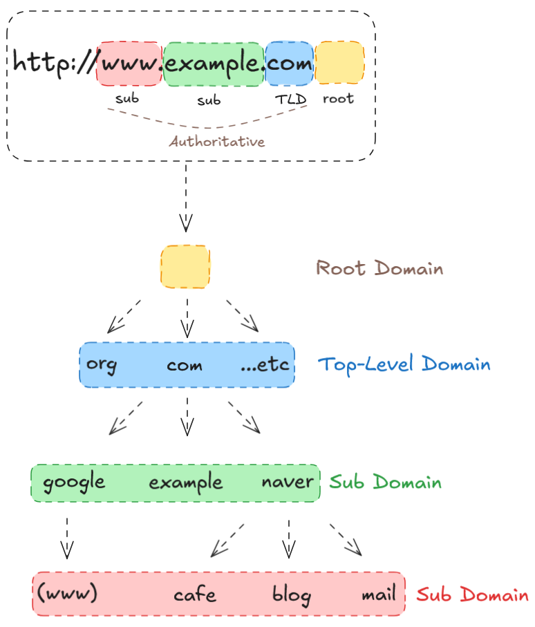
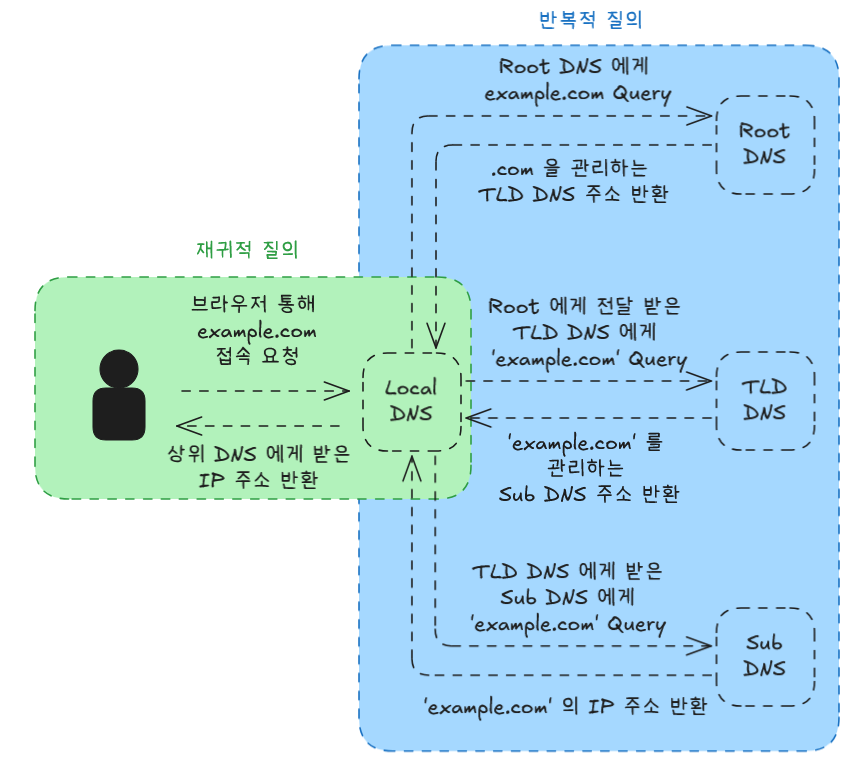
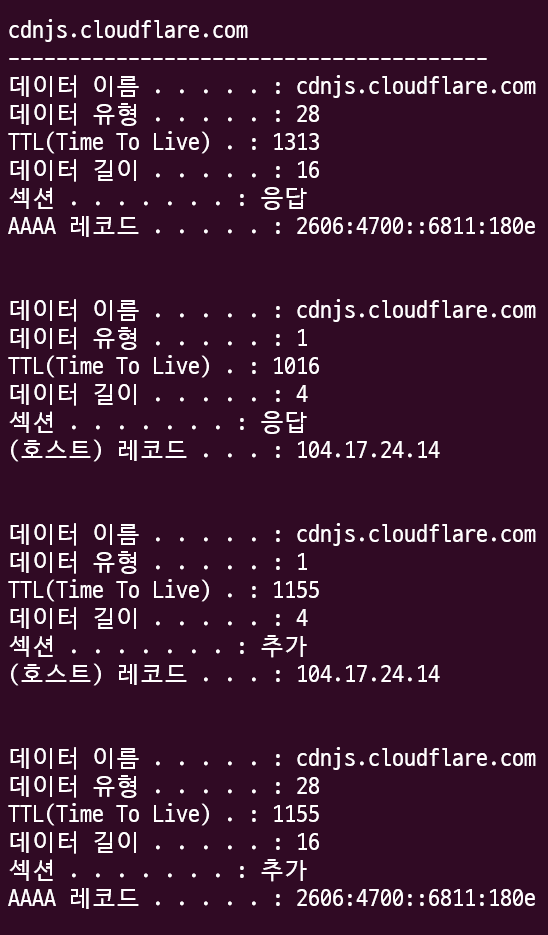

## 목적

> DNS 는 우리가 사용하는 도메인을 IP 주소로 변환해주는 역할을 하는 체계다.  
> 어떤 방식으로 IP 주소로 변환해주는지 그 방식을 이해해보자.

## DNS란?

Domain Name System 의 약자로, 사이트의 도메인을 IP 주소로 변환해주는 역할을 한다.  
우리가 더 이상 휴대폰 번호를 외우지 않아도, 번호를 저장만 해둔다면 연락이 가능한 전화번호부 같은 것이다.

하지만 전화번호부에 너무 많은 번호를 저장한다면, 일일히 관리하기 힘들어 질텐데 하물며 웹 사이트는 어떻게 관리할 수 있을까?

퍼플렉시티를 통해 찾아본 결과, 현재까지 등록된 웹 사이트는 2025년 7월 기준으로 11억 - 12억 개가 존재한단다.

물론 이 중에 실질적으로 관리되고 있는 것들은 10% 내외라고 하며, 이들은 도메인 등록 기간이 만료되어 사라지는 경우가 대다수다.

아무튼, 이렇게 많은 도메인과 IP 주소를 매칭하기 위해 관리하는 방법이 있다.
바로 DNS Name Space 인데, 이 체계를 이해하면 도움이 될 것이다.

### DNS Name Space



DNS Namp Space 는 이렇게 구성되어있다.

Root -> Top-Level -> Sub -> Sub 처럼 이루어져 있다.

#### Root

Root 도메인의 경우, 출발지 역할을 담당하는데 하위 단계인 Top-Level Domain 들의 정보를 저장하는 `또 다른 DNS 서버`의 위치를 저장하고 있다.

전 세계 13개의 원본 DNS root Name server 가 존재하며, 이 들을 다시 복제해서 사용한다.  
[링크](<http://www.iana.org/domains/root/servers>)에 접속하면 확인해볼 수 있다.

#### TLD(Top Level Domain)

최상위 도메인 (Top Level Domain, TLD)이라 부르며, 일반적으로 국가 혹은 일반 최상위 도메인(.kr, .jp, .net, .com, .org 등)을 관리한다.

#### Sub Domain

TLD 의 하위에 계층에 속하는 2차 이상 도메인, 즉 최상위 도메인이 관리하는 하위 도메인 (google, naver, .ac, .go, .co 등)이다.

하위노드는 무제한으로 만들 수 있으나 도메인 전체길이는 255 bytes 제한이 있다.

### DNS 쿼리 과정

DNS 를 통해, URL 을 IP 로 변환하는 과정을 'DNS Query'라고 한다.

DNS 를 어느정도 이해했으니, 변환 과정을 이해해보도록 하자.
이 과정은 2가지로 구성 되어있는데, **재귀적 질의** 와 **반복적 질의** 두 개다.

도메인을 IP 주소로 변환하면서, 두 가지 과정 모두 이루어지기 때문에 구분하지 않는 경우도 있는 것 같다.

실제 과정을 살펴보도록 하자.



위 흐름에서 재귀적 질의는 사용자의 요청을 받은 리졸버가 대신 주소를 찾아오는 과정에 해당하고, 반복적 질의는 단계적으로 DNS 서버들에게 질의하며 주소를 확인하는 과정이다.

이 두 가지 질의 과정을 거쳐 IP 주소로 변환할 수 있게 되는 것이다.

물론, 이 과정을 단축하기 위해 캐싱을 적용하는 경우도 있다.

#### DNS 캐싱

캐싱된 내역을 직접 확인할 수 있다. (Window 기준 명령어)

```cmd
> ipconfig /displaydns
```



직접 명령어를 입력한다면, 정말 많은 정보가 있는데 TTL(Time To Live) 정도만 알아두자.

TTL은 캐싱 기간으로 이해하면 되는데, 이 시간이 지나게되면 이 내역을 삭제하는 것이다.

## 마무리

DNS 를 통해 웹 도메인에서 IP 주소를 얻는 과정을 살펴보았다.
다음엔 HTTP 통신에 대해 다루어 보도록 하자.