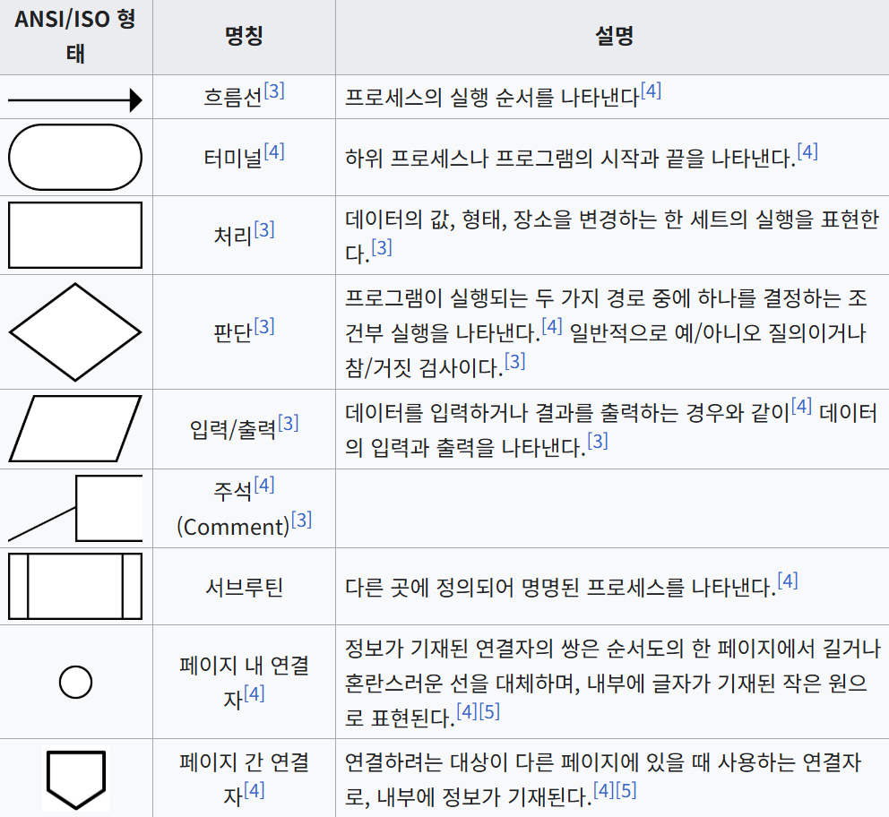
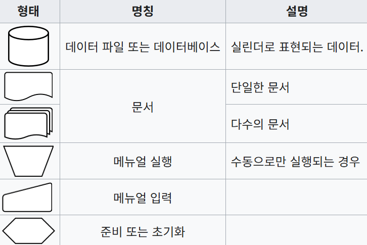
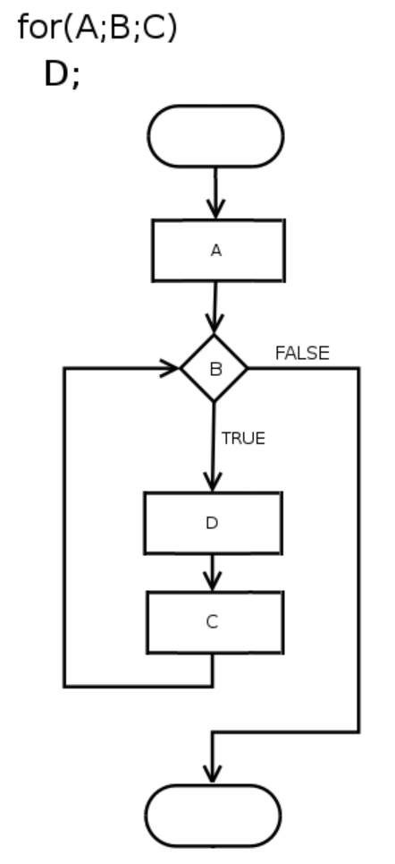

> 한동안 글이 뜸했지만, 여러 가지 초안을 올리지 못했다. 살짝 지쳤었고, 여러 시행착오들이 있었다.
> 그 내용은 다른 게시글로 정리해보도록 하고, 지금 플로우 차트를 사용해볼 생각이라 이를 먼저 다루려고 한다.

## 목적

Socket.io 기반 서버와 클라이언트 간의 상호 작용을 도식화 할 필요가 있어, 플로우 차트를 사용하기로 했다.

지금 단계에서는 코드로 구현하는 과정보다는, 우리가 구현하려는 Socket.io 서버와 클라이언트 간 상호작용 과정을 팀원들에게 설명하기 위함이 주 목적이니 만큼 플로우 차트가 더 단순하고 이해하기 쉽다고 생각했다.

## 플로우 차트란?

어떤 일을 처리하는 과정을 간단한 기호, 화살표로 도식화한 그림이다.  
주로 프로그램이 어떤 과정으로 실행되는지 그 과정을 그림으로 나타날 때 사용한다.

## 플로우 차트의 구성 요소(기호)

위키피디아에서 가져온 내용을 보자.



위 기호들은, 일반적으로 사용하는 기호들이고 자세히 구성하기 위해 아래 기호를 추가할 수 있다.



작성 예시를 통해 살펴보자.

## 작성 예시

C 언어의 반복문을 플로우 차트로 표시한 예시를 통해 살펴보도록 하자.
반복문의 실행 과정은 주요 언어들도 동일할테니, C 언어를 몰라도 괜찮다.

```C
for (A; B; C) {
    D
}
```

이 반복문은 다음과 같이 처리될 것이다.

- A 실행
- B 실행
  - 참(True)일 경우
    - D 실행
    - C 실행
    - B 실행
  - 거짓(False)일 경우
    - 실행 종료

아래는 위 반복문을 어떤 방식으로 실행하는지 표기한 플로우 차트다.



## 마무리

꽤나 이해하기 쉽지 않은가? 잘 만든 플로우 차트가 있다면, 개발 과정에 큰 도움이 될 것 이다. 다음 게시글은 직접 만든 플로우 차트를 가지고 돌아오도록 해보겠다.
