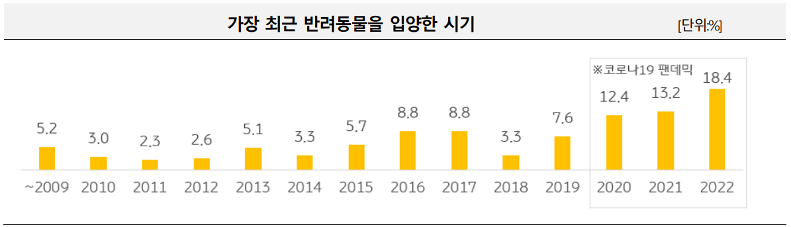
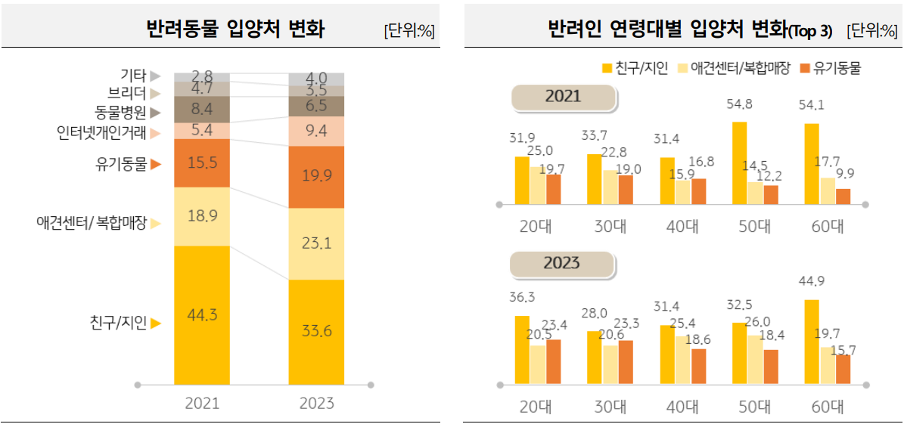
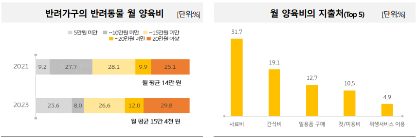
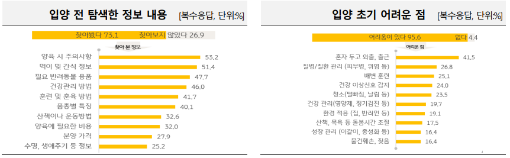

## 증가하는 반려가구

'2023 한국 반려동물 보고서 - KB금융연구소' 에 따르면, 2022년 말 한국의 반려 가구는 552만 가구로 전체 가구의 25.7%에 달함.
개인으로 따지면, 반려동물과 함께 살아가는 사람들의 수는 1,262만 명으로 한국의 국민 중 1/4은 반려동물과 함께 살아가고 있음.

2020-2022 팬데믹 시기를 거치며, 반려동물 입양 또한 크게 증가함.

반려동물을 입양하는 채널은 '친구/지인'이 전체응답자의 33.6%로 가장 많고, 두 번째로는 '반려동물복합매장'이 23.1%, 세 번째로는 '동물보호센터/유기동물 직접 구조' 19.9%가 차지했다.

눈여겨볼 점은, 20-30대를 제외한 다른 연령대는 '친구/지인', '반려동물복합매장', '동물보호센터/유기동물 직접 구조' 순으로 입양을 하게 됨.
그러나, 20-30대의 반려동물 입양 경로를 다른 연령대와 비교해보면 '동물보호센터/유기동물 직접 구조'가 23% 정도로, 2위를 차지했음.
이는 이전 년도의 조사(2021년, 약 19%)와 비교해 증가한 수치임.

### 반려동물은 가족이다

반려동물과 함께 살아가는 반려가구의 81.6% 는 '가족의 일원이다'라 생각하고 있었다.

이들은 양육에 대한 책임감을 크게 느끼고 있는 것으로 보인다.
그에 대한 근거로, 반려가구의 63.7%는 반려동물과 함께하는 삶에 크게 만족하지만 타인에게 추천하겠다는 사람의 비율은 41.3%로 크게 줄었다.
이는 양육에 대한 책임감이 커지면서 나타난 결과로 보인다.

### 새로운 가족 구성원의 양육법 / 건강관리에 큰 관심

반려가구 중 86.4%는 반려동물 양육과 관련해 관심을 갖고 있다고 답했다.
그 중 1순위는 '반려동물 건강관리 관련'이었으며, 2순위는 '반려동물 양육 관련'이 차지했다.

또한, 반려동물 양육비로 월 평균 15만 4천원 가량 고정적으로 지출하고 있다.
그 중 '사료비', '간식비' 등 식비 관련 지출이 절반을 차지했다.

### 반려동물 양육 관련 정보

실제 반려동물을 입양하기 전, 정보를 찾아본 적 있다고 답한 가구는 73.1% 였다.
가장 많이 찾아 본 정보로는 '양육 시 주의사항', '먹이 및 간식 정보'가 응답자의 반 이상을 차지했다.

## 결론

반려가구는 지속적으로 증가하고 있으며, 가족의 일원으로서 받아들이고 있다.
이들은 반려동물의 건강에 관심을 가지고 다양한 정보를 필요로 하고 있다.

서비스 타겟: 20-30대의 젊은 반려가구

커뮤니티기능으로 정보 공유의 장을 만든다?

경쟁 사이트들과 비교해 어떤 점을 내세워서 차별화할지?

<!-- ## 계획 및 진행 현황

HTML/CSS/JS 부터 시작해서 Front end 작업 부터 실시하자.
Back end 작업은 아예 뒤로 밀어두고 진행하자.

1차 목표: 모든 구성 요소를 bootstrap 만을 복사해 구현한 기존 사이트를 직접 만든 코드로 구현해본다.
메인화면, 안구질환 예측, 피부질환 예측, 상품 판매, 게시판까지 총 5가지 사이트를 구현한다.

일단 Git 먼저 공부하고 적극적으로 Git 을 활용해보자!

메인화면 구성 먼저 진행하자!

기본적인 디렉토리 구성
html / css / js / image 네 가지.

파일과 변수명은 camelCase 를 우선시 하며, css 는 BEM 을 사용하자.

HTML Semantic Tag를 사용하자.

먼저, css 내부에는
screens, components 디렉토리를 추가했고 자주 사용하는 것들을 변수화하기 위해 variables.css 를 만듦.
그리고 클론코딩에서 사용한 reset.css 를 추가해주었다.
어디서든 일정한 레이아웃을 보장하기 위함과 내가 편하게 디자인하기 위함.

참고할만한 디자인을 찾아서, 어떻게 구현할지 틀을 잡아두는 것이 좋을 것 같다. -->
