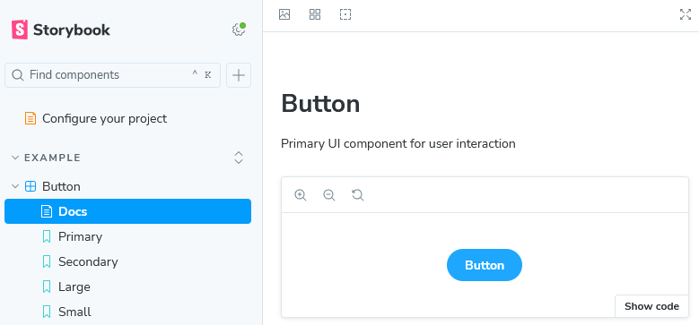
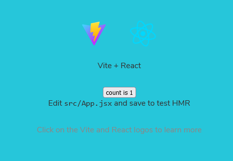

`@gather_here` 프로젝트를 계속 진행하게 되면서, 스토리북을 도입하기로 결정했다.

### 도입을 결정한 이유

지금 우리는 기능 개발만 하는 것이 아니고, 퍼블리싱 작업도 함께 해야하는 상황이다. 
그래서, 디자이너의 시안에 맞춰 작업을 해야하는데 그 작업 방식 자체가 효율적이지 못했다.

조금 더 자세히 이야기 해보자면, 자주 사용하는 디자인 컴포넌트 들이 존재하고 디자이너는 이를 컴포넌트 화 해둔 상황이다.
그런데, 개발자 쪽에서는 이를 컴포넌트로 만들지 않고 계속해서 이전에 만들어둔 페이지에서 복사해서 붙여넣고 있었던 것이다.

시안이 바뀌면 일일이 찾아가서 하나하나 바꾸고 있어야했던 것이다.
그러니 디자이너는 개발자가 어떤 작업을 하고 있는지 살펴보기 어려웠다.

웹 사이트가 배포되기 전까지는 디자이너가 개발자 없이는 새로운 컴포넌트가 잘 만들어 졌는지 확인할 방도가 없던 것이다.
이런 문제점을 느꼈고, 스토리북이 이를 해결해줄 수 있다고 판단해 도입하기로 했다.

오늘 튜토리얼을 진행하면서, 스토리북에 대해 파악해보고
내일 프로젝트에 적용까지 해보려고 한다.

`@gather_here`는 `Next.js` 기반 프로젝트로, 이에 맞춰 정리해보자.

### 스토리북 튜토리얼

먼저 튜토리얼을 진행해보자. 

```zsh
npx degit chromaui/intro-storybook-react-template taskbox
```

이 명령어를 통해 튜토리얼에 필요한 기본 셋업을 간편하게 구축할 수 있다.

```zsh
cd taskbox

# yarn 사용해도 문제 없음
npm install
```

이후, 필요한 dependencies 를 모두 설치해주면 완료다.

이번엔 만들어진 템플릿을 한 번 확인해보자.
스토리북을 어떻게 활용하는 건지 대충 감을 잡을 수 있다.

```zsh
# yarn storybook 과 동일, 6006 포트에 스토리북 앱 실행이 가능함.
npm run storybook
```

6006 포트에 열린 페이지로 접속하게 되면, 아래 사진과 같이 나타난다.



템플릿에 미리 생성된 컴포넌트를 스토리북을 통해 보고있는 것이다.
이게 어디에 만들어져있는지 파일을 한 번 찾아보았다.

일단, 프로젝트 최상단 경로에 `.storybook` 이라는 디렉토리가 생겼다.
이 안에 뭔가 설정 파일이 있는 것 같다.

일단 조금 헷갈려서, `npm run dev` 를 통해 이 컴포넌트들이 만들어져있는지 살펴보았다.



음.. 그렇진 않았다. `src/App.jsx` 에서 따로 이 컴포넌트들을 `import` 하지는 않았다.

스토리북 앱에서 보이는 컴포넌트들은 `stories` 라는 디렉토리 내부에 정의되어있는 것 같았다.


대충 감이 잡혔다.

`.storybook` 은 설정 파일로 보이고, `stories` 라는 디렉토리는 컨벤션인 것 같다. 
일단 중요한 건, 컴포넌트 파일(.jsx) 와 컴포넌트의 `story`(.stories.jsx) 를 정의해주면 되는 것 같다.

이렇게 정의해두면, 이 스토리북 앱을 배포해서 협업할 때 활용이 가능한 것 같다.

그렇다면 여기서 마무리해보고, 다음 게시글에서 `story` 는 무엇이며 컴포넌트를 어떻게 만드는지 부터 알아보도록하자.
